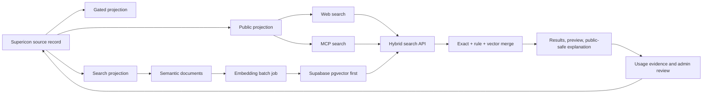

# SI v2 Search Engine Blueprint

> **Superseded on 2026-07-11.** This document is retained as historical input. For current requirements, use [`search/search-engine-v2.md`](search/search-engine-v2.md); for resolved choices and verified delivery state, use [`search/decisions.md`](search/decisions.md) and [`search/implementation-status.md`](search/implementation-status.md).

Version 0.2 - 2026-07-08 - Status: revised draft proposal

Scope: a v2 search system for the Supericons web UI, MCP tools, and future CLI flows. This proposal does not change production behavior by itself. It defines the search layer that should sit between SI v2 schema records and all user-facing search surfaces.

Companion documents:
- `supericon-schema-v1.md` - universal supericon record shape.
- `PRD-si-v2-blueprint.md` - SI v2 rings, business goals, and acceptance gates.
- `design-record-schema-v1-proposal.md` - design-record rationale from the Agent Pulse pilot.
- `v2-living-map-vision.md` - long-term product vision.

Verified local inputs for this revision:
- `lib/semantic-search-documents.js` already generates semantic search documents with five document types: `identity`, `meaning`, `visual`, `domain`, and `negative`. [SOURCE: `lib/semantic-search-documents.js`]
- The SI v2 schema tiers mark public `[P]`, gated `[G]`, and internal `[I]` fields, and gated mind-map fields include `mindmap.associations`, `mindmap.anti_associations`, and `distinct_from`. [SOURCE: `docs/si-v2/supericon-schema-v1.md`]
- The current hosted search ranker already combines lexical rank, registry rank, alias hits, use-case hits, manual boost/penalty, intent boost/penalty, contraindications, and avoid-rank penalties. [SOURCE: `lib/hosted-search-core.js`]
- Hosted MCP usage logging currently records tool-level events, query text, client family, country headers when available, hashed IP/client/session/API-key fields, account plan fields when an API key can be resolved, latency, result count, and MCP server version. [SOURCE: `mcp/remote-server.js`]
- The v2 program expects passive MCP/search signals to flow into the contribution pipeline and eventual monetization path. [SOURCE: `docs/si-v2/PRD-si-v2-blueprint.md`]

---

## 1. Problem

Supericons search is improving, but broad meaning queries still require too much manual keyword work. Queries such as `powerful`, `ai slop`, `license plate recognition camera scan car`, or localized long prompts should resolve through meaning, relationships, visual concepts, and use cases instead of only exact terms or hand-authored aliases. [SOURCE: current user feedback in this thread]

The current search foundation is valuable because it already uses normalized text, registry metadata, semantic tags, synonyms, aliases, use cases, intent rules, and reranking. [SOURCE: `lib/hosted-search-core.js`; SOURCE: `lib/search-intent-core.js`; SOURCE: `lib/search-query-frame.js`] The gap is that it is still mostly deterministic and rule-driven, so new phrases can require manual patches. [SOURCE: current user feedback in this thread; ASSUMPTION]

The SI v2 schema defines the missing record-level meaning layer: face, soul, pulse, hands, wallet, mind-map associations, anti-associations, use guidance, and gated design intelligence. [SOURCE: `docs/si-v2/supericon-schema-v1.md`] The v2 search engine should turn that schema into fast, explainable semantic retrieval for both humans and agents. [ASSUMPTION]

There is also a live-business concern: hosted MCP usage appears continuous and free. That is good demand evidence, but without better usage segmentation it is hard to know whether traffic is many users, a few heavy clients, scanners, or agent directories. V2 search must therefore include usage/cost observability and guardrails, not just relevance improvements. [SOURCE: current user feedback in this thread; SOURCE: `mcp/remote-server.js`; ASSUMPTION]

---

## 2. Target User

### Human web users

When a person needs an icon but does not know the exact icon name, they want to describe the object, action, feeling, UI job, brand, or visual metaphor so they can quickly see useful options. [SOURCE: current user feedback in this thread]

### MCP agent users

When an AI agent needs to choose or place an icon in code, it needs machine-readable search results, clear match reasons, exact icon references, and visual previews so it can select useful icons without guessing. [SOURCE: `mcp/preview-icons.js`; SOURCE: `mcp/search.js`; SOURCE: current user feedback in this thread]

### Supericons admin and curator

When search fails, returns weak results, or consumes hosted resources, the owner needs to see what the query meant, which client/surface used it, whether it came from one heavy client or many users, why the engine made its choice, and what record fields should be improved. [SOURCE: current user feedback in this thread; SOURCE: `supabase/functions/admin-api/index.ts`; SOURCE: `mcp/remote-server.js`]

### Future creator or publisher

When a creator publishes a schema-native icon, they need the record to become searchable by meaning, visual form, use case, and correct/incorrect usage without writing search metadata twice. [SOURCE: `docs/si-v2/PRD-si-v2-blueprint.md`; SOURCE: `docs/si-v2/supericon-schema-v1.md`]

---

## 3. Goals

1. Make search work by meaning, not only by file name, label, or manual aliases. [SOURCE: current user feedback in this thread]
2. Keep exact search excellent for logos, IDs, brand names, and known icon names. [SOURCE: current user feedback in this thread]
3. Use the SI v2 schema and current registry as the source of search intelligence. [SOURCE: `docs/si-v2/supericon-schema-v1.md`; SOURCE: `lib/semantic-search-documents.js`]
4. Serve the same search intelligence to web, MCP, and future CLI surfaces. [SOURCE: `supabase/functions/search-icons/index.ts`; SOURCE: `supabase/functions/mcp-search/index.ts`; SOURCE: `mcp/search.js`]
5. Return visual previews and public-safe match explanations for agents where clients support it. [SOURCE: `mcp/preview-icons.js`; SOURCE: `mcp/public-icon-preview.js`]
6. Improve records through admin review, usage signals, and search-miss evidence, not through unbounded manual keyword patches. [SOURCE: current user feedback in this thread; SOURCE: `docs/si-v2/v2-living-map-vision.md`; SOURCE: `docs/si-v2/PRD-si-v2-blueprint.md`]
7. Keep the system resilient: if semantic/vector search fails, exact and rule-based search must still work. [ASSUMPTION]
8. Make hosted MCP usage visible enough to estimate demand, unique-client spread, heavy users, scanners, latency, and resource pressure. [SOURCE: current user feedback in this thread; SOURCE: `mcp/remote-server.js`]

---

## 4. Non-goals

- Do not replace the existing web UI search in one risky release. [ASSUMPTION]
- Do not make gated design intelligence publicly downloadable. [SOURCE: `docs/si-v2/supericon-schema-v1.md`]
- Do not echo gated mind-map terms in public `matched_concepts`, `why_it_fits`, exported query packs, or public MCP results. [SOURCE: `docs/si-v2/supericon-schema-v1.md`; DECISION]
- Do not auto-promote raw user feedback into public records without review. [SOURCE: `docs/si-v2/v2-living-map-vision.md`; SOURCE: `docs/si-v2/PRD-si-v2-blueprint.md`]
- Do not require a new vector database vendor for the first production experiment unless Supabase/Postgres cannot meet latency or quality targets. [ASSUMPTION]
- Do not use LLM generation at request time for every search result. Search should be fast and predictable. [ASSUMPTION]
- Do not expose internal evidence, raw comments, private notes, raw IP addresses, raw user-agent strings, API keys, or process metadata through public search results. [SOURCE: `docs/si-v2/supericon-schema-v1.md`; SOURCE: `AGENTS.md`; SOURCE: `mcp/remote-server.js`]
- Do not treat Railway HTTP/scanner traffic as the same thing as useful tool usage. HTTP logs help diagnose infrastructure; search-product decisions should rely on actual tool calls and search events. [SOURCE: current user feedback in this thread; ASSUMPTION]

---

## 5. Product Principles

1. Exact beats fuzzy when the user names a specific brand, logo, or icon ID. [SOURCE: current user feedback in this thread]
2. Meaning search should broaden discovery, not pollute exact matches. [ASSUMPTION]
3. Public fields help users find and use icons correctly; gated fields help users adapt and rebuild icons. [SOURCE: `docs/si-v2/supericon-schema-v1.md`; SOURCE: `docs/si-v2/design-record-schema-v1-proposal.md`]
4. Search should explain itself enough for humans and agents to trust it. [SOURCE: current user feedback in this thread]
5. Admin review is the taste gate. Automated signals can propose improvements, but human approval decides what becomes part of the record. [SOURCE: `docs/si-v2/PRD-si-v2-blueprint.md`; SOURCE: `docs/si-v2/v2-living-map-vision.md`]
6. Usage observability is part of the product. Free MCP traffic is useful only if it teaches us demand, quality gaps, abuse pressure, and future monetization paths. [SOURCE: current user feedback in this thread; ASSUMPTION]

---

## 6. Socratic QA Decisions

### Q1. Should semantic/vector search replace deterministic search?

No. Exact and deterministic lanes remain primary for brand names, icon IDs, library filters, and known labels. Vector search is an additional candidate lane for broad or long meaning queries. [DECISION]

Reason: a fuzzy semantic match can be attractive but wrong for logos and brand identity. [SOURCE: current user feedback in this thread]

### Q2. Should we add many manual keywords for every miss?

No. Manual aliases are allowed as emergency fixes, but the main improvement path should be schema fields, generated semantic documents, evaluation fixtures, and admin-approved record updates. [DECISION]

Reason: manual keyword patches solve individual misses but do not create a general search system. [SOURCE: current user feedback in this thread]

### Q3. Should gated mind-map fields influence public search?

Yes, but only internally. Gated fields may affect retrieval/ranking through distilled internal signals. Public outputs may not reveal gated-only terms unless those same terms are already in public fields or in the user's query. [DECISION]

Testable rule: `matched_concepts`, `why_it_fits`, exported MCP responses, and public debug payloads may contain only tokens from `[P]` fields, the user's query, or approved public templates. [DECISION]

### Q4. Should the first vector backend be Pinecone, Qdrant, Weaviate, Milvus, Chroma, or pgvector?

Use Supabase/Postgres with pgvector first unless an offline benchmark proves it cannot meet quality or latency targets. [DECISION]

Reason: the current stack already depends on Supabase, and the dataset is small enough that operational simplicity beats a new vendor at this stage. Qdrant or another dedicated vector engine remains a later escape hatch if scale or filtering proves painful. [ASSUMPTION]

### Q5. How should localized search start?

Start with a multilingual embedding model plus current locale dictionaries, not per-locale document explosion. [DECISION]

Reason: 13 locales times every icon times every document type creates rebuild and QA overhead before we know it is needed. Per-locale documents should be added only after eval shows a locale-specific gap. [ASSUMPTION]

### Q6. Should `debug_intent` be exposed through public hosted MCP?

No. Full debug payloads should be admin-only. Public MCP may include compact public-safe query-frame hints only when explicitly requested and scrubbed. [DECISION]

Reason: debug output can expose ranking strategy and accidental private signals. [SOURCE: current user feedback in this thread; ASSUMPTION]

### Q7. Is continuous hosted MCP use good or bad?

It is a positive demand signal only if we can separate useful tool calls from liveness checks, scanners, repeated heavy clients, and failed/low-quality searches. [DECISION]

Action: search v2 must measure unique anonymous client hashes, client family, tool mix, result quality, latency, country headers when available, account/API-key presence, and free-to-paid conversion opportunities. [SOURCE: `mcp/remote-server.js`; SOURCE: current user feedback in this thread]

---

## 7. Proposed Architecture



### 7.1 Source records

The source record is the full SI v2 supericon record. It contains identity, face, soul, construction, pulse, hands, wallet, community, and design process sections. [SOURCE: `docs/si-v2/supericon-schema-v1.md`]

Concern: the schema kind matrix currently references a `live` section for token, alert, game, persona, and storefront kinds, but the same schema file does not define a `live` section. [SOURCE: `docs/si-v2/supericon-schema-v1.md`]

Decision: this search PRD should not invent the missing `live` shape. Treat that as a separate schema cleanup task before live-kind records depend on it. [DECISION]

### 7.2 Public projection

The public projection exposes the fields needed for discovery and correct use, such as label, purpose, depicts, semantic tags, synonyms, use_when, avoid_when, motion behavior, access tier, and preview assets. [SOURCE: `docs/si-v2/supericon-schema-v1.md`]

### 7.3 Gated projection

The gated projection exposes paid design intelligence, such as construction recipes, motion specs, detailed mind-map associations, anti-associations, distinct_from rules, and revision history. [SOURCE: `docs/si-v2/supericon-schema-v1.md`]

### 7.4 Search projection

The search projection is an internal search-only document set derived from public fields plus safe, distilled ranking hints from gated fields. It should not expose gated content directly. [DECISION]

Search projection documents should be generated, not hand-maintained. [ASSUMPTION]

The first implementation should extend the existing semantic document generator instead of creating a parallel model. [SOURCE: `lib/semantic-search-documents.js`; DECISION]

Baseline document types:

| document type | status | purpose | source fields |
|---|---|---|---|
| identity | keep | exact logo, product, brand, icon name, aliases | label, name, aliases, synonyms, source_name, icon_id |
| meaning | keep | purpose and correct use | purpose, meaning, use_when |
| visual | keep | what the icon looks like | depicts, asset type, style, semantic tags |
| domain | keep | domain/category/context filtering | category, job category, AI category, pack, filter tags, search terms |
| negative | keep | avoid weak or misleading matches | avoid_when, contraindications |

Future document types should be added only after eval proves the current five are insufficient:

| candidate type | when to add |
|---|---|
| action | if `hands.actions` materially improves workflow queries |
| relationship | if approved public relationship fields exist or gated terms can be safely distilled without leakage |
| locale | if multilingual embeddings plus dictionaries fail on localized evals |

### 7.5 Public-safe explanation rule

`why_it_fits` and `matched_concepts` must be generated from:
- public projection fields;
- the user's own query terms;
- fixed public-safe templates; and
- non-sensitive rank signals such as `exact_brand`, `meaning_match`, `visual_match`, `domain_match`, or `fallback_match`.

They must not include raw gated mind-map associations, anti-associations, distinct_from differentiators, revision history, internal review notes, raw user feedback, raw prompt text beyond the submitted query, raw IP address, raw user-agent string, or API-key data. [DECISION]

Generation method:
- Phase 1 uses deterministic templates over matched public fields and rank signals.
- Later phases may use offline generated explanations if a public-safety scrubber validates them before release.
- No request-time LLM explanation generation in the default path. [DECISION]

---

## 8. Search Runtime

### 8.1 Query intake

Inputs:
- `query`
- `library`
- `locale`
- `limit`
- `include_image`
- `surface`: `web`, `mcp`, `cli`, `api`, or `admin`
- `debug_intent`: admin-only

Existing hosted search and MCP search functions already separate web and MCP entry points. [SOURCE: `supabase/functions/search-icons/index.ts`; SOURCE: `supabase/functions/mcp-search/index.ts`]

### 8.2 Query understanding

The search engine should produce a query frame:

```json
{
  "normalized_query": "license plate recognition camera scan car",
  "intent_types": ["object_search", "workflow_search"],
  "objects": ["license plate", "car"],
  "actions": ["recognition", "scan"],
  "domain_terms": ["vehicle", "camera", "ocr"],
  "fallback_terms": ["scan", "camera", "car", "id"]
}
```

The current query-frame implementation already has the concept of normalized query, tokens, meaning groups, domain terms, objects, actions, fallback terms, and confidence floor. [SOURCE: `lib/search-query-frame.js`]

### 8.3 Candidate retrieval

Retrieve candidates from three lanes:

1. Exact lane: label, icon ID, brand/logo, aliases, slug, library. [SOURCE: `lib/hosted-search-core.js`]
2. Rule lane: generated intent rules, known compound phrases, fallback terms. [SOURCE: `lib/search-intent-core.js`]
3. Semantic lane: vector search over generated semantic documents. [ASSUMPTION]

### 8.4 Merge and rerank

Merge candidates with a weighted ranker:

```txt
final_score =
  exact_score
  + lexical_score
  + intent_score
  + semantic_score
  + behavioral_score
  + admin_boost
  - avoid_penalty
  - collision_penalty
```

The existing ranker already combines lexical rank, registry rank, alias hits, use-case hits, behavioral/editorial scores, manual boosts, intent boosts, penalties, contraindication hits, and avoid rank. [SOURCE: `lib/hosted-search-core.js`]

V2 should add semantic score and collision penalty from public-safe SI v2 signals. Gated `distinct_from` and anti-association fields may influence collision/avoid penalties, but the public output must explain the penalty only with public fields or generic labels such as `collision_penalty` or `avoid_guidance`. [DECISION]

### 8.5 Embedding path and latency guardrail

Embedding generation should be offline or batch-based for icon documents. Query embeddings are the only request-time embedding call. [ASSUMPTION]

Latency guardrails:
- Cache normalized query embeddings.
- Cap semantic candidate count before rerank.
- Add a semantic-lane kill switch.
- Fall back to exact/rule search if embedding or vector retrieval fails.
- Measure search p95 separately for web and MCP. [DECISION]

### 8.6 Result output

Each result should include:

```json
{
  "icon_ref": "supericons:x-ai",
  "si_id": "si:x-ai",
  "id": "x-ai",
  "library_key": "supericons",
  "library_name": "Supericons",
  "label": "xAI",
  "kind": "brand_logo",
  "score": 0.93,
  "match_type": "exact_brand_and_semantic",
  "matched_concepts": ["xai", "ai company"],
  "why_it_fits": "Official xAI brand mark; useful when the interface refers to xAI or related AI app workflows.",
  "preview_url": "https://supericons.dev/?view=icons&preview=mcp&library=supericons&icon=supericons%3Ax-ai"
}
```

Use the full public library name in user-facing output. Humans should not need to know that `si` means Supericons. [SOURCE: current user feedback in this thread]

`icon_ref` and `si_id` are separate fields: `icon_ref` identifies the current registry/library reference, while `si_id` is the SI v2 record identifier when available. [DECISION]

---

## 9. Web Search Requirements

### W1. Same search box, better meaning

The existing web UI should keep the same basic search workflow. [SOURCE: current user feedback in this thread] V2 should improve result relevance without forcing users into a separate "AI search" screen. [ASSUMPTION]

Maps to:
- User job: find an icon from natural language.
- Business goal: make the library feel useful immediately.
- Risk: avoid adding UI friction.

### W2. Result confidence handling

If confidence is high, show normal results. If confidence is medium, show results with soft relatedness. If confidence is low, show best fallbacks plus a clear request/feedback path. [ASSUMPTION]

Maps to:
- User job: avoid trusting bad icon suggestions.
- Risk: semantic search can overreach.

### W3. No-result feedback loop

Zero-result and low-result web queries should flow into the admin evidence system and future contribution pipeline. [SOURCE: current user feedback in this thread; SOURCE: `docs/si-v2/v2-living-map-vision.md`]

Maps to:
- Business goal: turn unmet demand into record improvements and new icon ideas.
- Risk: manual alias patching does not scale.

### W4. Locale-aware search

If a user searches in another language, the engine should use locale signals, localized search terms, and semantic retrieval to return relevant icons. [SOURCE: current user feedback in this thread]

First implementation: multilingual embeddings plus existing locale dictionaries. Per-locale semantic documents are deferred until eval proves they are needed. [DECISION]

Maps to:
- User job: find icons without translating into English.
- Business goal: global usage.

---

## 10. MCP Search Requirements

### M1. One shared search brain

MCP tools should call the same hybrid search core as web search so agents and humans receive consistent results. [SOURCE: `supabase/functions/search-icons/index.ts`; SOURCE: `supabase/functions/mcp-search/index.ts`]

Maps to:
- User job: get consistent results across interfaces.
- Risk: web and MCP drifting apart.

### M2. Agent-ready explanations

MCP search results should include public-safe `why_it_fits`, `matched_concepts`, `avoid_when`, `use_when`, and `confidence`. [SOURCE: `docs/si-v2/supericon-schema-v1.md`; SOURCE: current user feedback in this thread]

Maps to:
- MCP agent job: pick a correct icon without guessing.
- Risk: agents over-trust weak matches.

### M3. Visual preview support

MCP should keep supporting preview output, direct preview URLs, and direct PNG preview URLs where available. [SOURCE: `mcp/preview-icons.js`; SOURCE: `mcp/public-icon-preview.js`; SOURCE: `mcp/remote-server.js`]

Maps to:
- Human-in-the-loop job: verify icon suitability visually.
- Risk: text-only results are hard to trust.

### M4. Admin-only debug intent

MCP and admin smoke tests should be able to request a debug payload showing query frame, retrieval lanes, and rank signals. Public/default agent output should stay clean. [ASSUMPTION]

Maps to:
- Admin job: understand why a result happened.
- Risk: exposing internal ranking details publicly.

### M5. Brand/logo precision

For brand/logo queries, exact brand identity should outrank broad semantic AI matches. [SOURCE: current user feedback in this thread]

Maps to:
- User job: find exact logos.
- Risk: vector search returning "similar meaning" when identity matters.

### M6. MCP usage and cost visibility

Hosted MCP should log enough aggregate-safe data to answer:
- how many tool calls happened;
- which tools were called;
- how many distinct anonymous client hashes appeared;
- which client families appeared;
- which countries were captured by headers, where available;
- how many requests came from registered API keys;
- which plan/status those keys map to;
- which queries were zero-result, low-result, or high-latency;
- which traffic looks like liveness/scanner traffic rather than real tool use.

Raw IP addresses, raw user-agent strings, API keys, and private prompts should not be stored in the product database. [SOURCE: `mcp/remote-server.js`; DECISION]

Maps to:
- Admin job: know whether free hosted MCP usage is real demand, abuse, or bots.
- Business goal: decide when to introduce limits, keys, Pro, x402, or hosted tiers.
- Risk: Railway/resource cost grows without visibility.

---

## 11. Data Model Proposal

### 11.1 `supericon_search_documents`

Generated table or materialized source for semantic documents.

```sql
supericon_search_documents
- document_id
- si_id
- library_key
- icon_id
- document_type
- locale
- content
- public_safe
- source_record_version
- content_hash
- updated_at
```

Purpose: create stable text documents from SI v2 records and existing registry data. [ASSUMPTION]

Document types must initially match the existing generator: `identity`, `meaning`, `visual`, `domain`, `negative`. [SOURCE: `lib/semantic-search-documents.js`; DECISION]

### 11.2 `supericon_search_embeddings`

Vector table for embeddings.

```sql
supericon_search_embeddings
- document_id
- embedding
- embedding_model
- embedded_at
- content_hash
```

Purpose: store vector representations without regenerating embeddings unnecessarily. [ASSUMPTION]

Decision: first production experiment should prefer Supabase/Postgres with pgvector. A dedicated vector database is a later migration if pgvector fails quality, filter, latency, or cost targets. [DECISION]

### 11.3 Search reviews and evidence linkage

Review decisions should not become a separate analytics silo. They should reference existing query evidence wherever possible.

```sql
supericon_search_reviews
- review_id
- normalized_query
- library_filter
- job_category
- verdict
- note
- promoted_change_type
- evidence_source
- evidence_ids
- created_at
- updated_at
```

Purpose: allow admin feedback to improve records and ranking while preserving why the decision was made. [ASSUMPTION]

### 11.4 MCP usage ledger

The existing hosted MCP usage event shape should remain a first-class input to search v2 decisions. [SOURCE: `mcp/remote-server.js`]

Required aggregate-safe fields:
- request/tool identifiers: request id, tool name, event type, status;
- usage context: channel, environment, client family, MCP server version;
- search context: normalized query, library filter, locale, result count, latency;
- attribution: hashed IP/client/session/API-key values, API-key presence, registered/pro flags, account plan/status;
- geography: country code and geo source when headers provide it;
- no raw IP, raw user-agent, raw API key, or raw private prompt. [DECISION]

Purpose: distinguish many users from one heavy user, find abuse/scanner traffic, and decide when free hosted usage needs limits or monetization. [SOURCE: current user feedback in this thread; ASSUMPTION]

### 11.5 Existing evidence sources

The system should continue using existing search/audit/usage evidence rather than creating a separate analytics silo. [SOURCE: `supabase/functions/admin-api/index.ts`; SOURCE: current user feedback in this thread]

---

## 12. Functional Requirements

| id | requirement | maps to |
|---|---|---|
| F1 | Generate public-safe search documents from SI v2 records and current registry records. | User job: meaning search; Business goal: schema as source of truth |
| F2 | Extend the existing five-type semantic document generator before adding new document types. | Risk: duplicated search systems |
| F3 | Generate embeddings for search documents offline or in a controlled batch job. | Risk: search latency and cost |
| F4 | Add semantic candidate retrieval behind a feature flag. | Risk: production safety |
| F5 | Merge exact, rule, and semantic candidates into one ranked result list. | User job: useful results from vague queries |
| F6 | Preserve exact brand/logo/icon ID ranking priority. | Risk: fuzzy search damaging exact search |
| F7 | Return public-safe match explanations and preview URLs in web and MCP responses. | User job: trust and verify results |
| F8 | Support multilingual search first through multilingual embeddings plus locale dictionaries. | Business goal: global use |
| F9 | Log zero-result, low-result, weak-confidence, and high-latency queries into admin evidence. | Business goal: improve library from demand |
| F10 | Provide an admin-only debug view of query frame and rank signals. | Admin job: diagnose misses |
| F11 | Fall back to current deterministic search if semantic retrieval fails. | Risk: availability |
| F12 | Keep gated design intelligence out of public responses while allowing safe internal ranking use. | Risk: paid layer leakage |
| F13 | Add evaluation fixtures from real query packs before rollout. | Risk: unmeasured relevance regression |
| F14 | Track hosted MCP usage with anonymous unique-client estimates, client family, tool mix, country headers when available, latency, and API-key/account attribution. | Business goal: understand free usage and resource pressure |
| F15 | Separate liveness/scanner traffic from real tool calls in admin reporting. | Risk: overestimating real demand |

---

## 13. Success Metrics

Primary metrics:
- Zero-result query rate decreases on the approved eval set and live traffic. [ASSUMPTION]
- Low-result query rate decreases on the approved eval set and live traffic. [ASSUMPTION]
- Human-rated top-3 usefulness improves on a fixed query set. [ASSUMPTION]
- Exact brand/logo rank-1 accuracy does not regress. [SOURCE: current user feedback in this thread; ASSUMPTION]
- MCP top result is accepted, fetched, previewed, or used more often. [ASSUMPTION]
- Search p95 latency stays within an approved threshold for web and MCP separately. [ASSUMPTION]

Usage and cost metrics:
- Hosted MCP tool calls by tool, status, and client family. [SOURCE: `mcp/remote-server.js`]
- Distinct anonymous client hashes per day/week/month. [SOURCE: `mcp/remote-server.js`]
- Heavy-client concentration: share of calls from top anonymous client hashes. [ASSUMPTION]
- Registered/API-key share of MCP calls. [SOURCE: `mcp/remote-server.js`]
- High-latency query/tool share. [SOURCE: `mcp/remote-server.js`]
- Scanner/liveness ratio versus real tool-call ratio. [ASSUMPTION]

Secondary metrics:
- More queries have clear public-safe `matched_concepts`. [ASSUMPTION]
- More admin reviews produce record improvements instead of one-off aliases. [ASSUMPTION]
- Preview use increases for MCP flows that support images or URLs. [SOURCE: current user feedback in this thread]
- More country headers are captured where the host/client provides them, without storing raw IP. [SOURCE: `mcp/remote-server.js`; ASSUMPTION]

Evaluation set requirement:
- Minimum 50 queries before Phase 2 gate.
- Include exact logos, known icon IDs, broad concepts, long natural-language queries, no-result cases, low-result cases, localized prompts, and known-bad regressions.
- Include owner-scored expected useful icon families and unacceptable results.
- Keep a smaller smoke subset for every release. [DECISION]

Suggested seed queries:
- `xai`
- `grok imagine`
- `openai codex logo`
- `license plate recognition camera scan car`
- `powerful`
- `ai slop`
- `neck pain person`
- `dream interpretation moon star eye mystical`
- localized prompts from real query logs

[SOURCE: current user feedback in this thread]

---

## 14. Rollout Plan

### Phase 0 - Baseline and evaluation

Export current query packs and admin evidence. Create a fixed evaluation set with expected useful icon families and unacceptable results. [SOURCE: current user feedback in this thread]

Gate:
- Existing deterministic search baseline captured.
- At least 50 query fixtures created and owner-scored.
- Exact-logo regression canaries included.
- Hosted MCP usage baseline captured: tool calls, client families, anonymous-client concentration, result counts, latency, and scanner/liveness indicators.
- No production behavior change.

### Phase 1 - Search projection

Extend the existing generated search document layer from current registry records and SI v2 pilot records. [SOURCE: `docs/si-v2/supericon-schema-v1.md`; SOURCE: `lib/semantic-search-documents.js`]

Gate:
- Existing document types retained: `identity`, `meaning`, `visual`, `domain`, `negative`.
- Public-safe projection verified.
- Gated/internal source fields are not exposed in generated public artifacts.
- Explanation output uses only public fields, query terms, or approved public templates.

### Phase 2 - Embeddings and vector retrieval

Generate embeddings for search documents and store them in the chosen vector store. The first implementation should prefer Supabase/Postgres with pgvector unless testing proves it cannot meet the target. [DECISION]

Gate:
- Offline evaluation improves top-3 usefulness without hurting exact logo queries.
- Query embedding latency and cache hit rate measured.
- Semantic lane can be disabled without breaking search.

### Phase 3 - Hybrid search shadow mode

Run semantic retrieval in shadow mode. Log what v2 would have returned, but keep users on current results. [ASSUMPTION]

Gate:
- No material latency issue.
- No exact-search regression in evaluation.
- Owner approves sample outputs.
- Admin can compare current versus v2 result sets for real query evidence.

### Phase 4 - MCP beta

Enable hybrid search for MCP first with explicit preview and public-safe explanation output. [ASSUMPTION]

Gate:
- MCP smoke tests pass for exact logo, broad concept, long query, and localized query cases.
- Hosted MCP usage dashboard can separate tool calls from scanner/liveness traffic.
- Heavy-client and anonymous-client concentration is visible.

### Phase 5 - Web beta

Enable hybrid search for web behind a feature flag. [SOURCE: `docs/si-v2/PRD-si-v2-blueprint.md` supports feature-flag rollout for v2 surfaces]

Gate:
- Web smoke tests pass.
- No-result and low-result feedback still works.
- Public result explanations do not expose gated fields.

### Phase 6 - Admin learning loop

Add admin review tools to promote search improvements back into records or candidate record changes. [SOURCE: `docs/si-v2/v2-living-map-vision.md`; SOURCE: `docs/si-v2/PRD-si-v2-blueprint.md`]

Gate:
- A real low-result query becomes a proposed record improvement and is approved through the taste gate.
- The accepted improvement changes generated search documents, not only a hidden one-off alias.

### Ring mapping

| search phase | v2 program ring |
|---|---|
| Phase 0 baseline/eval | Ring 0 support work |
| Phase 1 search projection | Ring 0 foundation and Ring 1 pack launch support |
| Phase 2 embeddings/vector retrieval | Ring 1/Ring 2 infrastructure |
| Phase 3 shadow mode | Ring 2 feature-flag discipline |
| Phase 4 MCP beta | Ring 2 MCP-first delivery |
| Phase 5 web beta | Ring 2 live-site feature flag |
| Phase 6 admin learning loop | Ring 3 contribution pipeline |

This mapping prevents search v2 from competing with the main SI v2 sequencing. [SOURCE: `docs/si-v2/PRD-si-v2-blueprint.md`; DECISION]

---

## 15. Risks

| risk | mitigation |
|---|---|
| Vector search returns fuzzy but wrong icons | Exact lane priority, avoid_when penalties, anti-association penalties, human evaluation |
| Gated intelligence leaks through search output | Gated fields may influence internal ranking only; public output uses public fields, query terms, and approved templates |
| Search becomes slow | Cache normalized query embeddings, keep exact search fallback, cap candidate pool before rerank, semantic kill switch |
| Railway or hosted MCP cost grows from free use | Track hosted tool calls, latency, anonymous-client concentration, scanner/liveness ratio, and registered/API-key share |
| Admin overestimates demand from scanners | Separate HTTP/liveness/scanner logs from real MCP tool calls |
| Admin gets overwhelmed by signals | Cluster similar misses and promote suggestions only after repeated evidence |
| Web and MCP drift apart | Shared search core and shared evaluation fixtures |
| Manual keyword work continues under a new name | Record improvements must target schema fields or generated search documents, not one-off hidden aliases |
| Localization quality is uneven | Start with multilingual embeddings plus locale dictionaries; add per-locale documents only if eval proves the need |
| Search reviews become a new analytics silo | Link review rows back to existing query evidence and MCP usage events |
| Schema contradiction around `live` section blocks later records | Track as separate schema cleanup before live-kind records depend on it |

---

## 16. Open Questions

1. What p95 latency is acceptable for web search and MCP search? [ASSUMPTION]
2. Which embedding model should be used for production, and what is the acceptable cost per rebuild? [ASSUMPTION]
3. What exact threshold should trigger hosted MCP throttling, API-key nudges, or paid-agent calls: total calls, heavy-client share, latency, or repeated high-result exports? [ASSUMPTION]
4. What is the minimum useful country/region attribution standard when Railway or clients do not provide geo headers? [ASSUMPTION]
5. How should search handle low-confidence results: show fallback icons, ask a clarifying question, or push to Icons Lab/new icon request? [ASSUMPTION]
6. Should search reviews promote changes directly to SI v2 records, or create suggested changes that require a separate owner approval screen? [SOURCE: `docs/si-v2/v2-living-map-vision.md`; ASSUMPTION]
7. When should Supericons move from free hosted MCP to API-key-required hosted MCP or x402-paid gated actions? [SOURCE: `docs/si-v2/PRD-si-v2-blueprint.md`; ASSUMPTION]

Answered in this revision:
- First vector store: Supabase/Postgres pgvector unless benchmarks prove it is insufficient. [DECISION]
- Locale strategy: multilingual embeddings plus dictionaries first; per-locale documents later if needed. [DECISION]
- Debug intent: admin-only for full debug payloads. [DECISION]
- Document types: extend existing `identity`, `meaning`, `visual`, `domain`, `negative` first. [DECISION]
- Gated fields: internal ranking only; no public echo in explanations. [DECISION]

---

## 17. Acceptance Criteria

The v2 search engine is ready for first beta when:

- Exact brand/logo queries still return the exact expected result at rank 1. [SOURCE: current user feedback in this thread]
- Broad meaning queries return at least one useful icon family in the top 3 on the approved baseline set. [ASSUMPTION]
- Long natural-language queries produce a query frame and useful fallback candidates. [SOURCE: current user feedback in this thread]
- MCP responses include full public library names, icon refs, match reasons, and preview URLs. [SOURCE: current user feedback in this thread]
- MCP usage dashboards can estimate distinct anonymous clients, heavy-client concentration, tool mix, query quality, latency, country headers when available, and registered/API-key share. [SOURCE: `mcp/remote-server.js`; ASSUMPTION]
- Web search still works when vector retrieval is disabled or unavailable. [ASSUMPTION]
- No public artifact exposes gated or internal SI v2 fields. [SOURCE: `docs/si-v2/supericon-schema-v1.md`; SOURCE: `AGENTS.md`]
- Admin can see query evidence, weak matches, and suggested record improvements. [SOURCE: current user feedback in this thread]
- The evaluation set has at least 50 owner-scored queries plus a smaller release smoke subset. [DECISION]

---

## 18. Decision Proposal

Build v2 search as a hybrid engine:

1. Keep current exact and deterministic ranking.
2. Extend the existing semantic document generator.
3. Use the five existing document types first: `identity`, `meaning`, `visual`, `domain`, `negative`.
4. Add embeddings and pgvector retrieval behind a feature flag.
5. Merge exact, rule, and vector candidates.
6. Use public-safe explanations and visual previews.
7. Use admin review, query evidence, and MCP usage telemetry to improve records and manage free hosted usage.

This approach preserves what already works while adding the missing meaning layer and making hosted MCP demand measurable. [SOURCE: `lib/hosted-search-core.js`; SOURCE: `lib/semantic-search-documents.js`; SOURCE: `mcp/remote-server.js`; SOURCE: `docs/si-v2/supericon-schema-v1.md`; ASSUMPTION]
