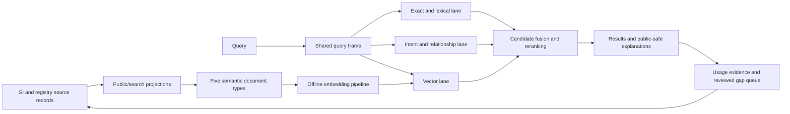

# SI Search Engine v2

Version: 1.5
Approved: 2026-07-11
Amended: 2026-07-12
Status: canonical product and technical specification

## Authority and scope

This document is the official specification for SI Search Engine v2 across the web UI, hosted MCP, local MCP, and future CLI/API surfaces. It owns intended search behavior, architecture, requirements, safety gates, metrics, and rollout order.

Related authority is deliberately separated:

- [`decisions.md`](decisions.md) records why accepted decisions were made. A decision is active only when this specification is updated in the same change.
- [`implementation-status.md`](implementation-status.md) records what is implemented, verified, packaged, deployed, and observed live. It does not define intended behavior.
- [`consolidation-traceability.md`](consolidation-traceability.md) is frozen evidence showing how the four earlier planning generations were handled. It is not normative.

When sources conflict:

1. This document controls intended search behavior.
2. Verified code, deployment records, and production checks control what currently exists.
3. The SI v2 schema and registry contracts control their field and projection definitions; this document controls how search consumes them.
4. A conflict must be resolved in the specification and decision log, never by silently choosing a convenient source.

## Product question

How should Supericons improve exact identities, visual meaning, relationships, UI jobs, localized language, and long natural-language requests through a deterministic-first search system, while keeping web and MCP behavior aligned and avoiding open-ended model cost on free requests?

## Problem statement

The current engine has useful exact, registry, alias, use-case, intent, and reranking signals, but new phrases still require manual rules and different surfaces can follow different recommendation paths. Search failures are therefore a mixture of metadata gaps, intent gaps, library-filter gaps, relationship gaps, genuine missing icons, and noise.

The sanitized seven-day baseline reports 534 zero-result query records among 2,196 summary records. Its bounded detail contains 1,069 zero-result attempts among 4,045 attempts; 984 of those zero-result attempts came from `recommend_icons`. The sample is predominantly hosted MCP and has sparse acceptance signals, so it is a prioritization signal rather than a production-wide estimate of human impact. [Evidence: `references/verification/search-query-baseline-2026-07-11.md`]

SI v2 also introduces public, gated, and internal record fields. Search must benefit from richer record meaning without leaking paid design intelligence, private evidence, or operational identifiers into public results.

## Target users and jobs

### Human web users

When people do not know an icon's exact name, they need to describe its object, action, feeling, UI job, brand, or visual metaphor and quickly receive useful, honest options.

### MCP and API agents

When an agent chooses an icon, it needs consistent search and recommendation behavior, stable icon references, public-safe match reasons, confidence, use/avoid guidance, and preview support.

### Supericons administrators and curators

When a search fails or produces weak results, maintainers need evidence that distinguishes metadata, intent, relationship, library-filter, new-icon, and abuse/noise gaps. They also need to know whether behavior is local-only, deployed, or observed live before acting on it.

### Future creators and publishers

When schema-native icons are published, their public meaning, appearance, use guidance, and approved relationships should become searchable without duplicating hidden keyword records.

## Goals

- `G-01` Improve meaning-based discovery for short concepts, UI jobs, long phrases, and localized queries.
- `G-02` Preserve exact rank quality for icon IDs, known names, brands, and logos.
- `G-03` Use one query-understanding and candidate contract across web search, hosted MCP, local MCP, CLI/API, and `recommend_icons`.
- `G-04` Use SI v2 records and registry projections as maintained search intelligence.
- `G-05` Return agent-ready, public-safe explanations, confidence, use/avoid guidance, and previews.
- `G-06` Turn repeated weak searches into reviewed record, graph, ranking, library, or Icons Lab work.
- `G-07` Keep exact/rule search available when embeddings or vector retrieval fail.
- `G-08` Measure search quality, acceptance, latency, client concentration, and hosted resource pressure without storing raw sensitive identifiers in public artifacts.
- `G-09` Keep the default free web and MCP search path deterministic and free of paid model calls per request.

## Non-goals

- `NG-01` Do not replace the existing web search workflow with a separate AI-search screen.
- `NG-02` Do not call a general-purpose language model for every public search request.
- `NG-03` Do not make gated design intelligence, internal notes, raw evidence, or operational identifiers publicly downloadable or explainable.
- `NG-04` Do not auto-promote raw searches or feedback into public records without review.
- `NG-05` Do not require a new vector vendor before Supabase/Postgres with pgvector is evaluated against explicit gates.
- `NG-06` Do not create new icons inside the search-engine implementation; create reviewed Icons Lab briefs instead.
- `NG-07` Do not include payment, entitlement, affiliate, or deployment-platform redesign in this program.
- `NG-08` Do not treat liveness checks, scanners, or concentrated automation as equivalent to user demand.
- `NG-09` Do not call an AI agent, general-purpose language model, or metered third-party embedding API in the default free search path.

## Product principles

1. Exact identity beats fuzzy similarity when identity matters.
2. Meaning retrieval broadens discovery without weakening exact results.
3. Query interpretation, retrieval lanes, and public explanations are separate contracts.
4. Public fields explain results; gated fields may influence internal ranking only under the leakage rules below.
5. Admin review is the taste gate. Automation proposes; approved records and decisions control.
6. Search status is evidence-based: implemented, verified, packaged, deployed, and observed live are different states.
7. Failure must degrade to useful deterministic behavior, not an empty or misleading response.
8. Ambiguous short queries should show useful interpretation breadth in search, while recommendation uses task and slot context before asking for clarification.
9. Brand identity priority applies to genuine identity matches, not accidental prefixes, substrings, or ambiguous common words.
10. Deterministic search ships and is measured before semantic retrieval is reconsidered. AI may help offline with reviewed maintenance, but it does not decide live search results by default.

## Authoritative dependencies

| dependency | owns | search v2 use |
| --- | --- | --- |
| `docs/si-v2/supericon-schema-v1.md` | SI v2 record fields and public/gated/internal tiers | Source-field eligibility and projection rules |
| `docs/si-v2/PRD-si-v2-blueprint.md` | Program rings, approval gates, and MCP-first sequencing | Rollout mapping and owner gates |
| `docs/registry/registry-projection-contract.md` | Registry projection contract | Current public/search record inputs |
| `docs/registry/semantic-registry-maintenance.md` | Registry maintenance workflow | Approved record changes and generated projections |
| `docs/registry/supabase-registry-schema-design.md` | Hosted registry storage design | Hosted source compatibility |
| `docs/cjk-search-quality.md` and i18n contracts | Existing localized search behavior | Locale dictionary and regression requirements |
| MCP hosted-search boundary documents | Hosted/public authentication and setup boundaries | Public payload and privileged diagnostic separation |

## Architecture

The diagram below is a future-capable architecture, not the current release requirement. The exact, lexical, intent, relationship, and deterministic reranking path is the approved default. The vector lane remains paused unless deterministic beta evidence shows a material gap and the owner approves a model shortlist and cost boundary.



### Online and offline boundary

The approved default request path is fully deterministic. It uses exact, lexical, approved intent, relationship, library, ambiguity, brand, and reranking rules without an AI agent or paid model call.

If a semantic lane is reconsidered later, document generation, icon embeddings, relationship seeding, model-assisted drafts, evaluation, and review happen offline. A request-time query encoder requires a new accepted decision covering whether it runs locally or externally, its fixed model version, resource limits, funding, abuse protection, and rollback.

The exact, lexical, and approved intent lanes must complete every default free request. A future semantic lane may add candidates only behind an independently controlled flag and may never become an unbounded paid fallback for free MCP traffic.

## Data and projection contracts

### Semantic documents

The initial runtime contract has exactly five document types:

| type | purpose | representative public/search inputs |
| --- | --- | --- |
| `identity` | Exact identity, name, brand, aliases | label, name, source name, icon ID, public synonyms |
| `meaning` | Purpose and correct use | meaning, purpose, `use_when` |
| `visual` | Literal appearance | `depicts`, style, public visual tags |
| `domain` | Domain and category context | category, job category, pack, public search terms |
| `negative` | Avoid misleading matches | public `avoid_when`, contraindications, approved negative terms |

Locale is a dimension on these documents. Localized aliases are source inputs that produce localized `identity` or `meaning` documents. A sixth document type requires a new accepted decision and a compatible migration.

The implemented table name remains `icon_search_semantic_documents`. The canonical implementation must extend that table and its generator rather than introducing the proposed parallel `supericon_search_documents` name.

### Embeddings

Embeddings are stored separately from documents and include:

- document ID;
- embedding vector;
- embedding provider/model identifier;
- embedding version;
- content hash;
- creation/update time.

Only changed content is re-embedded. A bad embedding version must be removable without deleting source documents.

Supabase/Postgres with pgvector is the first experiment. A dedicated vector service requires evidence that pgvector fails an approved quality, filtering, latency, scale, reliability, or cost gate.

### Relationships

`icon_search_relationships` is the bounded runtime graph shape for concept expansion and avoid/collision edges. Initial edges come from reviewed demand and fixtures. As SI v2 records adopt approved association, anti-association, and `distinct_from` fields, generated runtime edges may use them without exposing gated wording.

### Reviews and evidence

Search reviews must link to existing query/audit evidence instead of creating a disconnected analytics silo. Review outcomes classify the gap and identify the promoted change type: record metadata, public alias, intent group, relationship edge, ranking change, library behavior, new icon brief, or ignore/noise.

Raw IP addresses, raw user-agent strings, API keys, private prompts, private notes, and unreviewed raw evidence must not enter public search artifacts or repository verification snapshots.

## Query understanding contract

Every surface uses the same compact query frame before candidate retrieval. It may include:

```json
{
  "normalized_query": "license plate recognition camera scan car",
  "intent_types": ["compound_concept", "literal_object"],
  "meaning_groups": ["vision_scan_detection"],
  "objects": ["license plate", "car"],
  "actions": ["recognize", "scan"],
  "devices": ["camera"],
  "domain_terms": ["vehicle", "vision"],
  "avoid_concepts": ["dinner plate", "legal license"],
  "fallback_terms": ["scan", "camera", "car"],
  "confidence_floor": "medium"
}
```

Maintained ambiguous concepts additionally expose stable public interpretation options:

```json
{
  "normalized_query": "hello",
  "intent_types": ["ambiguous_concept"],
  "interpretation_family_ids": ["greeting_gesture", "friendly_face", "communication", "written_greeting"],
  "interpretations": [
    {
      "family_id": "greeting_gesture",
      "label": "Greeting gesture"
    },
    {
      "family_id": "friendly_face",
      "label": "Friendly face"
    },
    {
      "family_id": "communication",
      "label": "Message or conversation"
    },
    {
      "family_id": "written_greeting",
      "label": "Written greeting"
    }
  ],
  "interpretation_status": "ambiguous",
  "needs_clarification": true
}
```

Rules:

1. Normalize query and locale.
2. Preserve exact identity tokens and recognized brand/logo intent.
3. Match approved compound phrases and meaning groups.
4. Extract objects, actions, devices, domains, and atomic avoid concepts.
5. Suppress generic standalone tokens such as `icon`, `logo`, `app`, and `ai` unless they are part of a stronger phrase.
6. Build bounded variants in this order: full query, compound/alias, object-action/device pairs, strong visual terms, safe fallback.
7. Keep library preference separate from semantic meaning.
8. Detect when a short query has multiple plausible visual meanings and assign stable interpretation-family IDs.
9. Classify brand matches as distinctive exact, ambiguous exact, or prefix/substring matches before ranking.

### Public and privileged diagnostics

- `include_query_frame` is an optional public-safe interpretation summary. It may expose normalized public query understanding but no private scores, gated terms, internal candidates, or ranking strategy.
- `debug_intent` is privileged. It may expose retrieval lanes, scores, candidate diagnostics, and internal ranking signals to authorized admin tooling only. It is omitted from public hosted MCP contracts.

## Retrieval and ranking

### Candidate lanes

1. Exact/identity: icon ref, SI ID, label, source name, slug, library, brand aliases.
2. Lexical/registry: full text, public synonyms, aliases, use cases, public semantic fields.
3. Intent/relationship: approved query-frame expansions and bounded graph edges.
4. Semantic: vector similarity over generated documents.

### Fusion and reranking

Candidate sets are deduplicated by icon reference and fused using a deterministic, inspectable method such as reciprocal rank fusion plus the existing reranker. Signals may include exactness, lexical rank, intent overlap, semantic rank, public visual fit, popularity, reviewed editorial signals, avoid rules, collision risk, and library behavior.

Exact brand, icon ID, and known-name canaries must remain ahead of broad semantic candidates. Vector scores are inputs, not final authority.

### Ambiguous-query behavior

An ambiguous query has multiple plausible visual meanings and insufficient context to choose one confidently.

For `search_icons` and list-style web search:

- retrieve candidates for each approved interpretation family;
- label results with stable public-safe interpretation-family IDs;
- when at least three relevant families exist in the catalog, cover at least three families in the top eight;
- do not add weak candidates merely to satisfy a diversity count; and
- let added query context narrow or remove the diversity requirement.

For `recommend_icons`:

- use the task and slot together to narrow the meaning;
- return one decisive recommendation when the context supports it; and
- when context remains insufficient, return `needs_clarification` with labeled interpretation options instead of presenting a guess as confident.

Exact icon IDs and clear identity queries are not diversified.

### Brand-intent gating

Brand candidates use three match classes:

- `distinctive_exact`: the query exactly matches a maintained distinctive brand name or alias;
- `ambiguous_exact`: the query exactly matches a maintained brand term that is also a common concept; and
- `prefix_or_substring`: only part of the brand label or alias matches.

Distinctive exact matches retain identity priority. Ambiguous exact matches require context or share the result set with non-brand interpretations. Prefix or substring matches cannot take top rank without a brand signal such as `logo`, `brand`, `company`, `product`, or another approved identity cue.

The rule is generic. Query-specific fixtures such as `hello` and `HelloFresh logo` prove the behavior but do not create query-specific ranking code.

Engineering or admin review may propose brand-term additions or reclassification. The owner approves changes in `data/search-intent-graph/ranking-policy.json`. Every change requires a stable collision or identity fixture plus approved registry identity evidence or sanitized search evidence, and exact identity canaries must keep passing. Usage frequency alone cannot change a brand classification.

The bounded owner-maintained pass covers the 50 SI brand-logo records. Approved ambiguous terms and aliases are stored in the maintained ranking policy. Unclassified brand-logo candidates retain the distinctive exact fallback, and the generic prefix/substring gate still applies. External brand catalogs are classified reactively when stable collision or identity evidence appears. Registry aliases are evidence for review, not automatic brand-ranking aliases.

### Library-filter behavior

The caller contract must distinguish:

- `strict`: return only the requested library; if no confident match exists, explain the library-specific gap without silently crossing libraries.
- `prefer`: rank the requested library first, then return clearly labeled cross-library alternatives when the preferred library has no useful match.
- `all`: search all eligible libraries.

Existing inputs that do not declare a mode retain their current strict behavior until an API-compatible migration is approved. Evaluation must cover the same concept across `all` and individual libraries.

## Public explanation and leakage contract

Public `why_it_fits`, `matched_concepts`, use/avoid guidance, and query-frame output may make claims only from:

- public projection fields;
- public search documents;
- the user's submitted query;
- approved public templates; and
- non-sensitive public labels for rank behavior.

Gated fields may influence internal retrieval or scores but must not contribute facts, quoted wording, distinctive terms, or explanation reasons. Public templates may use normal connective language; safety is based on claim provenance, not literal token equality.

Leakage verification must seed distinctive gated sentinel terms and assert that they never appear in public web, MCP, exported query-pack, preview, or diagnostic output. No request-time generated explanation is permitted in the default path.

## Result contract

Results should support this public shape where the surface can carry it:

```json
{
  "icon_ref": "supericons:x-ai",
  "si_id": "si:x-ai",
  "id": "x-ai",
  "library_key": "supericons",
  "library_name": "Supericons",
  "label": "xAI",
  "kind": "brand_logo",
  "confidence": "high",
  "match_type": "exact_brand",
  "matched_concepts": ["xai"],
  "why_it_fits": "Official xAI brand mark.",
  "use_when": "Use when the interface refers to xAI.",
  "avoid_when": "Avoid for generic AI actions.",
  "preview_url": "https://supericons.dev/?view=icons&preview=mcp&library=supericons&icon=supericons%3Ax-ai"
}
```

`icon_ref` is the current library/registry reference. `si_id` is present only when an SI v2 record exists. User-facing output uses full library names. Public responses must not expose internal scores by default.

Ambiguous flows may additionally return this optional public-safe shape:

```json
{
  "needs_clarification": true,
  "interpretations": [
    {
      "family_id": "greeting_gesture",
      "label": "Greeting gesture"
    },
    {
      "family_id": "communication",
      "label": "Message or speech"
    }
  ]
}
```

The labels explain broad visual directions only. They do not expose scores or private ranking signals.

## Functional requirements

| ID | requirement | maps to | acceptance signal |
| --- | --- | --- | --- |
| `FR-01` | Preserve existing public search entry points and basic web workflow during rollout. | Human job; `NG-01` | Existing default requests remain compatible behind disabled flags. |
| `FR-02` | Use one shared query-frame contract across web, hosted MCP, local MCP, CLI/API, and `recommend_icons`. | `G-03` | Shared fixtures produce equivalent public query frames on every surface. |
| `FR-03` | Preserve exact icon ID, brand, logo, and known-name priority. | `G-02` | Approved exact canaries remain rank 1. |
| `FR-04` | Generate search documents from SI v2 and current registry projections. | `G-04` | Deterministic generation passes source and public-safety checks. |
| `FR-05` | Keep the five semantic document types and locale dimension defined above. | Data-contract risk | Generator, migration, and tests agree on the same set. |
| `FR-06` | If semantic retrieval is later approved, generate and sync embeddings offline with model/version/hash lifecycle and rollback. | `G-01`, `G-07`, `D-021` | Unchanged rows are skipped and an embedding version can be removed safely. |
| `FR-07` | If semantic retrieval is later approved, add vector candidate retrieval behind an independently controlled flag and time budget. | `G-01`, availability risk, `D-021` | Shadow retrieval can be enabled or disabled without changing default results. |
| `FR-08` | Fuse exact, lexical, and intent/relationship candidates deterministically, adding semantic candidates only when that lane is separately approved and enabled. | `G-01`, `G-02`, `D-021` | Candidate provenance is inspectable and duplicates are removed. |
| `FR-09` | Apply public avoid guidance, approved relationship edges, and collision penalties during reranking. | Relevance risk | Known false-positive fixtures are suppressed without exact-match regressions. |
| `FR-10` | Align `recommend_icons` with shared query understanding and candidate intelligence. | `G-03`; July baseline | Recommendation fixtures use the shared contract and reduce repeated zero-result clusters. |
| `FR-11` | Implement explicit `strict`, `prefer`, and `all` library behavior without breaking existing callers. | Library-filter risk | Cross-library fixtures pass and default compatibility is documented. |
| `FR-12` | Return confidence and honest low-confidence fallback behavior. | Human and agent jobs | Weak matches are labeled or return a clear library/new-icon gap. |
| `FR-13` | Return public-safe match explanations, use/avoid guidance, full library names, and stable icon refs. | `G-05` | Payload fixtures match the public result contract. |
| `FR-14` | Preserve preview URLs and image/preview support where the client supports them. | Agent job | MCP preview smoke tests pass. |
| `FR-15` | Keep `include_query_frame` public-safe and `debug_intent` privileged. | Leakage risk | Public schemas omit privileged fields and sentinel tests pass. |
| `FR-16` | Classify weak searches as metadata, intent, relationship, library-filter, new-icon, or abuse/noise gaps. | `G-06` | Every reviewed cluster receives one primary disposition. |
| `FR-17` | Provide a reviewed admin workflow: export, cluster, classify, add tests, make the smallest change, verify, approve, then sync/deploy. | Admin job | A real cluster completes the workflow with evidence links. |
| `FR-18` | Produce a bounded Icons Lab brief for approved `new_icon_gap` cases. | Creator job; `NG-06` | Brief contains label, meaning, must-show, avoid, and aliases. |
| `FR-19` | Link result selection, preview, fetch, copy/export, replacement, and reformulation to a durable search/request journey where privacy permits. | Measurement need | Acceptance and reformulation metrics can use stable denominators. |
| `FR-20` | Log aggregate-safe search quality, latency, surface, tool, locale, library, and client-segment evidence. | `G-08` | Admin reporting separates tool calls, likely automation, and sparse/unknown attribution. |
| `FR-21` | Maintain a fixed stratified evaluation suite plus a rolling production-derived suite. | Regression risk | Each case has expected families, unacceptable results, surface/tool/library/locale metadata, and owner review. |
| `FR-22` | Preserve deterministic fallback when embedding/vector work fails or exceeds budget. | `G-07` | Failure injection returns exact/rule results within the fallback budget. |
| `FR-23` | Support localized search through locale dictionaries and evaluated multilingual retrieval without creating a new document type by default. | `G-01` | Localized fixtures meet approved usefulness thresholds. |
| `FR-24` | Protect p95 latency, error rate, cost, candidate fan-out, and rate limits with measured guardrails. | Reliability/business risk | Shadow and beta gates report all guardrails. |
| `FR-25` | Keep all public outputs free of gated terms, private evidence, credentials, and operational identifiers. | `NG-03` | Public-safety and sentinel leakage checks pass. |
| `FR-26` | Require explicit owner approval before Supabase/Netlify deployment or npm publication. | Release risk | Status ledger links each external mutation to approval and verification evidence. |
| `FR-27` | Diversify ambiguous list-search results across approved interpretation families, while recommendation uses task context and asks for clarification when needed. | Human and agent jobs; ambiguity risk | Approved ambiguous cases cover at least three relevant families in the top eight when available; recommendation cases narrow correctly or return labeled clarification options. |
| `FR-28` | Gate brand rank priority by distinctive exact, ambiguous exact, and prefix/substring match classes. | `G-02`; brand-collision risk | Generic concept fixtures suppress accidental brand dominance while explicit brand/logo canaries remain rank 1. |
| `FR-29` | Proactively review the bounded SI brand-logo set while classifying external brand collisions reactively from approved evidence. | Brand-maintenance cost; `D-019` | The 50 SI brand records have an owner-review disposition; ambiguous approved terms have concept and explicit-identity fixtures; unclassified external exact matches keep the documented fallback. |
| `FR-30` | Apply separate hard-safety, per-locale, and aggregate quality gates to embedding candidates, while recording meaning approval and language assurance honestly. | Multilingual quality risk; `D-020` | Exact identity, blocked-alias, and safety fixtures have zero failures; every reviewed locale with at least five cases has at most one semantic failure; aggregate multilingual pass rate is at least 90 percent. |
| `FR-31` | Keep the default free web and MCP request path free of AI-agent, general-purpose LLM, and metered third-party embedding calls. | `G-09`; variable-cost and abuse risk; `D-021` | Default-path tests prove zero model-provider calls, while fixed ranking and fallback fixtures remain deterministic. |
| `FR-32` | Package and measure the deterministic MCP search before any embedding provider or local-model experiment resumes. The owner approves every future model shortlist first. | Product-fit and operating-cost risk; `D-021` | Deterministic MCP package checks pass, a controlled beta has reviewed evidence, and any later model experiment links to owner-approved candidates and a bounded cost or local-resource plan. |

## Constraints

- Current public APIs remain available until a compatible migration is approved.
- Semantic and relationship schema changes remain additive until v2 is proven.
- Hosted functions retain current CORS, authentication, rate-limit, and audit boundaries.
- Query fan-out and semantic candidates are bounded.
- No secrets, credentials, raw personal identifiers, private prompts, or internal process metadata enter public docs, packages, responses, or logs.
- No Supabase or Netlify deployment and no npm publication occurs without explicit owner approval.
- Search v2 does not define the missing SI schema `live` section; that is a separate schema correction.

## Evaluation and success metrics

### Evaluation suites

The fixed suite contains 225 stable queries, retaining the existing 28-query seed while expanding coverage. Candidate fixtures count toward structural coverage but do not satisfy the release gate until their recorded meaning and language checks are complete. It is stratified across:

- exact brand/logo and icon IDs;
- common UI concepts and short synonyms;
- long natural-language concepts;
- localized queries;
- negative/avoid and collision cases;
- no-result and low-result cases;
- web versus MCP and `search_icons` versus `recommend_icons`;
- `all`, strict-library, and preferred-library behavior;
- likely automation/test patterns versus reviewed product-demand cases.
- ambiguous short queries versus context-narrowed forms;
- generic concept queries that collide with brand prefixes, substrings, or common-word brand names.

Each case defines expected useful families, unacceptable results, required confidence behavior, and relevant surface/library/locale context. A smaller smoke subset runs on every release.

### Primary metrics

- Human-rated top-3 usefulness on the fixed suite.
- Exact brand/logo/icon rank-1 accuracy.
- `recommend_icons` acceptance rate using a defined downstream action.
- Long-query successful-family rate.

### Supporting metrics

- Zero-result and low-confidence rates by surface, tool, library mode, locale, and query class.
- Query reformulation rate within a linked journey.
- Time from search to accepted downstream action.
- Reviewed query clusters resolved per week.
- Percentage of reviewed gaps resolved through maintained records/graphs rather than hidden one-off patches.
- Ambiguous-query interpretation-family coverage in the top eight.
- Clarification rate for recommendation requests with insufficient context.

### Guardrail metrics

- Search p95 latency for web and MCP separately.
- Hosted function error and timeout rates.
- Cost per 1,000 searches and embedding rebuild cost.
- Exact short-query regression rate.
- Public leakage incidents and failed sentinel checks.
- Rate-limit and abuse/noise share.
- Candidate fan-out and query-embedding cache hit rate.
- Accidental brand-dominance rate for generic concept queries.

Metric definitions and thresholds that remain undecided are tracked as open questions and must be set before the relevant rollout gate.

## Rollout plan

| phase | objective | exit gate |
| --- | --- | --- |
| `P0` Governance and baseline | Approve canonical docs, preserve sanitized baseline, expand stratified evaluation, define library and acceptance contracts. | Traceability audit passes; baseline has reviewed denominators and exact canaries. |
| `P1` Shared deterministic understanding | Align query frames, intent rules, library behavior, ambiguity handling, brand gating, and `recommend_icons` without semantic ranking, then package the behavior for a controlled MCP beta. | Surface-parity, recommendation, library, ambiguity, brand-collision, exact-match, package, and default-path no-model-call fixtures pass. |
| `P2` Search projection | Generate five-type localized documents from approved projections. | Determinism, migration compatibility, and public-safety checks pass. |
| `P3` Offline embeddings | Generate versioned embeddings and prepare vector storage/RPC without user-visible ranking. | Incremental sync, rollback, cost, and model metadata checks pass. |
| `P4` Shadow retrieval and fusion | Compare vector/hybrid candidates with current results while serving current ranking. | Top-3 improves or stays neutral, exact canaries pass, latency/cost acceptable, leakage checks pass. |
| `P5` MCP-first beta | Enable hybrid results for an approved MCP cohort behind flags. | MCP payload, preview, recommendation, usage, rollback, and guardrail checks pass. |
| `P6` Web beta | Enable hybrid web results behind a default-off flag. | Web UX, relevance, latency, fallback, and public-output checks pass. |
| `P7` Reviewed learning loop | Turn repeated gaps into approved record, graph, ranking, library, or Icons Lab changes. | At least one real cluster completes the taste-gated loop with measurable improvement. |

Phases `P3` through `P6` are conditional and paused. They may resume only after deterministic MCP beta evidence shows a material unresolved meaning gap and the owner accepts a new decision covering the model shortlist, local or external execution, cost, abuse protection, and rollback.

### Deterministic MCP beta gate

- The packaged default path makes no AI-agent, LLM, or embedding-provider call.
- Exact, library, ambiguity, brand, clarification, and cross-surface fixtures pass.
- Same query, catalog version, policy version, and options produce the same ordered results.
- Hosted latency, error, zero-result, low-confidence, reformulation, and abuse evidence is captured with stable denominators.
- Deployment or publication still requires the explicit approval in `FR-26`.

### Feature flags

The rollout retains these planned controls unless implementation evidence requires an approved rename:

- `SEARCH_SEMANTIC_V2_SHADOW`
- `SEARCH_SEMANTIC_V2_ENABLED`
- `SEARCH_SEMANTIC_V2_RERANKER_ENABLED`

Semantic retrieval must also have an independent time-budget/kill-switch path.

### SI v2 ring mapping

| search phase | SI v2 program ring |
| --- | --- |
| `P0` | Ring 0 governance and support work |
| `P1`-`P2` | Ring 0 foundation / Ring 1 pack support |
| `P3`-`P4` | Ring 1-2 infrastructure and feature-flag discipline |
| `P5` | Ring 2 MCP-first delivery |
| `P6` | Ring 2 live-site default-off rollout |
| `P7` | Ring 3 contribution pipeline |

## Risks and mitigations

| risk | mitigation |
| --- | --- |
| Fuzzy but visually wrong results | Exact priority, reviewed families, avoid/collision fixtures, human evaluation |
| Gated intelligence leaks | Public claim provenance, deterministic templates, gated sentinel fixtures, privileged debug separation |
| Search becomes slow or expensive | Offline icon embeddings, query cache, bounded candidates, time budget, kill switch, deterministic fallback |
| Web, hosted MCP, local MCP, and recommendations drift | Shared query contract, runtime parity checks, cross-surface fixtures |
| Library constraints create silent dead ends | Explicit strict/prefer/all contract and cross-library evaluation |
| Raw demand data is misread | Stratified evidence, automation flags, acceptance denominators, bounded-snapshot caveats |
| Manual keyword work continues under a new name | Taste-gated record/graph changes and reviewed emergency aliases only |
| Admin queue becomes subjective or overwhelming | Stable gap taxonomy, clustering, frequency/impact evidence, owner approval |
| Localization is uneven | Measured multilingual experiment and high-value localized fixtures |
| Schema/runtime names diverge | Keep implemented table/generator names until an approved migration changes them |
| Deployment state is mistaken for local completion | Lifecycle status ledger with verification and deployment evidence |
| Diversification adds weak or noisy results | Require approved families, catalog availability, relevance floors, and context-based narrowing |
| Common-word or substring brand matches dominate concepts | Maintain brand match classes and require brand intent for ambiguous or partial matches |

## Open questions

- `OQ-01` What p95 latency and error budgets apply separately to web, hosted MCP, and local MCP?
- `OQ-02` If deterministic beta evidence justifies semantic retrieval, which owner-approved local or external model and dimensions win the documented multilingual quality, latency, cost, and rebuild experiment?
- `OQ-03` What downstream event defines `recommend_icons` acceptance: fetch, preview, copy/export, or another tool action?
- `OQ-04` What confidence thresholds separate normal, related, fallback, clarification, and gap-classification behavior?
- `OQ-05` When should hosted MCP require an API key, apply throttling, or use a paid/x402 action based on usage and cost evidence?
- `OQ-06` What minimum geography/client attribution is useful when trusted headers or authenticated identity are absent?
- `OQ-07` Should approved search reviews edit SI v2 records directly or create owner-approved change proposals?
- `OQ-08` Which conditions justify a dedicated vector service instead of pgvector?
- `OQ-10` What ambiguity signal and relevance floor trigger diversified search or recommendation clarification?

## Resolved questions

- `OQ-09` Resolved by `D-018`: engineering or admin review proposes brand-term changes, the owner approves them in the maintained ranking policy, and approved identity or sanitized search evidence plus stable fixtures governs changes.

## Acceptance criteria for the first hybrid beta

- Exact approved identity canaries remain rank 1.
- Broad and long-query fixtures return an approved useful family in the top 3 or an honest low-confidence/gap response.
- `search_icons` and `recommend_icons` use the same query-understanding contract.
- Strict, preferred, and all-library fixtures behave as specified.
- Public MCP results include stable refs, full library names, confidence, public-safe reasons, and preview support where available.
- Public query frames contain no privileged scores or gated terms; `debug_intent` is inaccessible from public hosted MCP.
- Gated sentinel fixtures do not appear in any public explanation, preview, export, or diagnostic.
- Search returns deterministic results when semantic retrieval is disabled or fails.
- Shadow/beta evidence reports quality, p95 latency, errors, cost, exact regressions, and acceptance denominators.
- The implementation-status ledger identifies what is local, verified, packaged, deployed, and observed live.
- Owner approval and a rollback path are recorded before any external deployment or publication.
- Approved ambiguous search cases cover the required interpretation families without weak filler results.
- Ambiguous recommendation cases use context or return labeled clarification options.
- Generic prefix/substring brand collisions do not outrank concept results without brand intent.
- The bounded SI brand review is complete before embedding baseline capture; external catalogs remain evidence-driven rather than manually classified in full.
- Embedding candidates pass every hard identity, blocked-alias, and safety fixture, no reviewed locale loses more than one of at least five semantic cases, and the aggregate reviewed multilingual pass rate is at least 90 percent.

## Change policy

- Requirements use stable IDs. Do not renumber existing IDs; add new ones or supersede them through an accepted decision.
- Every accepted architectural or product decision updates this document and `decisions.md` in the same change.
- Increase the specification version when requirements or accepted decisions change. An amended-date-only edit is limited to explanations, examples, and other changes that do not alter requirements.
- Implementation claims update `implementation-status.md` only when linked evidence exists.
- New production evidence may reprioritize phases or fixtures without silently rewriting contracts.
- Historical source plans remain superseded in place until a later link-safe archive pass.
