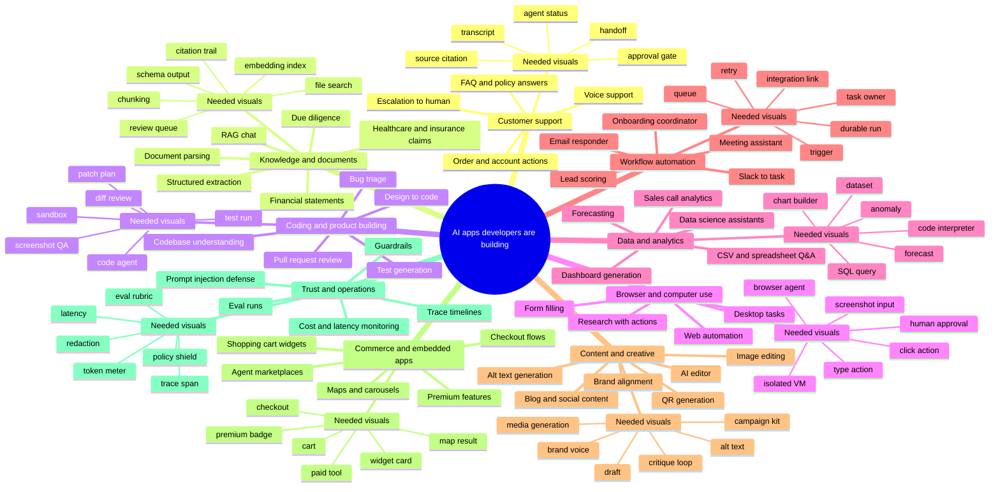

# Supericons AI App Demand Mind Map

Date checked: 2026-06-18

This note uses the `agentic-ai-concepts-001` icon concepts to map what developers are building with AI, then translates those app patterns into icon, image, loader, and work-surface needs for Supericons.

## Research Basis

Official and primary sources reviewed:

- LangChain's State of AI Agents report says customer service is the most common agent use case, followed closely by research and data analysis. It also names quality, latency, security, hallucinations, consistency, and context management as production barriers: https://www.langchain.com/state-of-agent-engineering
- Vercel AI templates include chatbots, AssistLoop customer support, sales call summary agents, browser automation starters, AI editors, alt text generation, image editing, QR generation, and code review helpers: https://vercel.com/templates/ai
- Google ADK sample agents include academic research, customer service, data engineering, data science, deep search, financial advisor, high-volume document analyzer, image scoring, software bug assistant, and time-series forecasting: https://github.com/google/adk-samples
- CrewAI official examples include content creator flows, email auto responders, lead scoring with human review, meeting assistants, and self-evaluation loops: https://github.com/crewAIInc/crewAI-examples
- OpenAI Codex use cases include inbox management, computer use, durable goals, data cleanup/querying, pull request review, UI generation, bug triage, slide decks, Slack-to-task workflows, and onboarding coordination: https://developers.openai.com/codex/use-cases
- OpenAI Apps SDK examples show MCP-backed widgets, shopping carts, carousels, maps, authenticated servers, widget state, and inline UI resources: https://github.com/openai/openai-apps-sdk-examples
- LlamaIndex highlights document parsing, structured extraction, logical splitting, classification, indexing, multi-step document agents, finance, insurance, manufacturing, and healthcare document-heavy workflows: https://www.llamaindex.ai/
- OpenAI Computer Use docs describe agents that operate software through a UI, inspect screenshots, produce actions, run in isolated browsers or VMs, keep humans in the loop, and treat page content as untrusted: https://developers.openai.com/api/docs/guides/tools-computer-use
- OpenAI Voice Agents docs cover browser voice assistants, speech-to-speech sessions, chained voice pipelines, tools, handoffs, guardrails, transcripts, and observability: https://developers.openai.com/api/docs/guides/voice-agents
- OpenAI File Search docs describe assistants using document knowledge, parsing, chunking, vector and keyword search, and financial-statement Q&A: https://developers.openai.com/api/docs/assistants/tools/file-search

## Mind Map

## App Types And Visual Needs

| App type developers are building | What the app does | Icons needed | Images or larger surfaces needed | Supericons opportunity |
| --- | --- | --- | --- | --- |
| Customer support agents | Answer questions, check orders, update accounts, hand off to humans. | `agent-core`, `source-citation`, `approval-gate`, `human-in-loop`, `agent-handoff`, `transcript`, `policy-guardrail`, `tool-call`. | Support console illustration, conversation timeline, escalation panel, customer journey bento. | High-demand free entry plus premium support-agent kit. |
| RAG and internal knowledge apps | Search company docs, cite sources, answer from files, update knowledge bases. | `file-search`, `retrieval-source`, `citation-trail`, `embedding-index`, `chunking`, `context-window`, `context-compaction`, `schema-contract`. | Knowledge base map, document ingestion pipeline, source card thumbnails, before-after extraction images. | A "Knowledge Agent" pack could sell well because nearly every team builds this first. |
| Document intelligence agents | Parse PDFs, extract structured data, classify documents, automate claims or due diligence. | `document-parser`, `structured-extraction`, `table-extraction`, `handwriting-ocr`, `review-queue`, `schema-output`, `confidence-meter`. | Document workflow diagram, finance/insurance/healthcare document bento, review dashboard mock images. | Strong premium pack because document workflows are enterprise-heavy. |
| Coding and product agents | Review PRs, debug, generate UI, turn screenshots into code, triage bugs. | `code-agent`, `patch-plan`, `diff-review`, `test-run`, `bug-triage`, `screenshot-qa`, `sandbox-boundary`, `trace-span`. | Developer workbench hero, pull request review card, before-after UI generation image. | Fits Supericons' developer audience directly. |
| Browser and computer-use agents | Click, type, scroll, inspect screenshots, run in browser or VM, ask approval for risky actions. | `browser-agent`, `computer-use`, `screenshot-input`, `click-action`, `type-action`, `scroll-action`, `isolated-vm`, `approval-gate`. | Browser automation storyboard, action replay timeline, permission review panel. | Differentiated because generic icon libraries do not have this visual grammar. |
| Voice and meeting agents | Run live voice sessions, transcribe, summarize calls, create follow-ups, route across specialists. | `voice-agent`, `live-audio-session`, `transcript`, `speaker-turn`, `barge-in`, `call-summary`, `sentiment-signal`, `handoff`. | Voice waveform panel, meeting recap bento, support call timeline. | Useful for voice startups and support products. |
| Data and analytics agents | Query CSVs, clean data, write SQL, build charts, forecast, analyze sales calls. | `dataset`, `sql-query`, `code-interpreter`, `chart-builder`, `forecast`, `anomaly-detection`, `metric-card`, `data-cleaning`. | Dashboard generation mock, spreadsheet-to-chart flow, sales call summary panel. | Good bundled set with charts, tables, and analysis states. |
| Workflow automation agents | Monitor inboxes, score leads, process meetings, create tasks, coordinate onboarding. | `event-trigger`, `queue-worker`, `task-owner`, `retry-loop`, `durable-run`, `resumable-run`, `integration-link`, `background-agent`. | Automation flow map, Slack/email/CRM generic connector grid, onboarding tracker surface. | Connects AI icons to SaaS automation buyers. |
| Content and creative agents | Draft blogs, align brand voice, edit content, generate alt text, create campaign kits. | `draft`, `brand-voice`, `critique-loop`, `content-calendar`, `alt-text`, `image-prompt`, `media-generation`, `campaign-kit`. | Editorial planner, creative generation carousel, brand review bento. | Can become a premium "AI Creative Ops" set. |
| Commerce and embedded ChatGPT apps | Render widgets, shopping carts, maps, carousels, checkout flows, premium app features. | `widget-card`, `widget-state`, `shopping-cart`, `checkout`, `map-result`, `carousel`, `authenticated-tool`, `premium-badge`. | Interactive widget preview images, marketplace cards, product carousel UI surfaces. | Aligns with preview-panel monetization and affiliate ideas. |
| Trust, evals, and operations | Evaluate outputs, trace runs, detect prompt injection, monitor token cost, redact sensitive data. | `eval-run`, `eval-rubric`, `eval-score`, `trace-timeline`, `prompt-injection-shield`, `token-meter`, `latency-meter`, `sensitive-data-mask`. | Observability dashboard, red-team report card, safety gate workflow. | Enterprise-grade pack with strong willingness to pay. |

## New Icon Gaps To Add To The Backlog

The previous `agentic-ai-concepts-001` list is a strong base. This app-demand pass adds these gaps:

| Icon ID | Name | Why it matters |
| --- | --- | --- |
| `si:source-citation` | Source Citation | RAG apps need visible citation and grounding states. |
| `si:file-search` | File Search | File and document Q&A is one of the most common AI app patterns. |
| `si:document-parser` | Document Parser | Document intelligence needs a parser concept distinct from generic file icons. |
| `si:chunking` | Chunking | RAG pipelines need an icon for splitting content into usable units. |
| `si:embedding-index` | Embedding Index | Vector and semantic search apps need a storage/retrieval symbol. |
| `si:structured-extraction` | Structured Extraction | Extraction agents need an icon for turning messy input into fields. |
| `si:table-extraction` | Table Extraction | Document agents often need to preserve table structure. |
| `si:review-queue` | Review Queue | Human review appears across support, document, lead scoring, and eval flows. |
| `si:patch-plan` | Patch Plan | Coding agents need a plan-before-change state. |
| `si:diff-review` | Diff Review | Pull request and code review agents need a dedicated diff symbol. |
| `si:screenshot-qa` | Screenshot QA | Design-to-code and browser agents need visual verification. |
| `si:screenshot-input` | Screenshot Input | Computer-use agents consume screenshots as first-class input. |
| `si:click-action` | Click Action | Browser/computer-use agents need explicit UI action glyphs. |
| `si:type-action` | Type Action | Same as above, for text entry actions. |
| `si:isolated-vm` | Isolated VM | Computer-use and sandbox products need a containment symbol. |
| `si:live-audio-session` | Live Audio Session | Voice agents need a session-level state icon. |
| `si:speaker-turn` | Speaker Turn | Voice/meeting apps need turn-taking visuals. |
| `si:barge-in` | Barge In | Voice agents need an interruption/overlap state. |
| `si:dataset` | Dataset | Data agents need source data surfaces. |
| `si:sql-query` | SQL Query | Data agents frequently translate language into queries. |
| `si:chart-builder` | Chart Builder | Analytics agents generate visualizations. |
| `si:forecast` | Forecast | Data science and time-series agents need a future trend symbol. |
| `si:anomaly-detection` | Anomaly Detection | Monitoring and analytics products need outlier states. |
| `si:integration-link` | Integration Link | Agent automations connect SaaS tools and workflows. |
| `si:brand-voice` | Brand Voice | Content agents need a brand alignment concept. |
| `si:alt-text` | Alt Text | AI image accessibility tools are common in templates. |
| `si:campaign-kit` | Campaign Kit | Codex and content workflows often generate launch kits. |
| `si:widget-card` | Widget Card | Apps SDK and embedded AI apps need a widget primitive. |
| `si:widget-state` | Widget State | Embedded widgets need a visible state persistence symbol. |
| `si:authenticated-tool` | Authenticated Tool | Apps and MCP servers need login-aware tool calls. |
| `si:premium-badge` | Premium Badge | Useful for paid icons, paid tools, and marketplace surfaces. |
| `si:latency-meter` | Latency Meter | LangChain's report names latency as a major production barrier. |

## Image And Illustration Needs

Icons are only one layer. AI builders also need larger visual assets that explain products quickly.

| Image type | Use in product | Suggested subjects |
| --- | --- | --- |
| Work-surface thumbnails | Cards, templates, marketplace listings, docs landing pages. | Browser agent, code agent, research agent, support agent, data agent, voice agent. |
| Workflow bento images | Pricing pages, onboarding, docs, premium pack previews. | Plan -> tool call -> memory -> output; RAG ingestion; approval gate; eval loop. |
| Empty states | SaaS dashboards and agent workbenches. | No sources yet, no traces yet, no eval runs yet, no automations yet. |
| Security/trust illustrations | Enterprise pages, settings, permissions, approvals. | Sandbox, human review, prompt injection shield, redaction, audit trail. |
| Widget preview images | ChatGPT Apps, MCP directories, agent marketplaces. | Shopping cart, map result, carousel, dashboard card, checkout, authenticated action. |
| Loader families | Premium motion assets. | Thinking, planning, tool use, browsing, code writing, file search, document parsing. |

## Recommended Pack Strategy

1. `agentic-ai-concepts-001`
   Core 72 icons from the non-logo target list.

2. `ai-app-surfaces-001`
   Larger work-surface thumbnails for browser, code, research, support, data, voice, and document agents.

3. `rag-document-agents-001`
   Document parsing, chunking, extraction, citations, tables, review queues, and source cards.

4. `agent-ops-trust-001`
   Guardrails, evals, traces, redaction, latency, token usage, audit logs, and prompt injection defense.

5. `embedded-ai-commerce-001`
   Widget cards, shopping cart, checkout, maps, carousels, authenticated tools, premium badges, paid tools, and agent marketplace visuals.

## Strongest First Build Recommendation

Build a 36-asset app-demand sprint:

- 12 core agent primitives from `agentic-ai-concepts-001`.
- 8 RAG/document icons.
- 6 coding/browser/computer-use icons.
- 5 trust/eval/ops icons.
- 5 work-surface thumbnails.

This gives Supericons both tiny UI primitives and bigger visual surfaces. That matters because developers building AI apps need icons inside the product, but they also need preview images for templates, docs, landing pages, marketplaces, and app cards.
