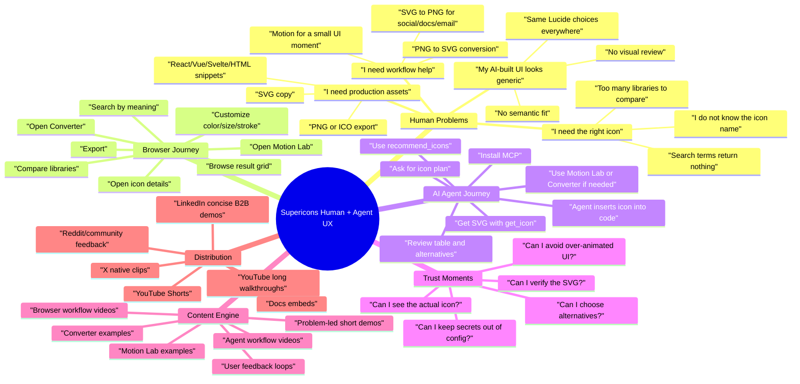

# Supericons Human + AI Agent UX Content Strategy

Date: 2026-05-23

## Purpose

Supericons is not only an icon search site. It is a workflow bridge between a human building an interface and an AI agent writing code. The next growth step should make that bridge obvious.

This plan maps how a human discovers Supericons, understands the browser workflow, connects MCP to an AI coding agent, and then uses Motion Lab and Converter when the work needs motion or asset conversion.

## Verified Product Surface

These facts are from the local product files and current app/MCP code:

- Browser product: search, browse, customize, preview, copy/download SVG, copy Base64, download PNG/ICO, export React/Vue/Svelte/HTML snippets.
- Free icon catalog: 21,264 free icons across 10 libraries, displayed publicly as 20,000+ icons.
- MCP package: `@supericons/mcp@0.4.9`.
- MCP tools: 13 total tools, with 3 free icon tools.
- Free MCP tools: `search_icons`, `recommend_icons`, `get_icon`, plus `list_libraries`.
- Pro MCP workflows: Motion Lab tools and Converter tools.
- Motion Lab: browser and MCP workflow for preset discovery, motion recipes, CSS export, animated SVG export, or bundled animation output.
- Converter: browser and MCP workflow for PNG to SVG, SVG to PNG, input inspection, and conversion settings.

External source notes:

- X Premium supports longer native video uploads for subscribers, with X currently documenting up to 4 hours at 1080p on x.com and iOS, and 10 minutes on Android. Non-subscribers can upload up to 140 seconds.
- X Premium has Basic, Premium, and Premium+ tiers. Buy only the lowest tier that unlocks the posting format you need; do not assume it guarantees reach.
- YouTube currently treats eligible square or vertical videos up to 3 minutes as Shorts.
- LinkedIn’s official video ad spec lists in-stream video ads up to 90 seconds; organic strategy should still favor concise, native uploads for busy B2B/dev audiences.

## Strategic Thesis

The strongest Supericons story is:

> “Stop guessing icon names. Tell Supericons what your UI needs, then use the browser or your AI agent to get usable SVGs, code, motion, or conversions.”

The market pain is not “people need more icons.” The pain is:

- “I do not know what icon name to search.”
- “My AI-generated UI uses generic icons.”
- “I need a consistent set of icons across a whole screen.”
- “I want the SVG/code, not another dependency.”
- “I need to see the icon before trusting the agent.”
- “I need an asset workflow, not just an icon gallery.”

## Mind Map

## Human Journey Map

### Journey 1: “I need one good icon”

Trigger: The user is building a button, nav item, card, dashboard widget, or landing section.

Flow:

1. User searches by concept: “failed payment”, “AI model”, “deployment”, “sold out”, “secure account”.
2. Supericons returns semantically useful candidates, not only exact-name matches.
3. User opens a candidate and checks visual fit.
4. User adjusts size, color, stroke, fill, or export size.
5. User exports SVG, PNG, ICO, Base64, or component code.

Content angle:

- “I searched for `sold out` instead of guessing icon names.”
- “Here are 5 icons that can mean `blocked account`, and why I picked one.”

### Journey 2: “My AI agent needs a consistent icon plan”

Trigger: A human asks Claude Code, Codex, Cursor, OpenCode, or another agent to build a UI.

Flow:

1. Human connects Supericons MCP with `npx -y @supericons/mcp@latest`.
2. Human asks the agent to use `recommend_icons` first.
3. Agent returns a compact icon plan with slot, icon ID, confidence, alternatives, and notes.
4. Human reviews the plan before code changes.
5. Agent retrieves SVGs and places them in the app.

Content angle:

- “Before your agent builds the sidebar, make it choose icons first.”
- “The difference between a generic AI dashboard and a semantic one.”

### Journey 3: “I need to see the icon, not just read an ID”

Trigger: The agent returns a table with IDs, but the human cannot judge visual quality.

Flow:

1. Agent uses `recommend_icons` for the plan.
2. Agent uses `get_icon` for the top choices.
3. Agent renders an HTML preview, markdown preview, or small local gallery when the harness supports it.
4. Human picks the icon visually.

Content angle:

- “Text-only agents can still produce SVG previews if the coding harness can render a file.”
- “Ask your agent to create a one-page icon contact sheet before choosing.”

Product implication:

- Add a documented “visual review prompt” for agents.
- Consider a future `preview_icon_plan` helper that returns compact HTML or SVG sprites for humans.

### Journey 4: “I want a small animation, but not noisy UI”

Trigger: The user wants a hover cue, success moment, loading state, or onboarding accent.

Flow:

1. User opens Motion Lab from a selected icon.
2. User previews presets.
3. User chooses CSS or animated SVG depending on integration.
4. User exports only if motion improves the interface.

Content angle:

- “Motion Lab is not for making everything wiggle. It is for giving one UI moment a job.”
- “Three motion presets I would use, and three I would reject.”

### Journey 5: “I have the wrong asset format”

Trigger: User has a PNG logo/icon and needs SVG, or has SVG and needs PNG for docs/social/email.

Flow:

1. User opens Converter.
2. For PNG to SVG, they inspect whether the source is traceable.
3. For SVG to PNG, they choose target width and background.
4. User previews before download.

Content angle:

- “Do not trace every PNG. Here is when PNG-to-SVG works.”
- “Turn an SVG into a clean PNG for docs, decks, or social cards.”

## Video Content Pillars

### Pillar A: Problem-Led Search

Goal: Show that Supericons solves “I do not know the icon name.”

Video ideas:

1. “Stop searching exact icon names”
   - Hook: “I needed a sold-out icon. Searching `sold out` in most icon sites fails.”
   - Demo: Search concept, compare results, export.
   - CTA: “Try a real UI concept, not an icon name.”

2. “Find icons by UI job”
   - Hook: “An icon should do a job, not just look familiar.”
   - Demo: Search “secure account”, “payment failed”, “deployment”, “monitoring”.
   - CTA: “Use meaning first, library second.”

3. “Compare libraries without hopping sites”
   - Hook: “Lucide, Tabler, Phosphor, MingCute, Material, all in one search.”
   - Demo: Same query across libraries.
   - CTA: “Pick style after meaning.”

### Pillar B: AI Agent Workflows

Goal: Teach humans how to make agents use icons better.

Video ideas:

1. “Make your AI agent choose icons before coding”
   - Hook: “Do not let the agent randomly pick icons.”
   - Demo: Prompt agent to call `recommend_icons`.
   - Show: table with slot, icon ID, confidence, alternatives.
   - CTA: “Ask for an icon plan first.”

2. “Build an ecommerce admin sidebar with Tabler icons”
   - Hook: “Products, orders, cart, returns, payments: one MCP call.”
   - Demo: `recommend_icons` plan, then `get_icon` for chosen SVGs.
   - CTA: “Use the plan before inserting icons.”

3. “How to visually review agent-picked icons”
   - Hook: “The table is not enough. You need to see the shapes.”
   - Demo: Agent creates a local HTML preview grid from SVGs.
   - CTA: “Ask for a preview sheet.”

### Pillar C: Browser-to-Code

Goal: Make the browser app feel immediately useful even without MCP.

Video ideas:

1. “Find, customize, export in 60 seconds”
   - Demo: Search, color, stroke, SVG, PNG, React export.
   - CTA: “Use the browser when you want control.”

2. “From icon idea to React component”
   - Demo: Search icon, customize, export React/Vue/Svelte/HTML.
   - CTA: “No extra dependency required.”

3. “Batch icon export”
   - Demo: Multi-select and export multiple SVG/PNG assets.
   - CTA: “Make a small icon set for a screen.”

### Pillar D: Motion Lab

Goal: Position motion as judgment, not decoration.

Video ideas:

1. “Animate one icon without making the UI annoying”
   - Demo: Select icon, open Motion Lab, compare subtle presets.
   - CTA: “Animate only where motion earns its place.”

2. “CSS vs animated SVG”
   - Demo: Show when to export CSS and when to export a self-contained animated SVG.
   - CTA: “Choose based on integration surface.”

3. “Agent-guided Motion Lab”
   - Demo: Agent calls `list_motion_presets`, `get_motion_recipe`, then exports.
   - CTA: “Ask the agent to justify the preset before exporting.”

### Pillar E: Converter

Goal: Turn Converter into a practical asset rescue workflow.

Video ideas:

1. “PNG to SVG: when it works and when it does not”
   - Demo: Good flat icon versus bad photo/gradient input.
   - CTA: “Inspect first, trace second.”

2. “SVG to PNG for docs and social”
   - Demo: Convert SVG to PNG at target width with background.
   - CTA: “Export the right size for the real surface.”

3. “Agent preflights a PNG before converting”
   - Demo: MCP `inspect_converter_input`, recommended settings, then conversion.
   - CTA: “Let the agent inspect before it converts.”

## Recommended First Video Series

Build these in order. Each should produce a short clip, a longer walkthrough, and a reusable prompt snippet.

### Week 1: Make the Core Promise Obvious

1. Short: “Stop guessing icon names”
2. Short: “Ask your agent for an icon plan first”
3. Long: “Supericons in 7 minutes: browser + MCP”
4. Post: “I built Supericons because icon search breaks when you do not know the icon name.”

### Week 2: Prove the Agent Workflow

1. Short: “Ecommerce admin sidebar with `recommend_icons`”
2. Short: “Make an HTML preview sheet from MCP SVGs”
3. Long: “From prompt to UI icons: using Supericons MCP in a coding agent”
4. Post: “Prompt template: ask your agent to plan icons before editing code.”

### Week 3: Show Asset Workflows

1. Short: “SVG export, PNG export, React export”
2. Short: “PNG to SVG: good input vs bad input”
3. Long: “Supericons as an asset workflow: search, customize, convert”
4. Post: “The fastest way to turn an icon idea into production SVG.”

### Week 4: Show Motion Taste

1. Short: “One subtle icon animation”
2. Short: “CSS vs animated SVG”
3. Long: “Motion Lab: when to animate and when to say no”
4. Post: “Good motion has a job.”

## Video Formats

### 30 to 60 second clips

Use for X, YouTube Shorts, and LinkedIn.

Structure:

1. 0-3s: pain hook.
2. 3-10s: show the failed/common path.
3. 10-35s: show Supericons solving it.
4. 35-50s: show output in code/browser.
5. 50-60s: prompt or CTA.

### 3 to 8 minute demos

Use for YouTube and docs embeds.

Structure:

1. Problem.
2. Browser solution.
3. MCP solution.
4. Human review point.
5. Final output.
6. Prompt users to try with their own UI.

### 15 to 25 minute deep dives

Use sparingly. Good for launch weeks or Pro workflows.

Topics:

- “Browser vs MCP: when to use each.”
- “How to make AI agents choose better icons.”
- “Motion Lab and Converter as a design engineering workflow.”

## X Subscription Recommendation

Buy an X subscription only if you will post native videos consistently for at least 30 days.

Recommended approach:

1. Start with the lowest X Premium tier that unlocks longer native video uploads on the platform you will use.
2. Use x.com for uploads when possible because X documents longer limits there than Android.
3. Do not buy Premium+ for this phase unless you have a separate reason. The content risk is not solved by a higher tier.
4. Measure whether X gives useful feedback, replies, DMs, or site clicks. If not, move effort toward YouTube and developer communities.

Why:

- X can host longer native videos for subscribers.
- But reach is not guaranteed by subscription.
- Supericons needs proof, comments, and user feedback more than passive impressions.

## Feedback Collection Plan

### Feedback channels

- X replies and quote posts.
- YouTube comments.
- LinkedIn comments from designers/developers.
- Reddit posts in webdev/react/frontend communities, only when the post is genuinely useful.
- Direct docs feedback link.
- Short “What did your agent get wrong?” form.

### Feedback prompts

Use questions that reveal workflow pain:

- “What icon did you try to find that normal search could not find?”
- “What icon did your AI agent choose badly?”
- “Would you trust an agent icon plan if it included SVG previews?”
- “Do you prefer browser search first, or MCP first?”
- “Where did setup fail?”
- “Would Motion Lab help your UI, or is it too much?”
- “What file conversion do you keep doing manually?”

### Feedback tags

Track every feedback item under one primary tag:

- Search relevance
- Icon alternatives
- Visual preview
- Agent setup
- Agent output quality
- Browser export
- Motion Lab
- Converter
- Pricing/access
- Docs confusion

## Product Improvements Suggested By This Strategy

These are not required before posting, but they would make the content stronger.

1. Add an “Agent visual review” docs section.
   - Prompt: “Use Supericons MCP to recommend icons, then create a local HTML preview grid with the SVGs.”

2. Add a `recommend_icons` demo page.
   - Let humans paste a slot list and see recommended icons visually.

3. Add sample MCP prompts beside each browser workflow.
   - Browser search page: “Use MCP to find this icon.”
   - Motion Lab page: “Ask your agent to compare presets.”
   - Converter page: “Ask your agent to inspect this image first.”

4. Add downloadable starter prompts.
   - News app icons
   - Ecommerce admin
   - AI dashboard
   - Editor toolbar
   - Security/auth flows

5. Add “known harness behavior” docs.
   - Which agents display SVG directly.
   - Which agents need an HTML preview file.
   - Which agents only show text tables.

## Content Production Workflow

### One video batch

1. Pick one user problem.
2. Write a 5-line script.
3. Record browser demo or MCP demo.
4. Export one vertical clip and one landscape version.
5. Add a short caption with the exact prompt.
6. Post on X, YouTube, and LinkedIn.
7. Log replies and questions.
8. Turn repeated questions into docs or product fixes.

### Naming convention

Use filenames like:

- `supericons-001-stop-guessing-icon-names.mp4`
- `supericons-002-agent-icon-plan-mcp.mp4`
- `supericons-003-visual-preview-grid.mp4`

### Measurement

Track weekly:

- Videos posted
- Comments/replies
- Meaningful feedback items
- Website clicks
- MCP install attempts
- NPM downloads
- Docs page visits
- User-reported setup failures
- Product issues discovered

## 30-Day Execution Plan

### Days 1-3: Prepare assets

- Create a branded video template.
- Create example projects: ecommerce admin, AI dashboard, editor toolbar.
- Write 10 reusable MCP prompts.
- Make a one-page feedback form.

### Days 4-10: Publish core workflow

- Post 4 short clips.
- Post 1 long walkthrough.
- Add docs links to video captions.
- Ask for one specific feedback question per post.

### Days 11-20: Publish agent workflow

- Post 4 MCP clips.
- Post 1 “agent preview grid” walkthrough.
- Share copy-paste prompts.
- Track where agents misunderstand setup or output.

### Days 21-30: Publish Pro workflow

- Post 2 Motion Lab clips.
- Post 2 Converter clips.
- Post 1 “browser + MCP + Pro workflows” walkthrough.
- Decide whether the next product sprint should improve visual preview, setup docs, or recommendation quality.

## First Five Scripts

### Script 1: Stop guessing icon names

Hook:

> “Icon search is annoying because you often do not know the icon name.”

Demo:

- Search “sold out”.
- Show candidates.
- Pick one.
- Export SVG.

CTA:

> “Search by what the UI means, not by what the icon might be called.”

### Script 2: Ask your AI agent for an icon plan

Hook:

> “Before your AI agent builds a dashboard, make it choose icons first.”

Demo:

- Prompt agent with ecommerce admin slots.
- Show `recommend_icons` output.
- Highlight alternatives and confidence.

CTA:

> “Ask for the icon plan before code changes.”

### Script 3: Human visual review

Hook:

> “A table of icon IDs is not enough. You need to see the shapes.”

Demo:

- Agent gets SVGs.
- Agent creates local preview grid.
- Human chooses final icons.

CTA:

> “Tell your agent to make an icon preview sheet.”

### Script 4: Motion with restraint

Hook:

> “Motion should earn its place.”

Demo:

- Open Motion Lab.
- Compare a noisy preset and a subtle one.
- Export CSS or animated SVG.

CTA:

> “Use motion for one UI moment, not everything.”

### Script 5: Converter as asset rescue

Hook:

> “Sometimes the problem is not the icon. It is the file format.”

Demo:

- PNG to SVG preview.
- SVG to PNG export.
- Explain when not to trace.

CTA:

> “Inspect first, convert second.”

## Immediate Next Step

Create the first launch batch:

1. One 60-second browser video: “Stop guessing icon names.”
2. One 60-second MCP video: “Ask your agent for an icon plan.”
3. One 6-minute walkthrough: “Supericons browser + MCP.”
4. One feedback post: “What icon did you fail to find this week?”

This is the smallest useful campaign because it tests the two core promises: human search and agent-assisted UI building.

## Sources

- X Help: longer videos for Premium subscribers: https://help.x.com/en/using-twitter/blue-longer-videos
- X Help: Premium tiers: https://help.x.com/en/using-x/x-premium
- YouTube Help: three-minute Shorts: https://support.google.com/youtube/answer/15424877
- LinkedIn Help: video ad specifications: https://www.linkedin.com/help/linkedin/answer/a424737/video-ads-advertising-specifications
- Reddit demand signal: exact icon names are hard to know: https://www.reddit.com/r/webdev/comments/1q6rdxe/we_just_opensourced_our_icon_library_1135_icons/
- Reddit demand signal: semantic icon search in React icons: https://www.reddit.com/r/reactjs/comments/1kxot9u/is_there_a_semantic_search_engine_for_finding_icons_within_reacticons/
