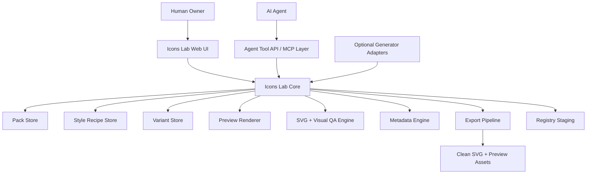

# Supericons Icons Lab PRD, Architecture, And Prototype Blueprint

Date: 2026-06-19

## Product Thesis

Icons Lab is a human-and-agent design workbench for producing original, programmatic icons and design elements for the agentic AI era.

The core idea is not "type a prompt, get an icon." The core idea is a controlled production system where a human owner sets taste, direction, constraints, and approval, while AI agents help research concepts, propose metaphors, generate variants, clean SVGs, test consistency, write metadata, and export production-ready packs.

Icons Lab should make Supericons faster at creating original icon libraries while preserving what makes good icon systems valuable: clarity, symmetry, consistency, editability, visual balance, small-size legibility, and a bit of artistic spark.

## Evidence Basis

Checked local inputs:

- `docs/supericons-icon-lab-research-2026-06-19.md`
- `docs/supericons-agentic-ai-non-logo-icon-targets-2026-06-18.md`
- `docs/supericons-ai-app-demand-mind-map-2026-06-18.md`
- Current Supericons logo pack: `data/supericons/icon-library/agentic-ai-tools-logos-001`

Relevant verified direction from those notes:

- The current Supericons custom library has 50 logo icons, but not yet the original non-logo concepts needed by AI app builders.
- Apple Icon Composer reinforces a document-based icon workflow with layered source, previews, appearance modes, and export paths.
- Recraft reinforces batch generation, reusable style, prompt structure, and set-level consistency.
- Magnific reinforces variation review, SVG export, SVG editing, and clear object/style/feel prompting.
- The next Supericons-native opportunity is agentic AI concepts: tool calls, context compaction, handoffs, guardrails, trace spans, evals, token meters, loaders, and work surfaces.

## Problem Statement

Creating logos was relatively easy because the visual target already existed. Creating original agentic AI icons is harder because:

- Many concepts are abstract, such as context compaction, handoff, eval run, tool call, memory checkpoint, and prompt injection.
- AI-generated icons can look attractive but inconsistent across a pack.
- Generic icon libraries do not yet have a deep visual grammar for agentic AI software.
- Human designers need direct manipulation, preview, and export control.
- Agents need structured APIs and constraints, not a blank canvas with vague instructions.
- Supericons needs repeatable production, not one-off art experiments.

## Target Users

Primary user:

- The Supericons human owner or designer creating original icon packs with an AI agent partner.

Secondary users:

- AI coding agents that need to create, edit, inspect, and export icons through a structured tool surface.
- Future pro users who may want to create custom icon packs or design elements for their own apps.
- Developers building AI products who need icons, loaders, bento cards, and design elements that match agentic software concepts.

## Jobs To Be Done

1. When I want to create a new icon pack, I want to define a style recipe and concept list so every icon has a consistent visual foundation.
2. When an agent proposes icon ideas, I want to review the metaphor, visual direction, and variants before anything enters the library.
3. When an icon is generated or sketched, I want to inspect it at real UI sizes so I can catch weak silhouettes and inconsistent strokes early.
4. When a pack is ready, I want clean SVGs, previews, metadata, and registry records without manual cleanup chaos.
5. When an agent works in the lab, I want it to use structured tools, observe constraints, and leave every asset in a reviewable draft state until I approve it.

## Goals

- Build a repeatable icon-production system for Supericons-native assets.
- Support human-led, agent-assisted creation of icons, loaders, bento surfaces, and design elements.
- Preserve strict visual consistency across a pack.
- Give agents a clear, tool-based interface for creating and editing icon projects.
- Give the human owner full control over style, variants, approvals, export, and library publishing.
- Create a first proof pack for agentic AI primitives.

## Non-Goals

- Do not clone Apple Icon Composer, Recraft, Magnific, or any proprietary tool.
- Do not create a general-purpose AI image generator in the first version.
- Do not publish unreviewed generated icons directly to Supericons.
- Do not embed affiliate links or commerce data inside portable SVGs.
- Do not depend on one generation provider as the permanent architecture.
- Do not ship advanced collaborative multi-user editing in the first prototype.

## Product Principles

1. Human taste is the source of authority.
   Agents can suggest, generate, critique, and clean up, but approval belongs to the human owner.

2. Style recipes beat one-off prompts.
   Every icon belongs to a pack-level system: grid, stroke, visual density, palette, metaphor language, and export rules.

3. Packs are the production unit.
   Single icons can be edited, but value comes from coherent sets.

4. SVG must stay useful.
   Prefer editable strokes, `currentColor`, clean viewBox, simple paths, and predictable variants.

5. QA is a creative tool.
   Small-size previews, contrast checks, optical balance, and pack consistency should guide design decisions, not only block export at the end.

6. Agent actions should be structured.
   Agents need API tools for briefs, variants, rendering, QA, metadata, and export. They should not need to improvise file operations.

7. Design elements go beyond icons.
   Icons Lab should support static icons, state icons, animated loaders, badges, bento tiles, workflow glyphs, and UI work-surface illustrations.

## Scope: MVP

The MVP should create and manage one internal proof pack:

```text
packId: agentic-ai-core-kit-001
targetCount: 12
styleRecipe: agentic-ai-core-v1
defaultAssetType: static_icon, workflow_icon, state_icon
```

First 12 concepts:

1. `si:agent-core`
2. `si:tool-call`
3. `si:tool-result`
4. `si:context-window`
5. `si:context-compaction`
6. `si:memory-checkpoint`
7. `si:agent-handoff`
8. `si:approval-gate`
9. `si:policy-guardrail`
10. `si:trace-span`
11. `si:eval-run`
12. `si:token-meter`

## Functional Requirements

### FR1. Pack Workspace

Icons Lab must support a pack workspace with:

- Pack name, ID, status, access tier, and description.
- A concept backlog.
- A shared style recipe.
- Draft, review, approved, exported, and archived states.
- Pack-level consistency score and QA summary.

Acceptance signal:

- A user can open `agentic-ai-core-kit-001` and see every concept, status, variant count, QA state, and export readiness.

### FR2. Style Recipe Editor

Icons Lab must support reusable style recipes with:

- Canvas and viewBox size.
- Stroke width, cap, join, and corner behavior.
- Fill mode rules.
- Palette and color role rules.
- Visual density rules.
- Symmetry and optical balance preferences.
- Detail limits.
- Allowed variants.
- Export rules.

Acceptance signal:

- An agent or human can apply `agentic-ai-core-v1` to all 12 concepts and every QA check can reference that recipe.

### FR3. Concept Brief Builder

Icons Lab must support structured concept briefs:

- Icon ID.
- Name.
- Concept.
- User interface use case.
- Primary metaphor.
- Avoided metaphors.
- Search terms.
- Related icons.
- Asset type.
- Priority.

Acceptance signal:

- `si:context-compaction` has a clear brief that explains it as a wide context/thread compressing into a compact summary, with avoided metaphors such as generic archive, zip file, or minimize button.

### FR4. Human-Agent Creation Loop

Icons Lab must let an agent:

- Read a pack and style recipe.
- Propose metaphors.
- Generate or import SVG candidates.
- Create variants.
- Run QA.
- Suggest metadata.
- Prepare export drafts.

The human owner must be able to:

- Approve or reject a metaphor.
- Select a variant.
- Edit SVG/layer properties.
- Override tags and metadata.
- Mark an icon approved.
- Export the pack.

Acceptance signal:

- No agent-created asset can become library-approved without a human approval state.

### FR5. Variant Board

Each concept must have a variant board showing:

- Candidate thumbnails.
- Source type: manual, generated, imported, refined.
- Variant type: outline, filled, mono, duotone, animated, work-surface.
- QA results.
- Human notes.
- Agent suggestions.
- Approval controls.

Acceptance signal:

- A user can compare four variants of `si:tool-call` at 16, 24, 32, and 48 px without leaving the board.

### FR6. Layer And SVG Editor

Icons Lab must provide practical editing controls:

- ViewBox inspector.
- Layer list.
- Path or stroke mode indicator.
- Stroke width and cap controls when editable.
- Color role mapping.
- Alignment and centering helpers.
- Grid overlay.
- Safe area overlay.
- Simplify and normalize actions.

Acceptance signal:

- A user can adjust stroke weight, align the icon optically, and export a clean SVG that still uses `currentColor`.

### FR7. Visual QA Matrix

Icons Lab must render every variant across:

- 16 px.
- 20 px.
- 24 px.
- 32 px.
- 48 px.
- 128 px.
- Light background.
- Dark background.
- Warm neutral background.
- Cool neutral background.
- Transparent checkerboard.

QA must include:

- Stroke consistency.
- ViewBox bounds.
- Empty margin.
- Contrast.
- Path count.
- Raster embed detection.
- Hidden text detection.
- Unsupported filter/mask warning.
- Pack-level visual density comparison.

Acceptance signal:

- A candidate with a raster image embedded in SVG is flagged before export.

### FR8. Programmatic Agent API

Icons Lab must expose an agent-friendly API surface through app internals and later MCP.

Initial tool concepts:

```text
icons_lab.list_packs
icons_lab.get_pack
icons_lab.create_concept
icons_lab.update_concept_brief
icons_lab.propose_metaphors
icons_lab.add_svg_variant
icons_lab.render_variant_previews
icons_lab.run_variant_qa
icons_lab.compare_pack_consistency
icons_lab.suggest_metadata
icons_lab.prepare_export
icons_lab.request_human_review
```

Acceptance signal:

- An agent can create a draft variant and request review without direct filesystem edits.

### FR9. Export Pipeline

Icons Lab must export:

- Clean SVG.
- Optional variant SVGs.
- Preview PNGs.
- Pack manifest.
- Registry-ready metadata.
- Internal source package.

Acceptance signal:

- The 12-icon proof pack can export to a staging folder without modifying the public registry until approved.

### FR10. Public-Safe Metadata

Icons Lab must keep public outputs focused on icon/product data:

- Name.
- Description.
- Asset type.
- Category.
- Search aliases.
- Use cases.
- Variants.
- Access tier.
- Source links where relevant.

It must not include internal AI process metadata in public registry records.

Acceptance signal:

- Exported public metadata contains no fields such as model names, hidden prompts, internal review notes, or private confidence rationale.

## System Architecture



### Frontend Layers

1. Workspace shell
   - Pack navigation.
   - Concept grid.
   - Status filters.

2. Concept studio
   - Brief panel.
   - Variant board.
   - Preview matrix.
   - QA panel.
   - Metadata panel.

3. SVG editor
   - Canvas.
   - Layers.
   - Grid overlays.
   - Style controls.
   - Export preview.

4. Pack review
   - Consistency dashboard.
   - Side-by-side icons.
   - Status transitions.
   - Export readiness.

5. Agent activity panel
   - Proposed changes.
   - Pending review requests.
   - Human approval controls.

### Backend / Core Modules

1. Pack service
   - Owns pack definitions, concept lists, statuses, and dependencies.

2. Style service
   - Owns reusable style recipes and validation rules.

3. Variant service
   - Stores SVG candidates, variant metadata, source type, and lineage.

4. Render service
   - Produces preview PNGs and thumbnails at required sizes.

5. QA service
   - Runs static SVG checks and visual checks.

6. Metadata service
   - Suggests aliases, categories, use cases, and export-ready metadata.

7. Agent tool service
   - Exposes structured operations to AI agents.

8. Export service
   - Writes clean assets to staging and produces pack manifests.

## Source Package Format

Use a Supericons-native package format. Do not copy Apple's `.icon` format.

```text
*.siicon/
  icon.json
  brief.md
  style.json
  layers/
    base.svg
    accent.svg
  variants/
    outline.svg
    filled.svg
    mono.svg
  previews/
    16-light.png
    16-dark.png
    24-light.png
    24-dark.png
    48-light.png
    128-light.png
  qa.json
  export/
    clean.svg
```

Pack-level source:

```text
*.sipack/
  pack.json
  style-recipes/
    agentic-ai-core-v1.json
  concepts/
    agent-core.siicon/
    tool-call.siicon/
    context-compaction.siicon/
  review/
    pack-consistency.json
  export/
    manifest.json
    svg/
    previews/
```

## Data Model Draft

### Pack

```json
{
  "id": "agentic-ai-core-kit-001",
  "name": "Agentic AI Core Kit",
  "description": "Original icons for agentic AI product interfaces.",
  "status": "draft",
  "styleRecipeId": "agentic-ai-core-v1",
  "targetCount": 12,
  "assetTypes": ["static_icon", "workflow_icon", "state_icon"],
  "accessTier": "premium_candidate"
}
```

### Style Recipe

```json
{
  "id": "agentic-ai-core-v1",
  "viewBox": "0 0 24 24",
  "strokeWidth": 1.5,
  "strokeLinecap": "round",
  "strokeLinejoin": "round",
  "fillMode": "none-by-default",
  "colorMode": "currentColor",
  "minMargin": 2,
  "maxPathCount": 12,
  "visualDensity": "medium",
  "cornerLanguage": "soft-geometric",
  "allowedVariants": ["outline", "filled", "mono", "animated"]
}
```

### Concept

```json
{
  "id": "si:agent-handoff",
  "packId": "agentic-ai-core-kit-001",
  "name": "Agent Handoff",
  "assetType": "workflow_icon",
  "concept": "One agent transfers task ownership or context to another specialist agent.",
  "primaryMetaphor": "context capsule moving from one agent node to another",
  "avoidMetaphors": ["generic share arrow", "file transfer", "sports baton"],
  "searchTerms": ["agent handoff", "handoff", "delegate", "specialist agent"],
  "status": "brief_ready"
}
```

### Variant

```json
{
  "id": "variant_agent_handoff_outline_001",
  "conceptId": "si:agent-handoff",
  "variantType": "outline",
  "sourceType": "agent_generated_draft",
  "svgPath": "variants/outline.svg",
  "strokeEditable": true,
  "qaStatus": "needs_review",
  "humanApproval": "pending"
}
```

### QA Result

```json
{
  "variantId": "variant_agent_handoff_outline_001",
  "checks": {
    "viewBox": "pass",
    "currentColor": "pass",
    "strokeWidth": "pass",
    "rasterEmbeds": "pass",
    "hiddenText": "pass",
    "pathCount": "warn",
    "smallSizeLegibility": "review"
  },
  "summary": "Technically valid; needs human review for 16px clarity."
}
```

## UX Blueprint

### Primary Navigation

1. Packs
2. Style Recipes
3. Concept Backlog
4. Review Queue
5. Exports
6. Settings

### Screen 1: Pack Dashboard

Purpose:

- Show all icon packs and their production state.

Primary action:

- Create pack.

Key UI:

- Pack table or dense grid.
- Status chips.
- Progress count.
- QA readiness.
- Export readiness.

States:

- Empty: prompt to create the first pack.
- Loading: skeleton rows with pack names hidden until loaded.
- Error: retry and show local file/API issue.
- Blocked: missing storage path or permission.

### Screen 2: Pack Workspace

Purpose:

- Manage one icon pack end to end.

Primary action:

- Add concept or open next review item.

Key UI:

- Left concept list.
- Center concept/variant board.
- Right style and QA summary.
- Top pack status bar.

States:

- Empty pack: show concept import or manual add.
- Draft pack: show concept statuses.
- Review pack: prioritize pending human decisions.
- Export-ready pack: show export CTA.

### Screen 3: Concept Studio

Purpose:

- Define and refine one icon concept.

Primary action:

- Generate or add variant.

Key UI:

- Brief editor.
- Metaphor candidates.
- Variant grid.
- Preview matrix.
- QA panel.
- Metadata panel.

States:

- No brief: ask for concept, use case, and metaphor.
- Brief ready: show generate/import actions.
- Variants available: show comparison.
- Approved: lock the chosen production variant unless reopened.

### Screen 4: SVG Editor

Purpose:

- Directly manipulate and normalize the selected variant.

Primary action:

- Save refined variant.

Key UI:

- Main canvas with grid and safe area.
- Layer list.
- Style controls.
- Path/stroke inspector.
- Live small-size strip.

States:

- Editable SVG: full controls.
- Flattened SVG: limited controls and conversion suggestions.
- Invalid SVG: show parsing error and recovery action.

### Screen 5: Review Queue

Purpose:

- Let the human owner approve agent work quickly.

Primary action:

- Approve selected variant.

Key UI:

- Queue of pending items.
- Before/after preview.
- Agent proposal summary.
- QA warnings.
- Approve, request changes, reject.

States:

- Empty queue: no pending reviews.
- Warning-heavy queue: group by severity.
- Blocked item: missing brief, missing SVG, failed QA, or unresolved license/source concern.

### Screen 6: Export Center

Purpose:

- Prepare assets for Supericons registry and product use.

Primary action:

- Export to staging.

Key UI:

- Export checklist.
- Public metadata preview.
- SVG file list.
- Preview image list.
- Pack manifest preview.

States:

- Not ready: show blocking checks.
- Ready: show export action.
- Export success: link to staging folder.
- Export failed: show exact failed step.

## Agent Workflow Framework

Agents should work through explicit tasks:

1. Research
   - Read concept brief and references.
   - Suggest metaphors and avoided metaphors.

2. Draft
   - Create SVG candidates or propose manual sketch instructions.
   - Save variants as draft.

3. Normalize
   - Clean viewBox, strokes, colors, path complexity, and metadata.

4. Test
   - Render previews.
   - Run QA.
   - Compare against style recipe and pack peers.

5. Explain
   - Summarize what changed.
   - Identify tradeoffs.
   - Request human review.

6. Export
   - Only after human approval.
   - Prepare staging outputs.

Agent permission model:

- Agents can create drafts.
- Agents can edit draft variants.
- Agents can run QA.
- Agents can suggest metadata.
- Agents can prepare exports.
- Agents cannot approve final assets.
- Agents cannot publish to public registry without explicit human action.

## Visual Design Framework

### Grid And Geometry

- Default canvas: 24 x 24.
- Safe area: 2 px margin by default.
- Main shapes should align to the grid but allow optical corrections.
- Use symmetry where it clarifies the concept.
- Break symmetry only for motion, direction, or meaning.

### Stroke And Shape

- Default stroke: 1.5 px.
- Rounded caps and joins.
- Avoid hairline detail that disappears at 16 px.
- Keep path count low.
- Prefer editable stroke icons for UI use.
- Use filled variants only when they add clarity or premium value.

### Metaphor System

Reusable agentic primitives:

- Agent node.
- Tool socket.
- Context capsule.
- Memory chip.
- Checkpoint marker.
- Guardrail path.
- Trace span.
- Output card.
- Evaluation mark.
- Token block.
- Human approval dot.

These primitives should repeat across icons so the library feels like a language, not a collection of unrelated drawings.

### Artistic Flair

Supericons should not be sterile. Artistic flair should appear through:

- Confident silhouettes.
- Gentle asymmetry where it improves meaning.
- Clever negative space.
- Small secondary marks that clarify function.
- Consistent motion language for loaders.
- Premium bento compositions for larger design elements.

Flair should never undermine recognizability at small sizes.

## Design Element Types

Icons Lab should support these asset types:

| Type | Description | Example |
| --- | --- | --- |
| `static_icon` | Standard UI icon. | `agent-core` |
| `workflow_icon` | Icon showing action or transition. | `agent-handoff` |
| `state_icon` | Status or condition icon. | `approval-gate` |
| `animated_loader` | Motion icon for waiting or active work. | `thinking-loader` |
| `badge` | Small overlay or label mark. | `premium-agent` |
| `bento_tile` | Larger product/design surface. | `workflow-bento` |
| `work_surface` | Mini illustration for UI, docs, or empty states. | `browser-agent` |
| `diagram_glyph` | Reusable node or connector for diagrams. | `tool-socket` |

## Prototype Plan

### Prototype 0: Files And CLI

Goal:

- Prove the source format, style recipe, SVG QA, and export staging without UI.

Build:

- `*.sipack` folder.
- `*.siicon` folders.
- `style.json`.
- `qa.json`.
- Script to render previews.
- Script to run SVG checks.
- Script to export clean SVG and manifest.

Success:

- One concept can move from brief to clean exported SVG through the file pipeline.

### Prototype 1: Web Workbench

Goal:

- Human can review and manipulate icon drafts visually.

Build:

- Pack dashboard.
- Pack workspace.
- Concept studio.
- Variant board.
- Preview matrix.
- QA panel.

Success:

- Human can approve one icon variant from inside the UI.

### Prototype 2: Agent Tool Layer

Goal:

- AI agents can use Icons Lab through structured calls.

Build:

- Local tool API.
- Later MCP wrapper.
- Agent-safe draft operations.
- Human review request workflow.

Success:

- An agent creates a draft SVG variant, runs QA, and requests review without direct registry edits.

### Prototype 3: First Proof Pack

Goal:

- Build `agentic-ai-core-kit-001`.

Build:

- 12 concepts.
- 12 approved outline SVGs.
- Small-size previews.
- Registry staging manifest.
- Pack consistency report.

Success:

- The pack is visually coherent enough to become the foundation for larger Supericons-native sets.

## Success Metrics

Primary metric:

- Time from approved concept brief to export-ready SVG pack.

Supporting metrics:

- Percent of icons passing SVG QA on first review.
- Percent of icons approved without full redraw.
- Pack consistency score.
- Average number of variants per approved icon.
- Small-size legibility pass rate.
- Search metadata completeness.

Guardrail metrics:

- Number of public exports containing internal/private process metadata.
- Number of SVGs with raster embeds or hidden text.
- Number of icons needing emergency metadata cleanup.
- Number of agent-created assets published without human approval.

## Risks And Mitigations

| Risk | Why it matters | Mitigation |
| --- | --- | --- |
| Generated icons look attractive but inconsistent. | Pack quality collapses. | Style recipes, pack-level QA, variant board, human approval. |
| Abstract concepts are visually unclear. | Icons do not help users. | Concept briefs must include use case, metaphor, avoided metaphors, and small-size testing. |
| SVGs become messy and hard to edit. | Product utility drops. | SVG normalization, path-count checks, stroke-editable preference. |
| Agents bypass human taste. | Library quality and trust suffer. | Draft-only agent permissions and explicit approval gates. |
| Tool becomes too broad too early. | MVP slows down. | Start with one 12-icon proof pack. |
| Public metadata leaks process details. | Product artifacts become messy or unsafe. | Public-safe export schema and metadata verification. |
| Licensing/source ambiguity. | Legal and brand risk. | Track source type and avoid using third-party generated outputs without clear rights. |

## Open Questions

1. Should Icons Lab be internal-only first, or should it be designed as a future Pro feature from day one?
2. Should the first renderer use browser SVG rendering, Resvg, or both?
3. Should source packages live in `data/supericons/icon-lab/`, `premium/icon-lab/`, or a new top-level `icon-lab/` folder?
4. Which generation provider should be supported first, if any, after the manual/CLI pipeline works?
5. Should animated loaders export as animated SVG, CSS animation, Lottie, or all three?
6. What is the minimum pack consistency score required before export?
7. Should bento tiles be part of the MVP or start in the second pack?

## Recommended Next Step

Build Prototype 0 first:

```text
data/supericons/icon-lab/packs/agentic-ai-core-kit-001.sipack/
```

Create:

- Pack manifest.
- `agentic-ai-core-v1` style recipe.
- 12 concept briefs.
- SVG QA script.
- Preview rendering script.
- Export staging script.

This gives both the human owner and future agents a real production surface before we invest in the full UI.
