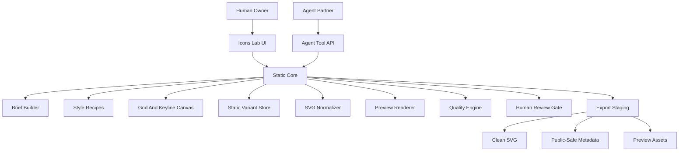

# Supericons Icons Lab Static Core PRD And Blueprint

Date: 2026-06-19

## Title

Icons Lab Static Core is the first production foundation for creating beautiful, consistent, programmatic Supericons icon packs with a human owner and agent partners.

Evidence labels used in this document:

- `[SOURCE: prior-blueprint]` = `docs/supericons-icons-lab-prd-architecture-blueprint-2026-06-19.md`
- `[SOURCE: research]` = `docs/supericons-icon-lab-research-2026-06-19.md`
- `[SOURCE: prototype-plan]` = `docs/supericons-icons-lab-prototype-implementation-plan-2026-06-19.md`
- `[SOURCE: icon-standard]` = `docs/supericons-agentic-icon-library-standard-2026-06-16.md`
- `[SOURCE: non-logo-targets]` = `docs/supericons-agentic-ai-non-logo-icon-targets-2026-06-18.md`
- `[SOURCE: demand-map]` = `docs/supericons-ai-app-demand-mind-map-2026-06-18.md`
- `[SOURCE: craft-plan]` = `docs/supericons-icon-craft-and-agentic-design-tool-plan-2026-06-11.md`
- `[SOURCE: agentic-icon-vision]` = `docs/agentic-icon-vision.md`
- `[SOURCE: icon-design-guidelines]` = `docs/icon-design-guidelines.md`
- `[SOURCE: hugeicons-inspiration]` = `strategy/inspiration/hugeicons/`
- `[SOURCE: lucide-guide]` = `https://lucide.dev/contribute/icon-design-guide`
- `[SOURCE: mingcute-github]` = `https://github.com/mingcute-design/mingcute-icons`
- `[SOURCE: hugeicons-site]` = `https://hugeicons.com/`
- `[ASSUMPTION]` = product direction inferred from the sources above and the current Supericons strategy.

## Executive Thesis

Icons Lab should become the production system that answers one core question: how do humans and agents reliably create icons that are useful, beautiful, searchable, consistent, and ready for software products? `[SOURCE: prior-blueprint]` `[ASSUMPTION]`

The first production foundation should focus on static icons, not animated or interactive icons. Static quality is the load-bearing layer. If the static silhouette, metaphor, grid discipline, SVG cleanliness, and pack consistency are weak, dynamic states will only animate weak work. `[SOURCE: craft-plan]` `[SOURCE: hugeicons-inspiration]` `[ASSUMPTION]`

Icons Lab should not become a clone of Photoshop, Gimp, Illustrator, Figma, Recraft, Magnific, Apple Icon Composer, Lucide, MingCute, or Hugeicons. It should learn from their useful product patterns, then build a Supericons-native system around icon production, human taste, agent workflows, structured QA, and pack-level consistency. `[SOURCE: research]` `[SOURCE: lucide-guide]` `[SOURCE: mingcute-github]` `[SOURCE: hugeicons-site]` `[ASSUMPTION]`

The strategic wedge is not "AI image generator for icons." The wedge is "agent-native icon production for emerging software concepts." `[SOURCE: research]` `[SOURCE: icon-standard]` `[ASSUMPTION]`

## Problem Statement

Creating logos is easier than creating original Supericons icons because logos have an existing target to preserve. Original icons require choosing the right metaphor, style, geometry, stroke language, detail level, and pack consistency from scratch. `[SOURCE: prior-blueprint]`

Generic icon libraries already cover common nouns and UI actions, but AI product builders need new visual language for agentic concepts such as tool calls, context compaction, agent handoff, approval gates, guardrails, traces, evals, token usage, browser agents, code agents, and workflow bento surfaces. `[SOURCE: non-logo-targets]` `[SOURCE: demand-map]`

Design tools expose powerful controls but often require users to already know icon craft. The user problem is not lack of buttons. The user problem is knowing what matters, in what order, and how to judge whether an icon is good. `[SOURCE: craft-plan]` `[SOURCE: hugeicons-inspiration]` `[ASSUMPTION]`

AI agents can help draft, normalize, compare, and document icons, but without a structured process they can produce attractive but inconsistent output. `[SOURCE: research]` `[ASSUMPTION]`

## Target Users

Primary user: the Supericons founder, owner, or design lead who wants to direct icon taste, approve variants, and build high-quality original packs faster. `[SOURCE: prior-blueprint]`

Secondary user: an AI agent that needs a structured way to create, inspect, refine, QA, and request review for icon assets without directly editing public registry files. `[SOURCE: prior-blueprint]` `[SOURCE: icon-standard]`

Future user: a developer, designer, or pro customer who wants to create a custom icon or bento set for a product without learning a full professional vector editor. `[ASSUMPTION]`

## Jobs To Be Done

1. When I want to build a new icon pack, I want the app to guide me through requirements, style, concepts, and quality standards so the pack starts coherent instead of improvised. `[SOURCE: research]` `[SOURCE: prior-blueprint]`

2. When I have a subjective taste direction, I want to express it through references, constraints, preferred variants, and reject reasons so the agent can learn the direction without guessing. `[SOURCE: hugeicons-inspiration]` `[ASSUMPTION]`

3. When an agent proposes icon candidates, I want to see the brief, metaphor, SVG structure, variants, preview sizes, QA checks, and pack context in one interface so I can judge quickly. `[SOURCE: prototype-plan]` `[SOURCE: prior-blueprint]`

4. When I make or import a static icon, I want the app to auto-check grid fit, stroke consistency, optical balance, small-size clarity, and SVG cleanliness so basic craft issues are caught early. `[SOURCE: lucide-guide]` `[SOURCE: mingcute-github]` `[SOURCE: craft-plan]`

5. When a pack is ready, I want clean SVGs, public-safe metadata, previews, and export staging without leaking internal review details into public records. `[SOURCE: icon-standard]` `[SOURCE: prior-blueprint]`

## Product Goals

1. Establish a Supericons quality doctrine that turns "good icon" from taste-only judgment into a shared rubric for humans and agents. `[SOURCE: hugeicons-inspiration]` `[SOURCE: craft-plan]`

2. Make Lucide, MingCute, and Hugeicons a minimum benchmark for craft, not the final ambition. `[SOURCE: lucide-guide]` `[SOURCE: mingcute-github]` `[SOURCE: hugeicons-site]` `[ASSUMPTION]`

3. Build a shallow-learning-curve creation flow where a user can start with a guided brief or template instead of a blank canvas. `[ASSUMPTION]`

4. Support structured agent contribution while preserving human taste authority and explicit approval gates. `[SOURCE: prior-blueprint]`

5. Produce the first static-core icon family for agentic AI concepts before adding dynamic or interactive states. `[SOURCE: non-logo-targets]` `[SOURCE: demand-map]`

6. Create reusable source packages, style recipes, QA reports, and export-ready metadata. `[SOURCE: research]` `[SOURCE: prior-blueprint]`

## Non-Goals

1. Do not build dynamic, animated, or interactive state conversion in the first static-core release. Dynamic icons remain a planned layer after static quality is reliable. `[SOURCE: non-logo-targets]` `[ASSUMPTION]`

2. Do not build a full Photoshop/Gimp/Figma replacement. Icons Lab should expose the essential icon-production controls, not every possible design feature. `[ASSUMPTION]`

3. Do not publish agent-created icons directly into the public Supericons registry without human approval. `[SOURCE: prior-blueprint]`

4. Do not copy, scrape, or reproduce third-party icon libraries as Supericons assets. References are quality benchmarks and learning material, not source material. `[SOURCE: research]` `[ASSUMPTION]`

5. Do not store internal process notes, private prompts, provider names, or hidden review rationale inside public icon records. `[SOURCE: icon-standard]`

6. Do not make bento tiles, work-surface illustrations, and animated loaders part of the first static-core MVP unless they are represented only as future pack types. `[SOURCE: demand-map]` `[ASSUMPTION]`

## Product Principle: Static First, Living Later

The static icon is the root object. Stateful and animated icons should be transformations of a strong static icon, not replacements for static craft. `[SOURCE: agentic-icon-vision]` `[SOURCE: craft-plan]` `[ASSUMPTION]`

Static Core responsibilities:

- Define concept and metaphor. `[SOURCE: craft-plan]`
- Create a clean base SVG. `[SOURCE: lucide-guide]`
- Fit the grid and keyline system. `[SOURCE: lucide-guide]` `[SOURCE: hugeicons-inspiration]`
- Keep stroke, radius, density, spacing, and silhouette consistent. `[SOURCE: lucide-guide]` `[SOURCE: hugeicons-inspiration]`
- Preview at small sizes and real UI surfaces. `[SOURCE: research]` `[SOURCE: prototype-plan]`
- Export public-safe SVG and metadata. `[SOURCE: icon-standard]`

Future Dynamic Layer responsibilities:

- Convert base icon into idle, hover, active, selected, disabled, loading, success, warning, error, blocked, and completed states. `[SOURCE: icon-standard]` `[SOURCE: agentic-icon-vision]`
- Add motion recipes only when motion communicates state or process. `[SOURCE: craft-plan]`
- Provide reduced-motion fallbacks. `[SOURCE: craft-plan]`
- Keep accessibility and state meaning explicit. `[SOURCE: icon-design-guidelines]`

## What Makes A Good Supericons Icon

### 1. Meaning Before Decoration

A Supericons icon must communicate the intended object, action, state, or workflow before it tries to look clever. The key lesson from the Hugeicons inspiration references is that small metaphor changes can make the icon easier to understand, such as replacing a lock with a key for device access or refining a rocket silhouette so it reads faster. `[SOURCE: hugeicons-inspiration]`

Acceptance signal:

- A reviewer can describe the icon's intended meaning in under five seconds without seeing the label. `[ASSUMPTION]`

### 2. Silhouette First

The outer shape should remain readable at 16px. Details should support the silhouette, not carry the full meaning. `[SOURCE: lucide-guide]` `[SOURCE: craft-plan]`

Acceptance signal:

- At 16px, the icon still reads as its intended family or object, even if fine detail is lost. `[SOURCE: craft-plan]`

### 3. Grid Discipline With Optical Permission

The icon should use a 24x24 canvas, safe area, keylines, and grid-aligned primitives, while allowing optical corrections when the mathematically centered version looks wrong. `[SOURCE: lucide-guide]` `[SOURCE: mingcute-github]` `[SOURCE: hugeicons-inspiration]`

Acceptance signal:

- The icon passes grid and safe-area checks, and any intentional off-grid correction has a visible reason. `[ASSUMPTION]`

### 4. Shared Shape Grammar

Icons in the same pack should reuse common shapes, modifiers, proportions, radii, and visual primitives. The Hugeicons house before/after reference shows that a family becomes stronger when variants share a recognizable underlying grammar. `[SOURCE: hugeicons-inspiration]`

Acceptance signal:

- A reviewer can place the icon beside its pack siblings and it feels like part of the same family. `[ASSUMPTION]`

### 5. Stroke And Radius Consistency

Default static-core Supericons should use a 24x24 viewBox, 1.5px stroke, rounded caps, rounded joins, `currentColor`, and a medium visual density unless a style recipe says otherwise. `[SOURCE: craft-plan]` `[SOURCE: prior-blueprint]`

Acceptance signal:

- The SVG validates against the active style recipe and does not silently mix unrelated stroke styles. `[ASSUMPTION]`

### 6. Small Detail Restraint

A beautiful icon often has fewer details than the obvious first draft. The reference screenshots repeatedly show simplified, more confident after versions. `[SOURCE: hugeicons-inspiration]`

Acceptance signal:

- Detail is reduced until each remaining mark improves recognition, style, or state. `[ASSUMPTION]`

### 7. Production-Ready SVG

The SVG should be clean, themeable, and predictable: valid viewBox, no accidental raster embeds, no hidden text, no unnecessary metadata, sensible path count, and `currentColor` where appropriate. `[SOURCE: lucide-guide]` `[SOURCE: craft-plan]` `[SOURCE: icon-standard]`

Acceptance signal:

- The icon can be copied into a React app, themed by text color, and rendered without cleanup. `[ASSUMPTION]`

## Quality Benchmark Ladder

| Level | Meaning | Pass Criteria | Source |
| --- | --- | --- | --- |
| `L0 invalid` | The asset is not usable. | Does not render, bad viewBox, clipped, raster-only, or unreadable. | `[SOURCE: craft-plan]` |
| `L1 usable` | It works as a basic SVG. | Renders at 24px, has a valid viewBox, and depicts the intended object. | `[SOURCE: icon-standard]` |
| `L2 benchmark` | It meets common library craft. | Follows 24px canvas conventions, consistent stroke, padding, round caps/joins where relevant, clean SVG. | `[SOURCE: lucide-guide]` `[SOURCE: mingcute-github]` |
| `L3 Supericons grade` | It belongs in a coherent Supericons pack. | Strong metaphor, small-size clarity, pack consistency, public-safe metadata, export readiness. | `[SOURCE: prior-blueprint]` `[SOURCE: craft-plan]` |
| `L4 signature` | It has distinctive Supericons taste. | It feels simpler, clearer, more memorable, or more agent-native than benchmark libraries. | `[SOURCE: hugeicons-inspiration]` `[ASSUMPTION]` |

The product should block public export below `L3`. `L4` should be the human taste target for premium packs. `[ASSUMPTION]`

## Minimum Benchmark To Surpass

Lucide demonstrates strict consistency rules around 24x24 canvas, padding, stroke width, round joins/caps, visual centering, visual density, smooth curves, pixel alignment, and simple SVG elements. `[SOURCE: lucide-guide]`

MingCute demonstrates a broad open-source library built around 24x24 grid, outline and filled styles, 2px stroke, and multiple delivery formats. `[SOURCE: mingcute-github]`

Hugeicons demonstrates a market-facing icon product with many styles, rounded stroke language, Figma/developer tooling, and a strong emphasis on designer/developer utility. `[SOURCE: hugeicons-site]`

Supericons should surpass these benchmarks by adding:

- Agent-native concepts not deeply covered by generic libraries. `[SOURCE: non-logo-targets]`
- Human-agent creation workflow. `[SOURCE: prior-blueprint]`
- Structured quality rubric and QA. `[SOURCE: craft-plan]`
- Public-safe semantic metadata for AI search and UI generation. `[SOURCE: icon-standard]`
- Static-to-stateful upgrade path after the static core is strong. `[SOURCE: agentic-icon-vision]` `[ASSUMPTION]`

## Design Thinking Model

Icons Lab should encode a simple design thinking loop into the product, not hide it in docs. `[ASSUMPTION]`

### Empathize

Question: who will use this icon, where will they see it, and what decision should it help them make? `[ASSUMPTION]`

Inputs:

- Product type.
- User context.
- Surface type.
- Icon role.
- Target size.
- Accessibility needs.

### Define

Question: what does this icon need to say without words? `[SOURCE: hugeicons-inspiration]` `[ASSUMPTION]`

Inputs:

- Concept.
- Primary metaphor.
- Avoided metaphors.
- Related concepts.
- State or action.

### Ideate

Question: what are three different visual routes, and which one reads fastest? `[ASSUMPTION]`

Inputs:

- Literal route.
- Abstract route.
- System route.
- Pack grammar route.

### Prototype

Question: what is the smallest static SVG that communicates the idea? `[SOURCE: craft-plan]`

Inputs:

- Outline draft.
- Filled draft.
- Simplified small-size draft.
- Optional bento or large-surface draft later.

### Test

Question: does it survive 16px, sit well with siblings, and remain clean as SVG? `[SOURCE: lucide-guide]` `[SOURCE: craft-plan]`

Inputs:

- Preview matrix.
- QA report.
- Pack comparison.
- Human taste decision.

## Socratic Prompting Framework

Icons Lab should guide users through questions rather than expose a blank canvas first. `[ASSUMPTION]`

### Pack Intake Questions

1. What product or surface is this icon set for?
2. Who will see these icons?
3. Are the icons for navigation, actions, states, workflow diagrams, empty states, or bento cards?
4. How many icons do you need in this set: 6, 12, 24, 36, or custom?
5. What visual references feel closest to your taste?
6. What visual references should be avoided?
7. Should this set feel technical, friendly, premium, playful, serious, or minimal?
8. What sizes must the icons support: 16, 20, 24, 32, 48, 128?
9. Should the default style be outline, filled, mono, duotone, or mixed by state?
10. What would make this pack feel unmistakably Supericons?

### Concept Brief Questions

1. What does this icon depict?
2. What user action or product state does it support?
3. What is the most obvious metaphor?
4. What is the clearer metaphor if the obvious one is weak?
5. What should this icon not be confused with?
6. What are the sibling icons it must visually match?
7. What detail can be removed without hurting meaning?
8. What detail must stay because it carries meaning?

### Human Taste Gate Questions

1. Which variant would you ship if you could only choose one?
2. Does this feel more Supericons, more Lucide, more MingCute, more Hugeicons, or something else?
3. Is it too generic?
4. Is it too clever?
5. Is the silhouette strong enough?
6. Does it feel premium enough to sell?
7. Does it feel simple enough to use in a real app?

### Agent Self-Check Questions

1. Which rule or style recipe did I use?
2. Which metaphor did I choose and why?
3. Which alternatives did I reject?
4. What did I simplify for small-size clarity?
5. What might the human owner dislike?
6. What QA warning remains?
7. What exact decision do I need from the human?

## Core Product Scope: Static Framework V1

Static Framework V1 should support one end-to-end journey:

```text
guided requirements -> style recipe -> concept backlog -> static variants -> QA -> human approval -> export staging
```

This journey should work before dynamic states, animation, or stateful conversion. `[ASSUMPTION]`

## Functional Requirements

### FR1. Icon Quality Doctrine

Icons Lab must include a visible quality doctrine that defines Supericons-grade icons and explains how each icon is scored. `[SOURCE: craft-plan]` `[SOURCE: hugeicons-inspiration]`

User job: judge whether an icon is good without relying only on vague taste. `[ASSUMPTION]`

Business goal: make Supericons original packs premium-worthy and consistent. `[SOURCE: icon-standard]`

Risk mitigated: agents and users produce attractive but inconsistent icons. `[SOURCE: research]`

Acceptance signals:

- Each variant has a quality score with rubric categories.
- The UI explains failing checks in plain language.
- Human taste can override numeric scoring, but the override is recorded as a decision.

### FR2. Guided Pack Builder

Icons Lab must guide users through pack-level questions before icon generation starts. `[ASSUMPTION]`

User job: turn a subjective request like "build a bento icon set for an AI coding tool" into structured requirements. `[ASSUMPTION]`

Business goal: make custom/premium icon pack creation repeatable. `[SOURCE: demand-map]`

Risk mitigated: vague prompts create inconsistent icon families. `[SOURCE: research]`

Acceptance signals:

- User can create a pack brief with product type, audience, use surfaces, set size, style direction, references, and non-goals.
- The app can generate a concept backlog from the pack brief.
- The user can edit every generated requirement before creation begins.

### FR3. Style Recipe Templates

Icons Lab must provide reusable static style recipes. `[SOURCE: research]` `[SOURCE: prior-blueprint]`

User job: start with a proven framework rather than a blank style decision. `[ASSUMPTION]`

Business goal: increase pack consistency and production speed. `[SOURCE: craft-plan]`

Risk mitigated: icons in the same pack look like they came from different libraries. `[SOURCE: hugeicons-inspiration]`

Acceptance signals:

- Static Core includes at least `si-outline-rounded-24`, `si-filled-rounded-24`, and `si-duotone-rounded-24` templates.
- A style recipe stores viewBox, safe area, stroke width, caps, joins, radius, density, variants, allowed elements, and export rules.
- QA checks read from the selected recipe.

### FR4. Concept Brief Builder

Icons Lab must provide structured concept briefs for each icon. `[SOURCE: research]` `[SOURCE: prior-blueprint]`

User job: clarify what the icon means, where it appears, and what it should not be. `[ASSUMPTION]`

Business goal: make icons searchable and useful for AI product builders. `[SOURCE: icon-standard]`

Risk mitigated: abstract agentic concepts become generic sparkles, robots, or arrows. `[SOURCE: non-logo-targets]`

Acceptance signals:

- Each concept has name, depictive name, use case, metaphor, avoided metaphors, sibling icons, tags, and target sizes.
- Agent suggestions must cite which part of the brief they are addressing.
- Human owner can lock a metaphor before variant creation.

### FR5. Static Variant Board

Icons Lab must let humans and agents compare multiple static variants per concept. `[SOURCE: research]` `[SOURCE: prototype-plan]`

User job: choose the strongest variant from real alternatives. `[ASSUMPTION]`

Business goal: improve output quality without making the user draw every asset manually. `[ASSUMPTION]`

Risk mitigated: first generated draft becomes the default even when it is not the best. `[SOURCE: research]`

Acceptance signals:

- Variant board supports outline, filled, mono, and duotone static candidates.
- Variants display source type, QA state, human notes, and selected status.
- Variants can be rejected with reasons such as unclear, too generic, too detailed, off-style, weak at 16px, or not premium enough.

### FR6. Grid And Keyline Canvas

Icons Lab must provide a purpose-built icon canvas with grid, safe area, keylines, symmetry helpers, optical center, and snap controls. `[SOURCE: lucide-guide]` `[SOURCE: hugeicons-inspiration]` `[SOURCE: craft-plan]`

User job: create or refine an icon without learning a full vector editor. `[ASSUMPTION]`

Business goal: make high-quality icon creation accessible and fast. `[ASSUMPTION]`

Risk mitigated: icons fail because of small alignment, spacing, or visual density mistakes. `[SOURCE: hugeicons-inspiration]`

Acceptance signals:

- Canvas supports 24x24 grid and 20x20 live area by default.
- Snap mode is on by default.
- Symmetry assist can mirror selected elements.
- Freeform mode exists but visually marks the icon as outside strict recipe until revalidated.

### FR7. Essential Editing Tools

Icons Lab must expose the few controls icon production cannot do without. `[ASSUMPTION]`

User job: edit icons without being overwhelmed by generic graphics-tool complexity. `[ASSUMPTION]`

Business goal: keep learning curve shallow while preserving advanced control. `[ASSUMPTION]`

Risk mitigated: app becomes intimidating like a professional bitmap/vector editor. `[ASSUMPTION]`

Required controls:

- Select.
- Move.
- Align.
- Mirror.
- Boolean combine where safe.
- Stroke width.
- Cap and join.
- Radius.
- Fill mode.
- Current color mapping.
- Simplify.
- Normalize.
- Preview sizes.
- Revert to recipe.

Acceptance signals:

- A non-expert can adjust stroke, alignment, radius, and fill without opening a full vector tool.
- An advanced user can enter freeform/path mode when necessary.
- The app always shows whether the asset remains recipe-compliant.

### FR8. SVG Normalizer

Icons Lab must normalize static SVGs before review and export. `[SOURCE: lucide-guide]` `[SOURCE: craft-plan]`

User job: make SVG output clean enough for app usage. `[ASSUMPTION]`

Business goal: reduce manual cleanup and increase library trust. `[SOURCE: icon-standard]`

Risk mitigated: exported icons contain messy paths, hidden metadata, fixed colors, raster embeds, or broken scaling. `[SOURCE: craft-plan]`

Acceptance signals:

- Normalizer checks viewBox, dimensions, fill, stroke, caps, joins, colors, path count, raster embeds, hidden text, filters, masks, transforms, and clipping.
- The app distinguishes editable-stroke SVGs from flattened outline SVGs.
- The user can preview the normalized SVG before accepting it.

### FR9. Preview Matrix

Icons Lab must render variants in realistic sizes and contexts. `[SOURCE: research]` `[SOURCE: prototype-plan]`

User job: see whether an icon works in actual UI contexts. `[ASSUMPTION]`

Business goal: reduce bad exports and increase perceived quality. `[SOURCE: craft-plan]`

Risk mitigated: icon looks good on a large canvas but fails inside UI. `[SOURCE: hugeicons-inspiration]`

Acceptance signals:

- Preview sizes include 16, 20, 24, 32, 48, and 128px.
- Backgrounds include light, dark, warm neutral, cool neutral, and transparent.
- UI surfaces include toolbar, sidebar, button, bento tile, empty state, and docs diagram.

### FR10. Pack Consistency Review

Icons Lab must compare a candidate icon against pack siblings. `[SOURCE: hugeicons-inspiration]` `[SOURCE: prior-blueprint]`

User job: ensure one icon does not break the family. `[ASSUMPTION]`

Business goal: sell packs, not isolated assets. `[SOURCE: demand-map]`

Risk mitigated: icons are individually good but collectively incoherent. `[SOURCE: hugeicons-inspiration]`

Acceptance signals:

- Pack review shows all concepts and variants side by side.
- Consistency checks include stroke, radius, density, live area usage, metaphor family, and modifier reuse.
- The app highlights outliers and suggests simplification or recipe corrections.

### FR11. Human-Agent Work Log

Icons Lab must show what the agent proposed, what changed, what QA found, and what decision the human needs to make. `[SOURCE: prior-blueprint]` `[SOURCE: prototype-plan]`

User job: supervise agent work without reading raw files. `[ASSUMPTION]`

Business goal: make agent-assisted production trustworthy. `[SOURCE: icon-standard]`

Risk mitigated: agents create unreviewable changes. `[SOURCE: prior-blueprint]`

Acceptance signals:

- Agent actions are grouped as proposal, draft, normalize, QA, and review request.
- Human decisions include approve, request changes, reject, and mark as taste reference.
- Public exports do not include private work-log details.

### FR12. Public-Safe Export Staging

Icons Lab must export only approved, clean, public-safe files to staging. `[SOURCE: icon-standard]`

User job: prepare assets for Supericons without manual file assembly. `[ASSUMPTION]`

Business goal: scale production while protecting public artifact quality. `[SOURCE: icon-standard]`

Risk mitigated: internal notes or unapproved assets leak into public registry outputs. `[SOURCE: icon-standard]`

Acceptance signals:

- Export produces clean SVG, preview PNGs, pack manifest, and registry-ready metadata.
- Export blocks if approval, QA, metadata, or rights/source status is missing.
- Export writes to staging only, not the public registry.

## Core Static Data Model

### Pack

```json
{
  "id": "agentic-ai-core-kit-001",
  "name": "Agentic AI Core Kit",
  "description": "Original static icons for agentic AI product interfaces.",
  "status": "draft",
  "styleRecipeId": "si-outline-rounded-24",
  "targetCount": 12,
  "assetTypes": ["static_icon", "workflow_icon", "state_icon_seed"],
  "accessTier": "premium_candidate"
}
```

Source basis: `[SOURCE: prior-blueprint]` `[SOURCE: non-logo-targets]`

### Style Recipe

```json
{
  "id": "si-outline-rounded-24",
  "name": "SI Outline Rounded 24",
  "viewBox": "0 0 24 24",
  "canvasSize": 24,
  "safeArea": 2,
  "strokeWidth": 1.5,
  "strokeLinecap": "round",
  "strokeLinejoin": "round",
  "fillMode": "none",
  "colorMode": "currentColor",
  "cornerLanguage": "soft-geometric",
  "visualDensity": "medium",
  "snapToGridDefault": true,
  "allowedStaticVariants": ["outline", "filled", "mono", "duotone"],
  "futureStateReady": true
}
```

Source basis: `[SOURCE: craft-plan]` `[SOURCE: prior-blueprint]`

### Concept Brief

```json
{
  "id": "si:agent-handoff",
  "packId": "agentic-ai-core-kit-001",
  "name": "Agent Handoff",
  "depicts": "two agent nodes connected by a context capsule",
  "useCase": "Show one agent transferring task ownership or context to another specialist agent.",
  "assetType": "workflow_icon",
  "primaryMetaphor": "context capsule moving between agent nodes",
  "avoidMetaphors": ["generic share arrow", "file transfer", "sports baton"],
  "siblingConcepts": ["si:agent-core", "si:tool-call", "si:approval-gate"],
  "targetSizes": [16, 20, 24, 32, 48],
  "status": "brief_ready"
}
```

Source basis: `[SOURCE: prior-blueprint]` `[SOURCE: non-logo-targets]`

### Static Variant

```json
{
  "id": "variant_agent_handoff_outline_001",
  "conceptId": "si:agent-handoff",
  "variantType": "outline",
  "sourceType": "draft",
  "svgPath": "variants/outline.svg",
  "strokeEditable": true,
  "styleRecipeId": "si-outline-rounded-24",
  "qualityLevel": "L2 benchmark",
  "reviewState": "pending_human_review"
}
```

Source basis: `[SOURCE: research]` `[SOURCE: craft-plan]`

### Quality Report

```json
{
  "variantId": "variant_agent_handoff_outline_001",
  "qualityLevel": "L2 benchmark",
  "checks": {
    "viewBox": "pass",
    "safeArea": "pass",
    "currentColor": "pass",
    "strokeWidth": "pass",
    "smallSizeClarity": "review",
    "packConsistency": "warn",
    "rasterEmbeds": "pass",
    "hiddenText": "pass",
    "pathComplexity": "pass"
  },
  "humanDecisionNeeded": "Choose whether the context capsule should be more prominent at 16px."
}
```

Source basis: `[SOURCE: craft-plan]` `[SOURCE: hugeicons-inspiration]`

## Source Package Blueprint

The source package should preserve editable production context without leaking private process into public exports. `[SOURCE: research]` `[SOURCE: icon-standard]`

```text
agentic-ai-core-kit-001.sipack/
  pack.json
  style-recipes/
    si-outline-rounded-24.json
  concepts/
    agent-handoff.siicon/
      concept.json
      brief.md
      variants/
        outline.svg
        filled.svg
        mono.svg
        duotone.svg
      previews/
        outline-16-light.png
        outline-24-dark.png
        outline-toolbar.png
      qa/
        outline.qa.json
      review/
        human-decision.json
  export/
    manifest.json
    svg/
    previews/
```

## System Architecture



Source basis: `[SOURCE: prior-blueprint]` `[SOURCE: research]`

## Essential UI Surfaces

### 1. New Pack Guide

Purpose: turn a user's subjective ask into a structured pack brief. `[ASSUMPTION]`

Primary action: create pack brief.

Key surfaces:

- Product/use-case intake.
- Reference and avoidance inputs.
- Set-size selector.
- Style template selector.
- Socratic question sidebar.
- Generated concept backlog preview.

### 2. Style Recipe Workshop

Purpose: define the visual system before any icon is created. `[SOURCE: research]`

Primary action: lock recipe for draft generation.

Key surfaces:

- 24x24 keyline preview.
- Stroke/radius/density controls.
- Reference comparison.
- Allowed variants.
- Recipe compliance preview.

### 3. Concept Studio

Purpose: refine one icon from brief to approved static variant. `[SOURCE: prototype-plan]`

Primary action: approve static variant.

Key surfaces:

- Concept brief.
- Metaphor candidates.
- Static variant board.
- Grid canvas.
- Preview matrix.
- QA panel.
- Human decision controls.

### 4. Pack Review

Purpose: judge the whole pack as a family. `[SOURCE: prototype-plan]` `[SOURCE: hugeicons-inspiration]`

Primary action: prepare export.

Key surfaces:

- Concept map.
- Variant comparison wall.
- Consistency heatmap.
- Outlier list.
- Export checklist.

### 5. Export Center

Purpose: stage clean assets for Supericons. `[SOURCE: icon-standard]`

Primary action: export to staging.

Key surfaces:

- Public metadata preview.
- SVG file list.
- Preview asset list.
- Blockers.
- Export log.

## Static Core Agent Tool Surface

Agents should use structured operations. They should not need to directly manipulate public files. `[SOURCE: prior-blueprint]`

Initial tool concepts:

```text
icons_lab.create_pack_brief
icons_lab.update_style_recipe
icons_lab.generate_concept_backlog
icons_lab.create_concept_brief
icons_lab.propose_static_metaphors
icons_lab.add_static_variant
icons_lab.normalize_svg
icons_lab.render_preview_matrix
icons_lab.run_static_quality_check
icons_lab.compare_pack_consistency
icons_lab.request_human_review
icons_lab.prepare_export_staging
```

Agent permissions:

- Can create draft packs, concepts, variants, previews, and QA reports. `[SOURCE: prior-blueprint]`
- Can request human review. `[SOURCE: prior-blueprint]`
- Cannot approve final assets. `[SOURCE: prior-blueprint]`
- Cannot publish to the public registry. `[SOURCE: icon-standard]`
- Cannot overwrite human-approved variants without reopening review. `[ASSUMPTION]`

## First Static Core Pack

First proof pack:

```text
packId: agentic-ai-core-kit-001
targetCount: 12
defaultRecipe: si-outline-rounded-24
```

Concepts:

1. `si:agent-core`
2. `si:tool-call`
3. `si:tool-result`
4. `si:context-window`
5. `si:context-compaction`
6. `si:memory-checkpoint`
7. `si:agent-handoff`
8. `si:approval-gate`
9. `si:policy-guardrail`
10. `si:trace-span`
11. `si:eval-run`
12. `si:token-meter`

Source basis: `[SOURCE: prior-blueprint]` `[SOURCE: non-logo-targets]`

Why this pack:

- It tests abstract-but-useful agentic concepts. `[SOURCE: non-logo-targets]`
- It is original Supericons IP rather than logo conversion. `[ASSUMPTION]`
- It creates the static grammar that later stateful icons can inherit. `[ASSUMPTION]`

## Static-To-Stateful Roadmap

Dynamic and interactive states are not V1, but V1 must preserve the hooks needed later. `[SOURCE: agentic-icon-vision]` `[ASSUMPTION]`

Static Core should store:

- Base metaphor.
- Static silhouette.
- Layer roles.
- Variant roles.
- State readiness notes.
- Motion-safe anchor points where relevant.
- Reduced-motion fallback requirement.

Future dynamic conversion should support:

- `idle`
- `hover`
- `active`
- `selected`
- `disabled`
- `loading`
- `success`
- `warning`
- `error`
- `blocked`
- `awaiting_human`
- `completed`

The future dynamic tool should answer:

- Which static layer changes?
- Which state does the change communicate?
- Does motion add meaning?
- Does the static icon remain recognizable without motion?
- Is there a reduced-motion version?

## Success Metrics

Primary metric:

- Time from approved pack brief to 12 export-staged static icons. `[ASSUMPTION]`

Supporting metrics:

- Percent of variants reaching `L3 Supericons grade`. `[ASSUMPTION]`
- Percent of icons passing 16px clarity on first review. `[SOURCE: craft-plan]`
- Average variants reviewed per approved icon. `[ASSUMPTION]`
- Pack consistency score. `[SOURCE: prior-blueprint]`
- Percent of exports with complete public-safe metadata. `[SOURCE: icon-standard]`

Guardrail metrics:

- Number of public exports containing internal/private process details. `[SOURCE: icon-standard]`
- Number of exported SVGs with raster embeds, hidden text, or invalid viewBox. `[SOURCE: craft-plan]`
- Number of agent-created assets approved without human review. `[SOURCE: prior-blueprint]`
- Number of icons that pass technical QA but fail human taste review. `[ASSUMPTION]`

## Risks And Mitigations

| Risk | Why It Matters | Mitigation | Source |
| --- | --- | --- | --- |
| The app becomes too complex. | Users wanted shallow learning, not a full graphics suite. | Keep V1 to guided static icon production and essential tools. | `[ASSUMPTION]` |
| Generated icons are pretty but inconsistent. | Packs lose commercial value. | Style recipes, pack review, consistency scoring. | `[SOURCE: research]` |
| Quality scoring becomes too mechanical. | Great taste cannot be fully automated. | Treat score as a guide; human taste remains final. | `[SOURCE: hugeicons-inspiration]` |
| Abstract AI concepts become generic. | Supericons loses differentiation. | Require concept briefs, avoided metaphors, and agentic primitives. | `[SOURCE: non-logo-targets]` |
| Public metadata leaks private process. | Product artifacts become unsafe or messy. | Separate source package, review log, and public export schema. | `[SOURCE: icon-standard]` |
| Dynamic ambitions distract from static core. | V1 never becomes production-grade. | Defer motion to a clear later layer. | `[ASSUMPTION]` |

## Open Questions For Human Taste

These are not blockers for drafting the static core, but they should become explicit review gates before production icon creation. `[ASSUMPTION]`

1. Should the default Supericons static style use 1.5px stroke as the house style, or should we offer both 1.5px and 2px recipe families?
2. Should Supericons feel closer to Hugeicons' friendly rounded style, Lucide's neutral utility style, or a sharper developer-tool style?
3. How much charm is allowed before an icon feels less professional?
4. Should filled variants be generated for every icon or only when a filled state improves clarity?
5. What is the minimum quality level for free icons versus premium icons?
6. Which reference screenshots from `strategy/inspiration/hugeicons/` should become permanent taste references inside Icons Lab?
7. Should a user be allowed to export `L2 benchmark` icons, or should export require `L3 Supericons grade`?

## Implementation Roadmap

### Milestone 1: Static Source Model

Build:

- `.sipack` and `.siicon` source package format.
- Pack, recipe, concept, variant, QA, and review JSON schemas.
- First 12 concept briefs.

Success:

- The static proof pack can exist as structured files before UI generation. `[ASSUMPTION]`

### Milestone 2: Static QA And Preview

Build:

- SVG parser/normalizer.
- Preview renderer.
- Quality report generator.
- 16/24/32/48/128 preview matrix.

Success:

- One imported or drafted SVG can be normalized, previewed, scored, and blocked or approved. `[SOURCE: craft-plan]`

### Milestone 3: Guided UI

Build:

- New Pack Guide.
- Style Recipe Workshop.
- Concept Studio.
- Static Variant Board.
- Pack Review.

Success:

- A human can guide the system from pack requirements to approved static variant. `[SOURCE: prototype-plan]`

### Milestone 4: Agent Tool API

Build:

- Structured draft operations.
- Human review request.
- Pack consistency comparison.
- Export staging.

Success:

- An agent can create draft variants and request review without public registry writes. `[SOURCE: prior-blueprint]`

### Milestone 5: First Static Proof Pack

Build:

- `agentic-ai-core-kit-001`
- 12 approved static icons.
- Preview assets.
- Public-safe metadata.
- Export staging report.

Success:

- The proof pack reaches `L3 Supericons grade` as a family. `[ASSUMPTION]`

## PRD Coverage Checklist

- Problem: present.
- Target user: present.
- Scope: present.
- Functional requirements: present.
- Non-goals: present.
- Success metrics: present.
- Risks: present.
- Open questions: present.
- Requirement mapping: each FR maps to user job, business goal, and risk.
- Static-first decision: explicit.
- Dynamic future: deferred but designed for.
