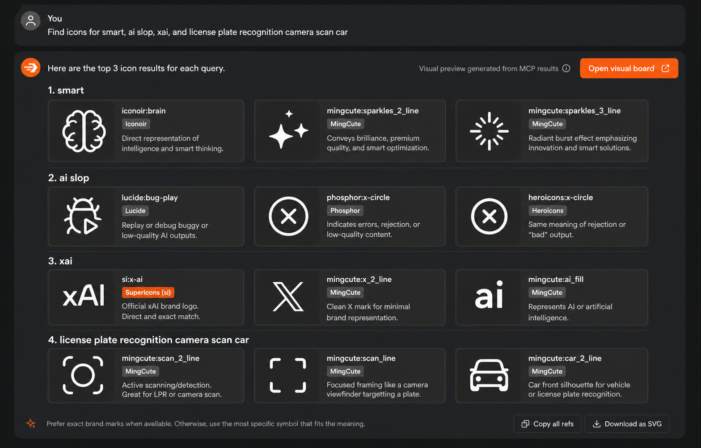
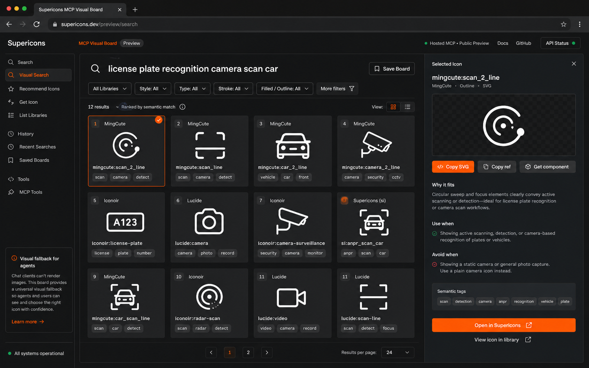

# Supericons MCP Visual Preview PRD

Date: 2026-07-02

## Source Register

- The local implementation prepares the hosted MCP server to expose `search_icons`, `recommend_icons`, `get_icon`, `preview_icons`, and `list_libraries` through Streamable HTTP. [SOURCE: `mcp/remote-server.js`]
- Current MCP icon results include public library display fields and browser preview URLs. [SOURCE: `mcp/remote-server.js`; `mcp/public-icon-preview.js`]
- The library registry maps `si` to `Supericons` and `simpleicons` to `Simple Icons`. [SOURCE: `mcp/remote-server.js`]
- The MCP package and hosted metadata are prepared at version `0.4.15`. [SOURCE: `mcp/package.json`; `mcp/server.json`]
- The official MCP tool result shape can include text content, image content with base64 data and a MIME type, audio content, resource links, or embedded resources. [SOURCE: https://modelcontextprotocol.io/specification/2025-11-25/server/tools]
- Claude Code supports remote HTTP MCP servers and treats `streamable-http` as an alias for `http` in config. [SOURCE: https://code.claude.com/docs/en/mcp]
- Claude Code documents MCP output token warnings and limits, so visual responses should stay compact. [SOURCE: https://code.claude.com/docs/en/mcp]
- ChatGPT Apps can render UI components inline from MCP tool results through an iframe and MCP Apps bridge. [SOURCE: https://developers.openai.com/apps-sdk/build/chatgpt-ui]
- The current implementation does not assume every terminal MCP client renders image content inline. [SOURCE: client support review, 2026-07-02]
- The 2026-07-02 admin query pack contains 262 query groups, 235 deduped query texts, 45 hard zero-result queries, 15 intermittent zero-result queries, 39 low-result-only queries, and 209 deduped queries from the MCP surface. [SOURCE: admin query pack export, 2026-07-02]
- The web UI now reads preview URL parameters such as `q`, `library`, `icon`, and `icons` and opens the existing icon grid with the requested query or icon refs. [SOURCE: `main.js`]
- Visual concept mockups for the inline contact sheet and hosted preview board are stored in `docs/assets/visual-preview/`. [SOURCE: generated concept mockups, 2026-07-02]

## Problem

Supericons MCP currently helps agents find icons by text, but icon selection is a visual decision. [SOURCE: user discussion, 2026-07-02] When the agent returns only text rows, the human must either trust the agent's explanation or open a separate browser flow manually. [SOURCE: user discussion, 2026-07-02] This creates a gap between agent-readable search and human-verifiable design judgment. [ASSUMPTION]

The issue is sharper for new or ambiguous library keys. `si` is a stable internal key for the Supericons logo library, but it is not self-explanatory to humans or agents. [SOURCE: `mcp/remote-server.js`; user discussion, 2026-07-02] In a Claude Desktop smoke test, the agent described `si` as "Simple Icons," even though `si` means Supericons. [SOURCE: user-provided Claude Desktop payload and screenshots, 2026-07-02]

## Target Users

- Indie developers and vibe coders asking an agent to pick icons for UI screens. [SOURCE: user strategy discussion, 2026-06-25 to 2026-07-02]
- Designers and builders using Claude Desktop, Codex, Cursor, OpenCode, or similar clients with Supericons MCP. [SOURCE: docs setup references in `docs-pages.js`; user testing discussion, 2026-07-02]
- AI agents that need structured icon data and stable identifiers. [SOURCE: `mcp/remote-server.js`]
- Human reviewers who need to see icons before accepting an agent's recommendation. [SOURCE: user discussion, 2026-07-02]

## Jobs To Be Done

1. When I ask an agent for icons, I want to see a visual shortlist so I can judge fit without trusting text alone. [SOURCE: user discussion, 2026-07-02]
2. When an agent returns a library key, I want the public library name beside it so I do not confuse `si` with `simpleicons`. [SOURCE: user discussion, 2026-07-02]
3. When the chat UI cannot render inline previews, I want one click to open the exact visual board in Supericons. [ASSUMPTION]
4. When a search has several possible meanings, I want the preview to show alternatives clearly enough that I can pick, reject, or refine. [ASSUMPTION]

## Design Thinking Summary

### Empathize

The user is not only asking whether the search engine found rows; they are asking whether the icon looks right. [SOURCE: user discussion, 2026-07-02] A row like `mingcute:scan_2_line` can sound correct, but visual fitness depends on shape, weight, style, and surrounding UI context. [ASSUMPTION]

### Define

The product gap is not search alone. The gap is search plus visual confirmation inside an agent workflow. [SOURCE: user discussion, 2026-07-02]

### Ideate

Three preview modes are possible:

- Result-level preview links in every MCP response. [ASSUMPTION]
- Hosted visual boards that open in the browser and show the exact shortlist. [ASSUMPTION]
- Inline MCP image contact sheets for clients that render image content. [SOURCE: MCP tool result image content support at https://modelcontextprotocol.io/specification/2025-03-26/server/tools]

### Prototype

Start with a low-risk additive contract: add display labels and preview URLs to existing responses, then add a new preview board route. [ASSUMPTION]

### Test

Use the 2026-07-02 query pack and Claude Desktop smoke tests to compare text-only versus visual-preview workflows. [SOURCE: admin query pack export and user-provided smoke test artifact, 2026-07-02]

## Visual Prototype Mockups

These mockups are concept images, not implementation screenshots. [SOURCE: generated concept mockups, 2026-07-02] Their purpose is to sharpen the product direction before code changes.

### Agent Chat Contact Sheet



The inline contact sheet should help users evaluate icon fit visually without leaving the agent chat. [SOURCE: generated concept mockup, 2026-07-02] The strongest pattern is grouped results by query, with each card showing a large icon preview, public library name, icon ref, and a short reason. [SOURCE: generated concept mockup, 2026-07-02]

Design insight: the library name must be visible on every card. [SOURCE: generated concept mockup review, 2026-07-02] For Supericons logo results, the card must say `Supericons (si)`, not only `si`. [SOURCE: user discussion, 2026-07-02]

### Hosted Preview Board



The hosted preview board should be the reliable fallback when a client cannot render inline images. [SOURCE: generated concept mockup, 2026-07-02] It should show a visual grid on the left and a selected-icon detail panel on the right, including `why_it_fits`, `use_when`, `avoid_when`, semantic tags, and copy actions. [SOURCE: generated concept mockup, 2026-07-02]

Design insight: the preview board should feel like the current Supericons app, not a separate landing page. [SOURCE: current web UI screenshots, 2026-06-26; generated concept mockup, 2026-07-02] The first screen should be the usable visual result set. [SOURCE: user discussion, 2026-06-26 to 2026-07-02]

## Socratic Decision Log

**Question: Should every `search_icons` call return inline images by default?**

Answer: No. Normal MCP calls should stay compact and predictable because not every client renders image content, and image payloads increase response size. [SOURCE: MCP tool result content supports image; Claude Code documents output token limits; client rendering support was not verified for every client] Default responses should include visual URLs and clear labels; inline contact sheets should be opt-in. [ASSUMPTION]

**Question: Is a browser preview a fallback or the main product?**

Answer: It should be the universal fallback and the first implementation target. [ASSUMPTION] Browser URLs work across clients, while inline image display depends on client support. [ASSUMPTION]

**Question: Should `si` be renamed?**

Answer: No for the stable API key, yes for all public display. [ASSUMPTION] Keep `library: "si"` for backward compatibility, but add `library_name: "Supericons"` and visible text that says `Supericons (si)`. [SOURCE: `mcp/remote-server.js`; user discussion, 2026-07-02]

**Question: Should preview boards be stored on the server?**

Answer: Not for MVP. [ASSUMPTION] A stateless URL based on query and icon refs reduces storage, privacy, and cleanup work. [ASSUMPTION] Stored boards can be added later if sharing, history, or analytics need them. [ASSUMPTION]

**Question: Should `preview_icons` search again or render a known result set?**

Answer: It should support both. [ASSUMPTION] Query mode helps agents ask for a fresh board; icon-ref mode lets agents render the exact candidates already shown in chat. [ASSUMPTION]

**Question: Can this work inside every agent harness?**

Answer: No single response mode should be treated as universal. MCP can carry image content in a tool result. [SOURCE: https://modelcontextprotocol.io/specification/2025-11-25/server/tools] Rich app hosts such as ChatGPT Apps can render custom inline UI from tool results. [SOURCE: https://developers.openai.com/apps-sdk/build/chatgpt-ui] Claude Code supports remote HTTP MCP, but the reviewed docs do not prove that terminal output will render inline images as a visual card. [SOURCE: https://code.claude.com/docs/en/mcp] Therefore Supericons should always return `preview_url`, keep PNG contact sheets compact and optional, and let each client render what it can. [ASSUMPTION]

## Goals

1. Make MCP icon results visually verifiable by humans. [SOURCE: user discussion, 2026-07-02]
2. Remove ambiguity between `si` and `simpleicons` in all MCP outputs. [SOURCE: user discussion, 2026-07-02; `mcp/remote-server.js`]
3. Provide a browser preview URL that works even when the MCP client cannot render inline images. [ASSUMPTION]
4. Provide an optional inline contact sheet for clients that support MCP image content. [SOURCE: MCP image content support at https://modelcontextprotocol.io/specification/2025-03-26/server/tools]
5. Improve human trust in agent-selected icons without requiring the user to manually search the web UI again. [SOURCE: user discussion, 2026-07-02]

## Non-Goals

- Do not replace the existing web search UI. [SOURCE: user discussion, 2026-06-26]
- Do not require login for free icon previews. [ASSUMPTION]
- Do not make every search response image-heavy by default. [ASSUMPTION]
- Do not build a full icon editor in this phase. [ASSUMPTION]
- Do not add paid gating for the Supericons logo library in this phase. [SOURCE: user discussion, 2026-06-26 to 2026-06-28]
- Do not expose private ranking internals or operational metadata in public MCP responses. [SOURCE: `AGENTS.md` sensitive metadata rules]

## Scope

### P0: Clear Labels And Preview Links

Add public display fields to every icon result from `search_icons`, `recommend_icons`, and `get_icon`. [SOURCE: current result shape in `mcp/remote-server.js`]

Required fields:

```json
{
  "id": "x-ai",
  "icon_ref": "si:x-ai",
  "library": "si",
  "library_key": "si",
  "library_name": "Supericons",
  "name": "xAI",
  "style": "outline",
  "icon_preview_url": "https://supericons.dev/?view=icons&preview=mcp&library=si&icon=si%3Ax-ai",
  "search_preview_url": "https://supericons.dev/?view=icons&preview=mcp&q=xai"
}
```

Notes:

- `library` remains for backward compatibility. [ASSUMPTION]
- `library_key` makes the key role explicit. [ASSUMPTION]
- `library_name` is required for every result. [SOURCE: user discussion, 2026-07-02]
- `icon_ref` is the human-readable stable ref agents should show in responses. [ASSUMPTION]

### P1: Hosted Visual Preview Board

Add a browser route that renders a visual board for either a query or a fixed list of icon refs. [ASSUMPTION]

Proposed routes:

```text
https://supericons.dev/?view=icons&preview=mcp&q=license+plate+recognition+camera+scan+car&limit=12
https://supericons.dev/?view=icons&preview=mcp&icons=mingcute:scan_2_line,mingcute:scan_line,mingcute:car_2_line
```

Board requirements:

- Show icons in a compact grid with icon image, `icon_ref`, library name, style, and short semantic guidance. [ASSUMPTION]
- Provide copy actions for SVG, icon ref, and component snippets where existing app capabilities support them. [SOURCE: current web UI has SVG/component copy controls in screenshots and `main.js` selection flow]
- Preserve current visual style of the Supericons app. [SOURCE: user screenshots, 2026-06-26]
- Support mobile and desktop. [ASSUMPTION]
- Include a "Open in Supericons" path for further customization. [ASSUMPTION]

### P2: Optional MCP Inline Contact Sheet

Add a new tool:

```text
preview_icons
```

Inputs:

```json
{
  "query": "smart",
  "icon_refs": ["iconoir:brain", "mingcute:sparkles_2_line"],
  "limit": 12,
  "style": "any",
  "locale": "zh-Hans",
  "format": "png"
}
```

Output:

- Structured icon results with the same P0 fields. [ASSUMPTION]
- A hosted board URL. [ASSUMPTION]
- An MCP `image` content item containing a PNG contact sheet when available. [SOURCE: MCP image content support at https://modelcontextprotocol.io/specification/2025-03-26/server/tools]
- A text fallback that instructs the agent to show the hosted board URL if image rendering is not available. [ASSUMPTION]

Contact sheet requirements:

- Maximum 12 icons by default. [ASSUMPTION]
- White or transparent icon canvas with clear labels. [ASSUMPTION]
- Must include `library_name` and `icon_ref` under each icon. [SOURCE: user discussion, 2026-07-02]
- Must stay below a safe response-size target. [ASSUMPTION]

### P3: Multi-Query Preview Boards

Support a board with sections for multiple queries. [ASSUMPTION]

Example:

```json
{
  "queries": [
    "smart",
    "ai slop",
    "xai",
    "license plate recognition camera scan car"
  ],
  "limit_per_query": 3
}
```

This matches the real smoke-test workflow used in Claude Desktop. [SOURCE: user-provided Claude Desktop payload and screenshots, 2026-07-02]

## Functional Requirements

1. `search_icons` returns `library_name`, `library_key`, `icon_ref`, and preview URLs for every result. [SOURCE: current gap verified in `mcp/remote-server.js`; user discussion, 2026-07-02]
2. `recommend_icons` returns the same label and preview fields for all recommended choices and alternatives. [SOURCE: `mcp/remote-server.js`]
3. `get_icon` returns the same label and preview fields for exact matches. [SOURCE: `mcp/remote-server.js`]
4. `list_libraries` clearly returns `id`, `name`, `description`, and `count`, and docs/tool descriptions explicitly state `si = Supericons` and `simpleicons = Simple Icons`. [SOURCE: `mcp/remote-server.js`; user discussion, 2026-07-02]
5. Web preview routes render visible icons without requiring login. [ASSUMPTION]
6. Preview routes can render from a query or a fixed list of `library:id` icon refs. [ASSUMPTION]
7. A new `preview_icons` MCP tool returns a hosted board URL and optionally an MCP image contact sheet. [SOURCE: MCP image content support at https://modelcontextprotocol.io/specification/2025-11-25/server/tools]
8. The preview image path is opt-in and never replaces the existing compact text result by default. [ASSUMPTION]
9. The browser preview board must handle no-result states by preserving the existing feedback path and allowing a user request for missing icons. [SOURCE: user discussion, 2026-06-27]
10. The preview board must be public-safe and must not include private scoring, internal prompts, or operational metadata. [SOURCE: `AGENTS.md` sensitive metadata rules]

## UX Requirements

- The user sees icons first, not a marketing page. [SOURCE: existing Supericons web UI screenshots, 2026-06-26]
- Each preview card shows the icon at a useful size, not only as text. [SOURCE: user discussion, 2026-07-02]
- Labels use public names such as `Supericons (si)` and `Simple Icons (simpleicons)`. [SOURCE: user discussion, 2026-07-02]
- Every visual result card shows the public library name, icon ref, and one short fit reason beside the icon preview. [SOURCE: inline contact sheet concept, 2026-07-02]
- The board has a clear query heading and result count. [ASSUMPTION]
- The board supports "copy icon ref" and "copy SVG" where allowed by existing licensing/access rules. [SOURCE: current web UI screenshots, 2026-06-26]
- If opened from an agent, the board should preserve enough context that the user can tell which agent query produced it. [ASSUMPTION]

## Technical Approach

### MCP Response Enrichment

Create a shared library metadata resolver in the MCP package so `remote-server.js`, `index.js`, and recommendation code use the same display labels. [SOURCE: duplicate library metadata exists in `mcp/remote-server.js` and `mcp/index.js`]

Suggested helper:

```js
getPublicLibraryMeta(libraryKey)
```

Returns:

```json
{
  "library_key": "si",
  "library_name": "Supericons",
  "library_description": "AI and developer tool logos curated for agentic app builders"
}
```

### Preview URL Builder

Create a shared URL builder:

```js
buildIconPreviewUrl({ library, id })
buildSearchPreviewUrl({ query, library, style, locale, limit })
buildIconBoardPreviewUrl({ iconRefs })
```

The base URL should default to `https://supericons.dev` and be configurable for local testing. [ASSUMPTION]

### Web Preview Board

Add a direct route for preview boards. [SOURCE: current route policy does not show direct `preview` route handling in verified search]

Candidate route view:

```text
preview
```

Rendering options:

- Query mode: run the same public search API used by the web UI. [ASSUMPTION]
- Icon refs mode: resolve exact icon refs from the public icon index. [ASSUMPTION]
- Desktop layout: visual grid plus selected-icon details panel. [SOURCE: hosted preview board concept, 2026-07-02]
- Mobile layout: visual grid first, then selected-icon details as a stacked section. [ASSUMPTION]

### Inline Contact Sheet Rendering

Use existing SVG data from search results and render a compact sheet. [SOURCE: MCP result currently includes inline SVG in `mcp/remote-server.js`] The package already depends on `@resvg/resvg-js`, which can support SVG-to-PNG rendering in the Node MCP package. [SOURCE: `mcp/package.json`]

The first implementation can render an SVG contact sheet and rasterize it to PNG for MCP image content. [ASSUMPTION]

### Client Compatibility

Because client image rendering differs, the response must always include the hosted preview URL even when an image content item is returned. [ASSUMPTION]

## Acceptance Criteria

### P0

- Searching `xai` returns a result whose structured content includes `library_name: "Supericons"` and `icon_ref: "si:x-ai"`. [SOURCE: current `xai` smoke payload exposed ambiguity]
- Claude Desktop no longer has to infer that `si` means Supericons from context alone. [SOURCE: user discussion, 2026-07-02]
- `list_libraries` includes `Supericons` and `Simple Icons` as distinct visible names. [SOURCE: `mcp/remote-server.js`]
- Existing clients that only read `id`, `name`, `library`, and `svg` still work. [ASSUMPTION]

### P1

- A `search_preview_url` opens a visual board showing the same top results for the query. [ASSUMPTION]
- An `icon_preview_url` opens the exact icon with label, library name, and SVG copy/download controls where available. [ASSUMPTION]
- Preview board works on desktop and mobile viewport widths. [ASSUMPTION]

### P2

- `preview_icons` can return a PNG contact sheet as MCP image content for up to 12 icons. [SOURCE: MCP image content support at https://modelcontextprotocol.io/specification/2025-11-25/server/tools]
- If the client does not render image content, the text content still contains the hosted board URL. [ASSUMPTION]
- The tool output includes structured icon data and does not require the model to OCR the preview image. [ASSUMPTION]

## Success Metrics

- Reduction in agent response corrections caused by library-name confusion, measured through smoke tests and user-reported examples. [ASSUMPTION]
- Preview URL click/open rate from MCP responses. [ASSUMPTION]
- Search-to-`get_icon` conversion rate after preview links are added. [ASSUMPTION]
- Lower no-result or follow-up refinement rate for visual-selection workflows. [ASSUMPTION]
- Hosted search and preview-board p95 latency stays within a product-acceptable threshold to be set before implementation. [OPEN QUESTION]

## Risks

- Inline image content may not render consistently across MCP clients. [ASSUMPTION]
- Contact sheets may increase payload size and latency. [ASSUMPTION]
- Rendering untrusted SVG without sanitization can create security risk. [SOURCE: MCP spec security considerations require output validation and sanitization at https://modelcontextprotocol.io/specification/2025-03-26/server/tools]
- Preview URLs can become stale if query ranking changes. [ASSUMPTION]
- A stateless URL with many icon refs can become too long. [ASSUMPTION]
- Public preview pages must not leak private query audit data or internal ranking signals. [SOURCE: `AGENTS.md` sensitive metadata rules]

## Open Questions

1. Should preview boards use query URLs, icon-ref URLs, or both for MVP?
   - Recommendation: both, with query URLs for normal search and icon-ref URLs when the agent already has a shortlist. [ASSUMPTION]
2. What is the maximum inline contact sheet size that Claude Desktop, Codex, Cursor, and OpenCode handle comfortably?
   - Recommendation: start with 12 icons and measure response size and render success. [ASSUMPTION]
3. Should contact sheets be PNG, SVG, or both?
   - Recommendation: PNG for MCP image content, SVG or HTML for hosted preview pages. [ASSUMPTION]
4. Should preview board URLs be stored server-side?
   - Recommendation: no for MVP; use stateless query and icon refs. [ASSUMPTION]
5. Should visual previews be added to `search_icons` directly or only through `preview_icons`?
   - Recommendation: add URLs to `search_icons`; keep inline image generation in `preview_icons`. [ASSUMPTION]
6. Should `si` ever be changed to a more explicit key such as `supericons`?
   - Recommendation: do not break the existing key now; add visible names everywhere and consider alias support later. [ASSUMPTION]

## Implementation Plan

### Phase 1: Labels And URLs

1. Add a shared library metadata helper for MCP. [SOURCE: duplicate metadata in `mcp/remote-server.js` and `mcp/index.js`]
2. Add `library_key`, `library_name`, `icon_ref`, `icon_preview_url`, and `search_preview_url` to MCP result builders. [SOURCE: current result gap in `mcp/remote-server.js`]
3. Update hosted and stdio MCP tool descriptions to explicitly distinguish `si` and `simpleicons`. [SOURCE: user discussion, 2026-07-02]
4. Add regression tests for `xai` verifying `library_name: "Supericons"`. [SOURCE: user-provided smoke payload, 2026-07-02]

### Phase 2: Hosted Preview Board

1. Add a `preview` route to the app route policy. [SOURCE: current `lib/view-route-policy.js`]
2. Add query and icon-ref parsing for preview pages. [ASSUMPTION]
3. Render a compact grid using existing icon card styles where possible. [SOURCE: current web UI screenshots, 2026-06-26]
4. Add smoke tests for:
   - `?q=xai`
   - `?q=license plate recognition camera scan car`
   - `?refs=si:x-ai,iconoir:brain`
   [SOURCE: user smoke tests, 2026-07-02]

### Phase 3: MCP Contact Sheet

1. Add `preview_icons` to hosted and stdio MCP. [ASSUMPTION]
2. Render PNG contact sheets from SVG results. [SOURCE: `mcp/package.json` includes `@resvg/resvg-js`]
3. Return both MCP image content and hosted board URL. [SOURCE: MCP image content support at https://modelcontextprotocol.io/specification/2025-03-26/server/tools]
4. Test in Claude Desktop and Codex. [SOURCE: user discussion, 2026-07-02]

### Phase 4: Analytics And Iteration

1. Add public-safe audit fields for preview URL creation/open events. [ASSUMPTION]
2. Compare preview usage against query refinement and `get_icon` calls. [ASSUMPTION]
3. Add agent-pack fields for `preview_generated`, `preview_opened`, and `selected_icon_ref` only if they remain public-safe and do not include private user data. [SOURCE: `AGENTS.md` sensitive metadata rules]

## QA Plan

- Unit test metadata enrichment for all libraries. [ASSUMPTION]
- MCP smoke test `xai` to ensure `Supericons (si)` is visible. [SOURCE: user smoke payload, 2026-07-02]
- MCP smoke test `search_icons` compatibility with older result consumers. [ASSUMPTION]
- Browser test preview pages on desktop and mobile. [ASSUMPTION]
- Contact-sheet test for 1, 3, 12, and no-result cases. [ASSUMPTION]
- Security test SVG sanitization and output encoding. [SOURCE: MCP spec security considerations at https://modelcontextprotocol.io/specification/2025-03-26/server/tools]
- Live hosted search smoke remains green before release. [SOURCE: `scripts/verify-hosted-search-intent-live.mjs`]

## Release Strategy

1. Release P0 as a backward-compatible MCP patch. [ASSUMPTION]
2. Release P1 behind preview URLs in MCP responses. [ASSUMPTION]
3. Release P2 as a new tool after visual rendering is tested in at least Claude Desktop and one coding-agent client. [ASSUMPTION]
4. Update Smithery and public docs only after hosted MCP health and smoke tests pass. [SOURCE: release workflow from 2026-07-02 user session]

## Final Recommendation

Build P0 and P1 first. [ASSUMPTION] They solve the immediate trust gap and the `si` naming issue without depending on client-specific inline image rendering. [SOURCE: user discussion, 2026-07-02] Then add `preview_icons` with inline contact sheets as the premium-feeling agent experience. [SOURCE: MCP image content support at https://modelcontextprotocol.io/specification/2025-11-25/server/tools]
