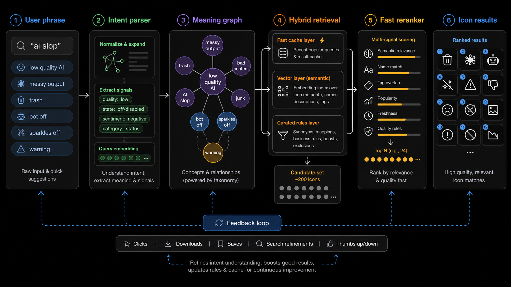
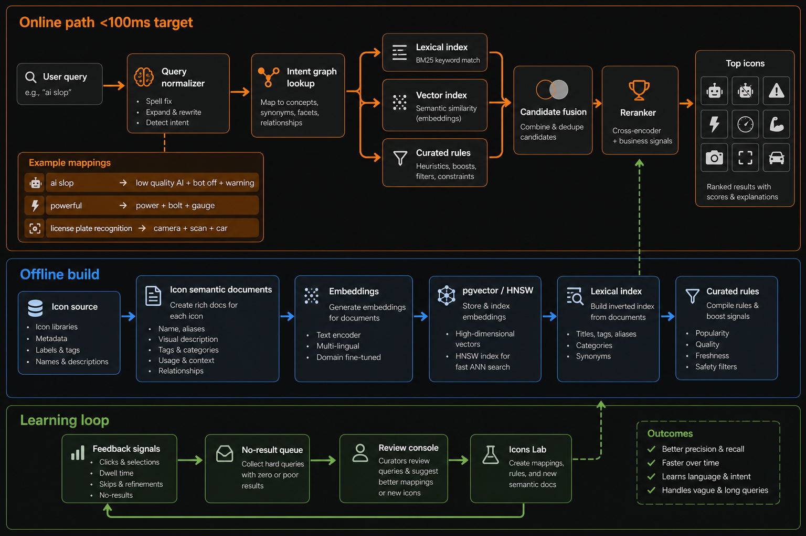

# Supericons Semantic Search v2 Intent Graph Refinement PRD

> **Superseded on 2026-07-11.** This document is retained as historical input. For current requirements, use [`docs/si-v2/search/search-engine-v2.md`](si-v2/search/search-engine-v2.md); for resolved choices and verified delivery state, use [`decisions.md`](si-v2/search/decisions.md) and [`implementation-status.md`](si-v2/search/implementation-status.md).

Date: 2026-07-01

Status: Draft PRD and implementation plan with resolved MVP decisions

Owner: Supericons

## Problem

Supericons search still needs a more general way to understand vague, emotional, judgment-based, and compound phrases such as `ai slop`, `powerful`, `secure checkout`, and `license plate recognition camera scan car`. [SOURCE: current product discussion]

The existing Semantic Search v2 plan already proposes hybrid retrieval using exact keyword search, full-text registry search, vector semantic search, an icon meaning graph, reranking, and a feedback loop. [SOURCE: docs/supericons-semantic-search-v2-prd-implementation-plan-2026-07-01.md]

The recent `powerful` fix proves the current deterministic intent layer can improve one class of query, but repeated manual word-by-word fixes will not scale to arbitrary language or localized versions. [SOURCE: references/verification/semantic-search-v2-phase-0-1-2026-07-01.md]

The refinement needed now is an intent graph layer that translates human phrases into structured icon meaning before search runs. [ASSUMPTION]

## Visual Direction



This ideation map shows the desired behavior for `ai slop`: parse the phrase into negative AI-quality concepts, retrieve candidates from fast cache, vector, and curated-rule lanes, then rerank icon candidates. [SOURCE: docs/assets/semantic-search-v2/semantic-search-v2-ai-slop-intent-flow.png]



This implementation map separates the online request path from the offline build and learning loop. The key insight is that public search should stay fast while heavier learning, embedding, and review work happens offline. [SOURCE: docs/assets/semantic-search-v2/semantic-search-v2-fast-hybrid-refinement.png]

## Current Implementation Status

Phase 1 has been implemented locally as a safe foundation slice. [SOURCE: references/verification/semantic-search-v2-intent-graph-phase-1-2026-07-01.md]

Implemented files:

- `data/search-intent-graph/intent-groups.json` [SOURCE: references/verification/semantic-search-v2-intent-graph-phase-1-2026-07-01.md]
- `data/search-intent-graph/intent-fixtures.json` [SOURCE: references/verification/semantic-search-v2-intent-graph-phase-1-2026-07-01.md]
- `scripts/build-search-intent-graph.mjs` [SOURCE: references/verification/semantic-search-v2-intent-graph-phase-1-2026-07-01.md]
- `scripts/verify-search-intent-graph.mjs` [SOURCE: references/verification/semantic-search-v2-intent-graph-phase-1-2026-07-01.md]
- `lib/search-query-frame.js` and `mcp/runtime/search-query-frame.js` [SOURCE: references/verification/semantic-search-v2-intent-graph-phase-1-2026-07-01.md]
- `lib/generated-search-intent-graph.js` and `mcp/runtime/generated-search-intent-graph.js` [SOURCE: references/verification/semantic-search-v2-intent-graph-phase-1-2026-07-01.md]

Verified local behavior:

- `ai slop` maps to `ai_low_quality_output` with warning, bot-off, trash, and cleanup concepts. [SOURCE: references/verification/semantic-search-v2-intent-graph-phase-1-2026-07-01.md]
- `powerful` maps to `power_strength_performance` with power, bolt, zap, rocket, gauge, and strength concepts. [SOURCE: references/verification/semantic-search-v2-intent-graph-phase-1-2026-07-01.md]
- `license plate recognition camera scan car` maps to `vision_scan_detection` with camera, scan, car, object/action/device fields, and false-positive avoid concepts. [SOURCE: references/verification/semantic-search-v2-intent-graph-phase-1-2026-07-01.md]
- `xai logo` is recognized as a `brand_logo` query without being forced into a generic AI meaning group. [SOURCE: references/verification/semantic-search-v2-intent-graph-phase-1-2026-07-01.md]

No production ranking behavior, hosted search deployment, Netlify deployment, npm publish, or Supabase deployment was performed in this slice. [SOURCE: references/verification/semantic-search-v2-intent-graph-phase-1-2026-07-01.md]

## Target User

- Web users who search by meaning, mood, product use case, or rough phrase instead of exact icon name. [SOURCE: docs/supericons-search-quality-implementation-plan-2026-06-29.md]
- AI coding agents that call Supericons MCP and need reliable icon search or recommendations from natural language. [SOURCE: docs/supericons-search-quality-implementation-plan-2026-06-29.md]
- Supericons maintainers who need a repeatable way to improve failed or weak searches without hand-patching every query. [SOURCE: docs/supericons-search-quality-implementation-plan-2026-06-29.md]
- Future Icons Lab users who need repeated search gaps converted into icon briefs when no suitable icon exists. [SOURCE: docs/supericons-semantic-search-v2-prd-implementation-plan-2026-07-01.md]

## Jobs To Be Done

- When I search with a vague phrase like `ai slop`, I want Supericons to understand the meaning so I can get relevant warning, bad-output, cleanup, or bot-off icons. [SOURCE: current product discussion]
- When I search with an adjective like `powerful`, I want related icon concepts such as power, bolt, gauge, rocket, or strength, not a no-result state. [SOURCE: references/verification/semantic-search-v2-phase-0-1-2026-07-01.md]
- When I search with a long phrase, I want the system to identify the important objects, actions, domains, and avoid terms instead of treating every word equally. [SOURCE: docs/supericons-search-quality-implementation-plan-2026-06-29.md]
- When I search for a logo or brand, I want exact brand/name matches to win over broad semantic matches. [SOURCE: docs/supericons-semantic-search-v2-prd-implementation-plan-2026-07-01.md]
- When the right icon does not exist, I want Supericons to show a useful fallback and create a clear Icons Lab opportunity. [SOURCE: docs/supericons-search-quality-implementation-plan-2026-06-29.md]

## Goals

1. Make intent handling scalable beyond one-off synonyms. [SOURCE: current product discussion]
2. Keep web search, hosted MCP, local MCP, and `recommend_icons` aligned. [SOURCE: docs/supericons-search-quality-implementation-plan-2026-06-29.md]
3. Preserve fast search behavior for public users and agents. [ASSUMPTION]
4. Preserve exact logo and brand search quality for the Supericons logo library. [SOURCE: docs/supericons-semantic-search-v2-prd-implementation-plan-2026-07-01.md]
5. Support localized and multilingual phrases through the same intent graph where possible. [SOURCE: docs/supericons-semantic-search-v2-prd-implementation-plan-2026-07-01.md]
6. Convert no-result and low-confidence searches into measurable review and Icons Lab creation workflows. [SOURCE: docs/supericons-search-quality-implementation-plan-2026-06-29.md]

## Resolved MVP Decisions

These decisions use the Socratic framing from the product discussion: what improves icon-finding quality fastest while keeping production search safe, fast, and explainable. [SOURCE: current product discussion]

| Decision Area | Decision | Rationale |
| --- | --- | --- |
| Intent graph authoring | Use model-assisted drafts with human approval before commit. [ASSUMPTION] | A model can speed up grouping failed searches, but humans should own the shipped meaning graph because search quality and brand/logo exactness are trust-sensitive. [SOURCE: docs/supericons-semantic-search-v2-prd-implementation-plan-2026-07-01.md] |
| Runtime latency | Target under 100 ms server-side for cached common queries and under 300 ms server-side for uncached hosted hybrid search before network variability. [ASSUMPTION] | A smarter search that feels slow weakens the core job: find the right icon fast. [SOURCE: current product discussion] |
| Vector fusion guardrail | Keep vector fusion skippable through a feature flag and per-request time budget. [SOURCE: docs/supericons-semantic-search-v2-prd-implementation-plan-2026-07-01.md] | Exact, lexical, and intent-graph search should still return useful results if vector retrieval is slow or unavailable. [ASSUMPTION] |
| Match reasons | Keep detailed match reasons internal first; expose only light public-safe reasons later if they help users or agents. [ASSUMPTION] | Raw scores and ranking internals can clutter the UI and leak too much implementation detail. [SOURCE: AGENTS.md instructions] |
| Localized MVP phrases | Hand-curate localized phrases only for high-value or high-risk groups at MVP, and let embeddings handle the long tail later. [ASSUMPTION] | Curated phrases are most useful where ambiguity or business value is high, such as logos, core UI concepts, security, AI workflow, and negative AI-quality searches. [SOURCE: docs/supericons-semantic-search-v2-prd-implementation-plan-2026-07-01.md] |
| Icons Lab brief policy | Create private draft briefs from single high-intent gaps, but promote to real backlog only after repeated searches, explicit feedback, or maintainer approval. [ASSUMPTION] | This captures good ideas quickly without flooding Icons Lab with noisy one-off searches. [SOURCE: docs/supericons-search-quality-implementation-plan-2026-06-29.md] |

## Non-Goals

- Do not call a general-purpose LLM for every public search request in the critical path. [SOURCE: docs/supericons-semantic-search-v2-prd-implementation-plan-2026-07-01.md]
- Do not allow model-proposed intent groups to ship without human approval. [ASSUMPTION]
- Do not replace the existing web UI. [SOURCE: docs/supericons-semantic-search-v2-prd-implementation-plan-2026-07-01.md]
- Do not create a separate UI just for this refinement. [SOURCE: current product discussion]
- Do not deploy to Netlify, publish npm, or deploy Supabase functions automatically as part of this PRD. [SOURCE: current product discussion]
- Do not move to Kubernetes for this refinement. [SOURCE: docs/supericons-semantic-search-v2-prd-implementation-plan-2026-07-01.md]
- Do not introduce Pinecone, Qdrant, Weaviate, or Milvus unless Supabase/pgvector fails defined scale or quality gates. [SOURCE: docs/supericons-semantic-search-v2-prd-implementation-plan-2026-07-01.md]
- Do not expose private ranking weights, service keys, private user data, or internal process metadata in public artifacts. [SOURCE: AGENTS.md instructions]

## Scope

### In Scope

- A structured intent graph for phrases, adjectives, emotions, quality judgments, domains, objects, actions, and avoid terms. [ASSUMPTION]
- A query-frame parser that converts raw searches into structured meaning. [SOURCE: docs/supericons-semantic-search-v2-prd-implementation-plan-2026-07-01.md]
- A fast online retrieval path that combines lexical search, curated intent rules, vector candidates, and reranking. [SOURCE: docs/supericons-semantic-search-v2-prd-implementation-plan-2026-07-01.md]
- Regression fixtures for vague phrases such as `ai slop`, `powerful`, `secure checkout`, and long natural-language queries. [SOURCE: current product discussion]
- Feedback-loop outputs that classify whether a weak query needs metadata, an intent rule, vector tuning, or a new Icons Lab icon. [SOURCE: docs/supericons-search-quality-implementation-plan-2026-06-29.md]

### Out Of Scope

- New icon creation inside this refinement. [SOURCE: docs/supericons-search-quality-implementation-plan-2026-06-29.md]
- New billing, pricing, affiliate, or login behavior. [SOURCE: current product discussion]
- Public UI redesign. [SOURCE: current product discussion]
- LLM-generated vector icons or image-to-vector creation in the search critical path. [ASSUMPTION]

## Product Principle

Search should not merely match words. Search should infer the user's visual intent, find the closest available icons quickly, and admit when a new icon is needed. [ASSUMPTION]

## Proposed System

```text
User query
  -> normalize language and spelling
  -> build query frame
  -> look up intent graph
  -> retrieve candidates from lexical, vector, curated, and cache lanes
  -> fuse candidates
  -> rerank with exactness, meaning, visual fit, and avoid rules
  -> return top icons with public-safe confidence
  -> log feedback signals for review
```

This system extends the existing Semantic Search v2 architecture rather than replacing it. [SOURCE: docs/supericons-semantic-search-v2-prd-implementation-plan-2026-07-01.md]

## Intent Graph Model

The intent graph should define meaning groups instead of single synonym patches. [ASSUMPTION]

Example shape:

```json
{
  "id": "ai_low_quality_output",
  "label": "Low-quality AI output",
  "domains": ["ai", "content generation"],
  "facets": ["quality_negative", "generated_content", "warning"],
  "phrases": ["ai slop", "low quality ai", "messy ai output", "bad generation"],
  "positive_concepts": ["bot off", "warning", "trash", "sparkles off", "x circle", "image off"],
  "avoid_concepts": ["food", "cooking", "animal feed", "slop bucket"],
  "result_families": ["bot_error", "warning", "cleanup", "negative_status"],
  "gap_strategy": "return_warning_or_cleanup_fallback"
}
```

The graph should support:

- Phrase-to-meaning mapping. [ASSUMPTION]
- Adjective-to-concept mapping. [SOURCE: references/verification/semantic-search-v2-phase-0-1-2026-07-01.md]
- Domain and object/action parsing. [SOURCE: docs/supericons-search-quality-implementation-plan-2026-06-29.md]
- Positive and negative examples for reranking. [SOURCE: docs/supericons-semantic-search-v2-prd-implementation-plan-2026-07-01.md]
- Localized aliases that point to the same meaning group. [SOURCE: docs/supericons-semantic-search-v2-prd-implementation-plan-2026-07-01.md]

## Query Frame

Each search should create a compact query frame before candidate retrieval. [SOURCE: docs/supericons-semantic-search-v2-prd-implementation-plan-2026-07-01.md]

Example for `ai slop`:

```json
{
  "normalized_query": "ai slop",
  "language": "en",
  "intent_types": ["abstract_metaphor", "quality_negative", "ai_domain"],
  "domain_terms": ["ai", "content generation"],
  "meaning_groups": ["ai_low_quality_output"],
  "positive_concepts": ["bot off", "warning", "trash", "sparkles off"],
  "avoid_concepts": ["food", "cooking", "animal feed"],
  "fallback_terms": ["bad output", "messy output", "hallucination"],
  "confidence_floor": "medium"
}
```

Example for `powerful`:

```json
{
  "normalized_query": "powerful",
  "language": "en",
  "intent_types": ["adjective", "performance_positive"],
  "meaning_groups": ["power_strength_performance"],
  "positive_concepts": ["power", "bolt", "zap", "rocket", "gauge", "flame"],
  "avoid_concepts": ["power off", "battery low", "plug off"],
  "confidence_floor": "medium"
}
```

Example for `license plate recognition camera scan car`:

```json
{
  "normalized_query": "license plate recognition camera scan car",
  "language": "en",
  "intent_types": ["compound_concept", "object_action", "computer_vision"],
  "domain_terms": ["computer vision", "vehicle", "security"],
  "objects": ["car", "license plate"],
  "actions": ["scan", "recognize"],
  "devices": ["camera"],
  "positive_concepts": ["camera", "scan", "car"],
  "avoid_concepts": ["legal license", "dinner plate", "shopping cart"]
}
```

## Functional Requirements

### FR1: Intent Group Source File

Create a source-of-truth file such as `data/search-intent-graph/intent-groups.json` for meaning groups. [ASSUMPTION]

Mapping: supports jobs 1, 2, 3, and 5.

Acceptance criteria:

- Each group has `id`, `label`, `phrases`, `positive_concepts`, `avoid_concepts`, and `result_families`. [ASSUMPTION]
- Each committed group has been human-approved; model-proposed groups remain outside shipped runtime outputs until approved. [ASSUMPTION]
- Each group can include localized aliases for high-value or high-risk phrases. [ASSUMPTION]
- Groups are public-safe and contain no internal process metadata. [SOURCE: AGENTS.md instructions]

### FR2: Query Frame Builder

Build a shared query-frame module used by web, hosted search, local MCP, and `recommend_icons`. [SOURCE: docs/supericons-search-quality-implementation-plan-2026-06-29.md]

Mapping: supports jobs 1, 2, 3, and 4.

Acceptance criteria:

- `ai slop` maps to an AI low-quality output frame. [SOURCE: current product discussion]
- `powerful` maps to power/performance concepts. [SOURCE: references/verification/semantic-search-v2-phase-0-1-2026-07-01.md]
- Brand/logo queries still preserve exact match priority. [SOURCE: docs/supericons-semantic-search-v2-prd-implementation-plan-2026-07-01.md]
- Long queries expose object/action/device/domain fields when possible. [SOURCE: docs/supericons-search-quality-implementation-plan-2026-06-29.md]

### FR3: Generated Runtime Rules

Generate web/hosted and MCP runtime rule files from the same intent graph source. [SOURCE: references/verification/semantic-search-v2-phase-0-1-2026-07-01.md]

Mapping: supports job 2 and mitigates runtime drift risk.

Acceptance criteria:

- Generator writes both `lib` and `mcp/runtime` outputs. [SOURCE: references/verification/semantic-search-v2-phase-0-1-2026-07-01.md]
- Verification fails if generated files drift. [SOURCE: references/verification/semantic-search-v2-phase-0-1-2026-07-01.md]
- Generated files contain no secrets or private process metadata. [SOURCE: AGENTS.md instructions]

### FR4: Fast Candidate Retrieval

Retrieve candidates from exact/name, lexical, intent graph, vector, and cache lanes. [SOURCE: docs/supericons-semantic-search-v2-prd-implementation-plan-2026-07-01.md]

Mapping: supports jobs 1, 2, and 3.

Acceptance criteria:

- Cached common query results can be returned without computing embeddings at request time. [ASSUMPTION]
- Exact brand/logo matches remain in the candidate set with priority. [SOURCE: docs/supericons-semantic-search-v2-prd-implementation-plan-2026-07-01.md]
- Vector candidates are optional behind a feature flag until the shadow evaluation passes. [SOURCE: docs/supericons-semantic-search-v2-prd-implementation-plan-2026-07-01.md]
- Vector retrieval can be skipped when it exceeds the request budget; lexical and intent-graph candidates still complete the response. [ASSUMPTION]

### FR5: Candidate Fusion

Merge candidate lanes using deterministic scoring before final reranking. [SOURCE: docs/supericons-semantic-search-v2-prd-implementation-plan-2026-07-01.md]

Mapping: supports jobs 1 and 3.

Acceptance criteria:

- Candidate records include which lanes matched them. [ASSUMPTION]
- Internal diagnostics can explain why an icon was included using public-safe reason labels such as `exact_name`, `intent_group`, `semantic_vector`, or `avoid_penalty`. [ASSUMPTION]
- The fusion layer deduplicates by icon id. [SOURCE: docs/supericons-semantic-search-v2-prd-implementation-plan-2026-07-01.md]

### FR6: Reranker With Avoid Rules

Rerank candidates using exactness, meaning overlap, visual fit, popularity, and avoid rules. [SOURCE: docs/supericons-semantic-search-v2-prd-implementation-plan-2026-07-01.md]

Mapping: supports jobs 1, 3, and 4.

Acceptance criteria:

- `ai slop` should avoid food/cooking interpretations unless the query explicitly asks for food. [ASSUMPTION]
- `license plate recognition camera scan car` should avoid dinner plate, generic legal license, and shopping cart false positives. [SOURCE: docs/supericons-search-quality-implementation-plan-2026-06-29.md]
- `powerful` should avoid off/low-power meanings. [SOURCE: references/verification/semantic-search-v2-phase-0-1-2026-07-01.md]

### FR7: Confidence And Gap Classification

Classify weak results into actionable gap types. [SOURCE: docs/supericons-search-quality-implementation-plan-2026-06-29.md]

Mapping: supports job 5.

Acceptance criteria:

- Gap classes include `metadata_gap`, `intent_gap`, `vector_gap`, `library_gap`, and `new_icon_gap`. [ASSUMPTION]
- Low-confidence responses can still return fallback icons while logging the gap. [ASSUMPTION]
- `new_icon_gap` can produce a private draft Icons Lab brief from a single high-intent query. [ASSUMPTION]
- A draft brief becomes a real Icons Lab backlog item only after repeated searches, explicit user feedback, or maintainer approval. [ASSUMPTION]

### FR8: Recommend Icons Alignment

`recommend_icons` should use query frames and intent groups for slot labels and task descriptions. [SOURCE: docs/supericons-search-quality-implementation-plan-2026-06-29.md]

Mapping: supports job 2.

Acceptance criteria:

- A slot like `low quality ai warning` can surface warning/bot-off style icons. [ASSUMPTION]
- Brand-logo slots still prioritize exact Supericons brand matches where available. [SOURCE: docs/supericons-semantic-search-v2-prd-implementation-plan-2026-07-01.md]
- Regression fixtures cover recommend mode separately from simple search mode. [ASSUMPTION]

### FR9: Feedback Learning Loop

Use no-result searches, low-confidence searches, refinements, clicks, copies, downloads, and saves as improvement signals. [SOURCE: docs/supericons-semantic-search-v2-prd-implementation-plan-2026-07-01.md]

Mapping: supports job 5 and business goal of improving search over time.

Acceptance criteria:

- Feedback data should not add user friction. [SOURCE: current product discussion]
- Public responses should not expose private user identifiers or ranking internals. [SOURCE: AGENTS.md instructions]
- Maintainers can review repeated gaps and decide whether to add metadata, add an intent group, adjust reranking, or create a new icon brief. [SOURCE: docs/supericons-search-quality-implementation-plan-2026-06-29.md]

### FR10: Match Reason Policy

Keep detailed match reasons internal in the MVP, with optional light public-safe reasons later for MCP or debugging contexts. [ASSUMPTION]

Mapping: supports jobs 2 and 4 while mitigating public leakage and UI clutter risks.

Acceptance criteria:

- MVP public web responses do not expose raw ranking scores, hidden weights, or full diagnostic traces. [SOURCE: AGENTS.md instructions]
- Internal logs can retain lane-level labels such as `exact_name`, `intent_group`, `semantic_vector`, and `avoid_penalty`. [ASSUMPTION]
- Any future public-facing reason is short and safe, such as `Matched by name`, `Matched by meaning`, or `Matched related concept`. [ASSUMPTION]

### FR11: Localized MVP Policy

Curate localized phrases for high-value or high-risk groups first, and rely on embeddings for lower-risk long-tail language after vector search is enabled. [ASSUMPTION]

Mapping: supports jobs 1 and 3 while mitigating noisy translation and maintenance risks.

Acceptance criteria:

- MVP localized graph entries prioritize logos, core UI concepts, security/privacy, AI workflow, negative AI quality, and repeated no-result queries. [ASSUMPTION]
- Localized aliases point to the same meaning groups as English aliases. [ASSUMPTION]
- Long-tail localized phrases are not hand-added unless they appear in repeated search gaps or high-intent user feedback. [ASSUMPTION]

## MVP Intent Groups

The first source file should focus on high-demand, high-ambiguity groups. [ASSUMPTION]

| Group | Example Queries | Positive Concepts | Avoid Concepts |
| --- | --- | --- | --- |
| `ai_low_quality_output` | `ai slop`, `bad ai output`, `messy generation` | `bot off`, `warning`, `trash`, `sparkles off`, `image off` | `food`, `cooking`, `animal feed` |
| `power_strength_performance` | `powerful`, `strong`, `high performance` | `power`, `bolt`, `zap`, `rocket`, `gauge`, `shield` | `power off`, `battery low`, `plug off` |
| `trust_security_privacy` | `secure`, `safe`, `private`, `trusted` | `shield`, `lock`, `key`, `verified`, `fingerprint` | `unlock`, `shield off`, `eye` when privacy is requested |
| `speed_latency` | `fast`, `instant`, `low latency`, `slow` | `timer`, `gauge`, `rocket`, `activity`, `bolt` | `settings slow motion` unless slow is explicit |
| `quality_polish` | `premium`, `beautiful`, `polished`, `clean` | `sparkles`, `badge`, `gem`, `palette`, `wand` | `bug`, `broken`, `warning` |
| `bad_state_error` | `broken`, `failed`, `not working`, `crash` | `x circle`, `bug`, `alert`, `wrench`, `bot off` | success/check icons |
| `vision_scan_detection` | `license plate recognition`, `scan car`, `camera detect` | `camera`, `scan`, `car`, `focus`, `target` | `dinner plate`, `shopping cart`, `legal license` |
| `agentic_workflow` | `agent`, `tool call`, `autonomous`, `orchestration` | `bot`, `workflow`, `route`, `network`, `terminal` | unrelated generic AI logos when not brand-seeking |

## Data And File Plan

Proposed new files:

- `data/search-intent-graph/intent-groups.json` for source meaning groups. [ASSUMPTION]
- `data/search-intent-graph/intent-fixtures.json` for group-level fixtures. [ASSUMPTION]
- `lib/search-query-frame.js` for shared query-frame construction. [ASSUMPTION]
- `mcp/runtime/search-query-frame.js` generated or copied runtime equivalent. [ASSUMPTION]
- `scripts/build-search-intent-graph.mjs` to generate runtime rules from source. [ASSUMPTION]
- `scripts/verify-search-intent-graph.mjs` to validate graph shape, fixtures, and runtime sync. [ASSUMPTION]

Existing files likely affected:

- `lib/search-intent-core.js` for integration with existing query variants. [SOURCE: docs/supericons-semantic-search-v2-prd-implementation-plan-2026-07-01.md]
- `mcp/runtime/search-intent-core.js` for MCP runtime parity. [SOURCE: docs/supericons-search-quality-implementation-plan-2026-06-29.md]
- `supabase/functions/_shared/search-engine/handle-search-request.ts` for hosted candidate-fusion integration. [SOURCE: docs/supericons-semantic-search-v2-prd-implementation-plan-2026-07-01.md]
- `mcp/recommend-icons.js` for recommendation alignment. [SOURCE: docs/supericons-search-quality-implementation-plan-2026-06-29.md]

## Performance Plan

The online path should be designed for a fast public search experience. [ASSUMPTION]

Targets:

- Cached common query response target: under 100 ms server-side. [ASSUMPTION]
- Uncached hybrid hosted response target: under 300 ms server-side before network variability. [ASSUMPTION]
- No LLM call in the default public request path. [SOURCE: docs/supericons-semantic-search-v2-prd-implementation-plan-2026-07-01.md]
- Embeddings should be precomputed for icon semantic documents. [SOURCE: docs/supericons-semantic-search-v2-prd-implementation-plan-2026-07-01.md]
- Query embeddings may be cached for repeated normalized queries. [ASSUMPTION]
- If vector retrieval or reranking risks breaching the hosted response budget, the request should fall back to exact, lexical, cached, and intent-graph candidates. [ASSUMPTION]
- The rollout should track latency by lane so vector fusion can be disabled without disabling the rest of search. [ASSUMPTION]

## Success Metrics

- No-result rate decreases for tracked natural-language and adjective queries. [ASSUMPTION]
- Top-8 recall improves or stays neutral across the existing search fixture suite. [ASSUMPTION]
- Exact brand/logo fixture pass rate remains 100% for existing Supericons logo fixtures. [SOURCE: references/verification/semantic-search-v2-phase-0-1-2026-07-01.md]
- `ai slop`, `powerful`, `license plate recognition camera scan car`, and localized equivalent fixtures return relevant top results. [SOURCE: current product discussion]
- Public hosted search latency remains within the defined target or feature flag remains off. [ASSUMPTION]
- Maintainer review turns repeated weak queries into an explicit action class. [SOURCE: docs/supericons-search-quality-implementation-plan-2026-06-29.md]

## Implementation Plan

### Phase 1: Intent Graph Source And Fixtures

Objective: replace one-off word patches with structured meaning groups. [ASSUMPTION]

Tasks:

- Create `intent-groups.json` with the MVP groups above. [ASSUMPTION]
- Allow model-assisted draft generation locally or in a private review workflow, but commit only human-approved intent groups. [ASSUMPTION]
- Add fixtures for `ai slop`, `powerful`, `strong`, `secure checkout`, `premium dashboard`, `license plate recognition camera scan car`, and localized equivalents where available. [ASSUMPTION]
- Validate group shape, duplicate phrases, and forbidden private fields. [SOURCE: AGENTS.md instructions]

Exit criteria:

- Intent graph verification passes locally. [ASSUMPTION]
- Existing search-intent fixture tests still pass. [SOURCE: references/verification/semantic-search-v2-phase-0-1-2026-07-01.md]

### Phase 2: Query Frame Builder

Objective: convert raw queries into structured meaning before retrieval. [ASSUMPTION]

Tasks:

- Implement a shared query-frame builder. [ASSUMPTION]
- Add deterministic phrase matching and adjective/facet matching. [ASSUMPTION]
- Add weak-token suppression and avoid-term extraction. [SOURCE: docs/supericons-search-quality-implementation-plan-2026-06-29.md]
- Wire query frames into the existing variant builder without changing public ranking yet. [ASSUMPTION]

Exit criteria:

- `ai slop` produces the expected AI low-quality output frame. [SOURCE: current product discussion]
- Existing `powerful` behavior remains covered. [SOURCE: references/verification/semantic-search-v2-phase-0-1-2026-07-01.md]
- Brand/logo exact fixtures remain unchanged. [SOURCE: docs/supericons-semantic-search-v2-prd-implementation-plan-2026-07-01.md]

### Phase 3: Fast Candidate Fusion

Objective: combine deterministic, lexical, and semantic candidates safely. [SOURCE: docs/supericons-semantic-search-v2-prd-implementation-plan-2026-07-01.md]

Tasks:

- Add query-frame fields to hosted search candidate diagnostics in a private-safe way. [ASSUMPTION]
- Add intent-graph candidate lane beside existing lexical and registry lanes. [ASSUMPTION]
- Keep vector lane feature-flagged until Semantic Search v2 shadow evaluation is ready. [SOURCE: docs/supericons-semantic-search-v2-prd-implementation-plan-2026-07-01.md]
- Add internal match reasons for debugging, with no raw scores in public responses. [ASSUMPTION]
- Add per-lane timing so vector fusion can be skipped or disabled when it threatens the latency target. [ASSUMPTION]

Exit criteria:

- Search results improve for graph-backed queries without degrading exact search fixtures. [ASSUMPTION]
- Hosted search core verification passes. [SOURCE: references/verification/semantic-search-v2-phase-0-1-2026-07-01.md]

### Phase 4: Recommend Icons Alignment

Objective: make `recommend_icons` benefit from the same meaning graph. [SOURCE: docs/supericons-search-quality-implementation-plan-2026-06-29.md]

Tasks:

- Use query frames for task descriptions and slot labels. [ASSUMPTION]
- Add fixtures for negative AI quality, security, performance, and agentic workflow slots. [ASSUMPTION]
- Keep exact brand slots prioritized. [SOURCE: docs/supericons-semantic-search-v2-prd-implementation-plan-2026-07-01.md]

Exit criteria:

- `recommend_icons` returns coherent icon sets for vague slots such as `bad AI output warning`. [ASSUMPTION]
- Existing recommendation tests remain passing. [SOURCE: references/verification/semantic-search-v2-phase-0-1-2026-07-01.md]

### Phase 5: Feedback Loop And Icons Lab Briefs

Objective: turn repeated weak searches into product improvement. [SOURCE: docs/supericons-search-quality-implementation-plan-2026-06-29.md]

Tasks:

- Add review classifications for `metadata_gap`, `intent_gap`, `vector_gap`, `library_gap`, and `new_icon_gap`. [ASSUMPTION]
- Generate private draft Icons Lab briefs for single high-intent `new_icon_gap` queries. [ASSUMPTION]
- Promote a draft to backlog only after repeated searches, explicit user feedback, or maintainer approval. [ASSUMPTION]
- Keep user-facing feedback frictionless. [SOURCE: current product discussion]

Exit criteria:

- Maintainers can review hard queries and choose a next action. [ASSUMPTION]
- The query review process does not expose private metadata in public artifacts. [SOURCE: AGENTS.md instructions]

## QA Plan

Required checks before release:

- Intent graph schema verification. [ASSUMPTION]
- Query frame fixture verification. [ASSUMPTION]
- Existing search intent expansion verification. [SOURCE: references/verification/semantic-search-v2-phase-0-1-2026-07-01.md]
- Existing web/CJK search verification. [SOURCE: references/verification/semantic-search-v2-phase-0-1-2026-07-01.md]
- Semantic Search v2 smoke verification. [SOURCE: references/verification/semantic-search-v2-phase-0-1-2026-07-01.md]
- Hosted search engine verification. [SOURCE: references/verification/semantic-search-v2-phase-0-1-2026-07-01.md]
- MCP package verification before npm release. [SOURCE: references/verification/semantic-search-v2-phase-0-1-2026-07-01.md]
- Public safety scan. [SOURCE: references/verification/semantic-search-v2-phase-0-1-2026-07-01.md]

Manual smoke examples:

- `ai slop`
- `low quality ai`
- `powerful`
- `secure checkout`
- `premium dashboard`
- `license plate recognition camera scan car`
- `dream interpretation moon star eye mystical`
- `xai logo`
- `openai codex logo`

## Risks

- The intent graph may become too broad and produce noisy results if avoid terms and fixtures are weak. [ASSUMPTION]
- Exact logo search could degrade if semantic matches outrank brand identity matches. [SOURCE: docs/supericons-semantic-search-v2-prd-implementation-plan-2026-07-01.md]
- Runtime drift can occur if web/hosted and MCP generated files are not kept aligned. [SOURCE: references/verification/semantic-search-v2-phase-0-1-2026-07-01.md]
- Public search latency can rise if vector retrieval or reranking is added without caching and limits. [ASSUMPTION]
- Feedback data can become noisy if user actions are interpreted without context. [ASSUMPTION]

## Open Questions

- What private review workflow should model-assisted intent drafts use before a human-approved group is committed? [ASSUMPTION]
- What real production latency baseline should become the final p95 gate after hosted shadow evaluation? [ASSUMPTION]
- Which exact localized phrases should be seeded first for AI-quality, security, and workflow groups? [ASSUMPTION]
- What maintainer approval threshold should promote a private Icons Lab draft brief into the public-facing creation backlog? [ASSUMPTION]

## Recommended Next Step

Build Phase 1 only: create the intent graph source file, add the initial MVP groups, generate runtime fixtures, and verify that `ai slop` and related phrases produce the right query frame without changing production ranking. Use model assistance only for draft suggestions, and commit only human-approved groups. [ASSUMPTION]

This gives Supericons a stronger meaning layer while keeping public search behavior controlled until we are ready to wire the graph into candidate fusion. [ASSUMPTION]
