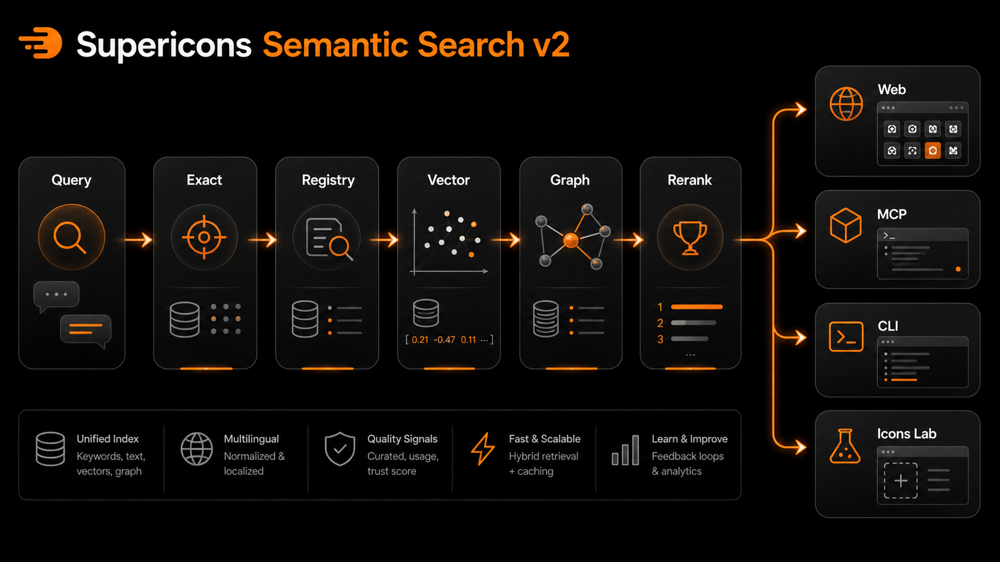
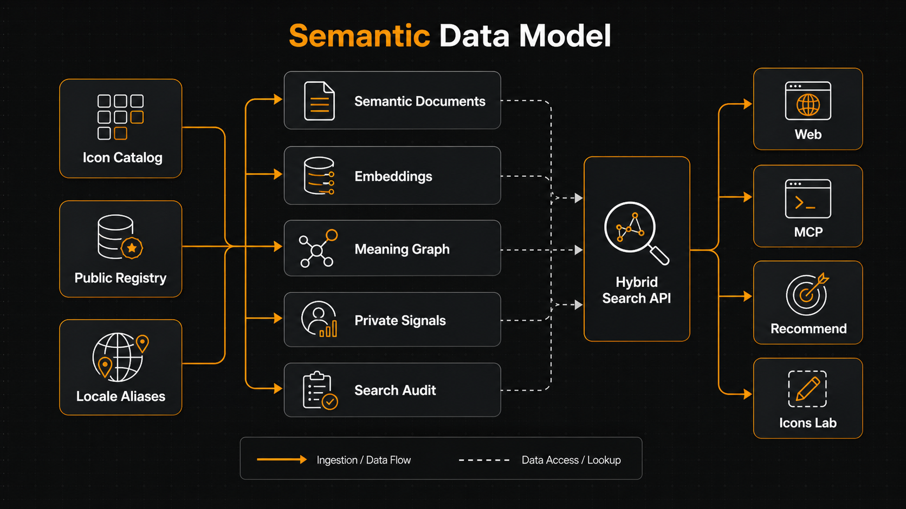
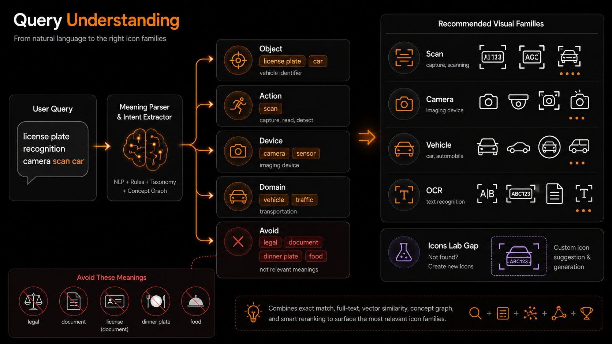
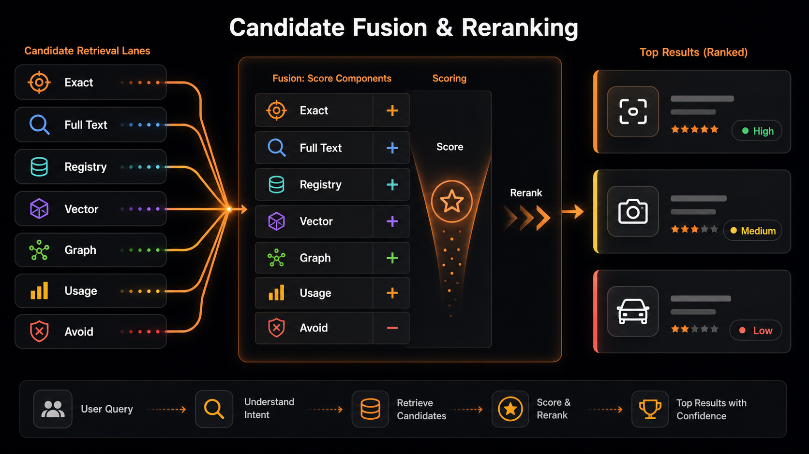
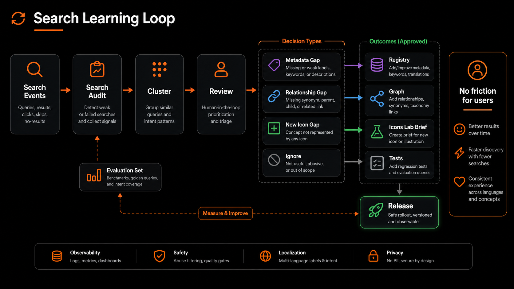
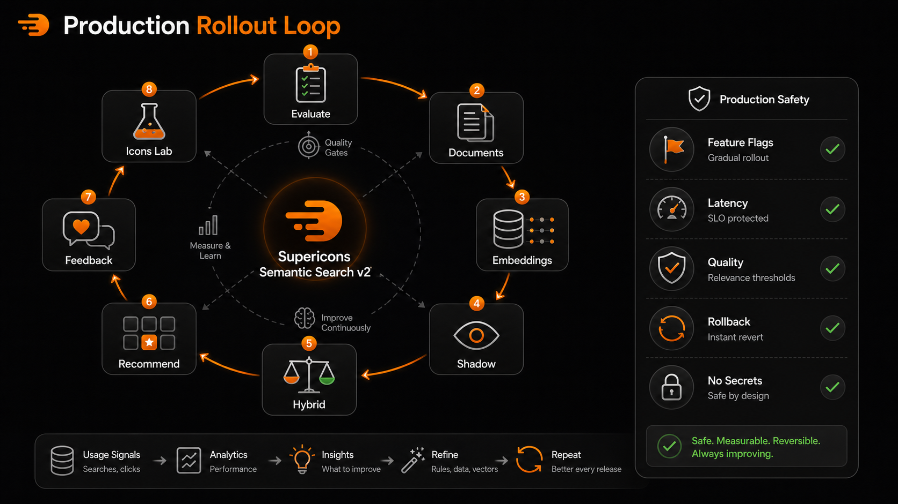

# Supericons Semantic Search v2 PRD And Implementation Plan

> **Superseded on 2026-07-11.** This document is retained as historical input. For current requirements, use [`docs/si-v2/search/search-engine-v2.md`](si-v2/search/search-engine-v2.md); for resolved choices and verified delivery state, use [`decisions.md`](si-v2/search/decisions.md) and [`implementation-status.md`](si-v2/search/implementation-status.md).

Date: 2026-07-01

Status: Draft PRD and implementation plan

Owner: Supericons

## Product Question

How should Supericons evolve from manually patched keyword rules into a production-safe search and recommendation system that understands icon meaning, relationships, brand names, localized queries, and long natural-language phrases across the web UI, hosted MCP, local MCP, and CLI-style usage?

## Short Answer

Supericons should move to a hybrid retrieval system:

```text
exact keyword search
  + full-text registry search
  + vector semantic search
  + icon meaning graph
  + reranking
  + production feedback loop
```

For the next production iteration, use Supabase Postgres plus `pgvector` rather than introducing a separate vector database or Kubernetes cluster. This keeps the architecture close to the live hosted search path, limits operational risk, and gives enough headroom for the current catalog size.

## Visual Summary



This map shows the intended direction: keep exact search and registry search, add vector search and a meaning graph, then rerank before serving results to the web UI, MCP, CLI-style usage, and Icons Lab backlog workflows.

## Current Implementation Status

Phase 0 and the safe local part of Phase 1 have been implemented as of 2026-07-01.

Implemented files:

- `data/semantic-search-v2/evaluation-set.json`
- `lib/semantic-search-documents.js`
- `scripts/build-semantic-search-documents.mjs`
- `scripts/verify-semantic-search-v2.mjs`
- `supabase/migrations/20260701_semantic_search_v2_documents.sql`

Verified local output:

- Evaluation set contains 28 public-safe evaluation queries across brand/logo, long natural-language, common UI, localized, negative-meaning, and recommendation-slot groups.
- Semantic document builder produced 75,560 documents from the current public icon and registry projections.
- The builder produced five document types for each resolved record: `identity`, `meaning`, `visual`, `domain`, and `negative`.
- The builder skipped 41 unresolved or duplicate resolved registry rows, matching the expected class of hosted sync edge cases.

No production ranking, hosted search behavior, Netlify deployment, npm package publish, or Supabase deployment has been changed by this implementation slice.

## Evidence Inventory

### Checked Repo Facts

- The web icon projection currently contains 21,371 icons, including 50 `si` Supericons icons. Verified with `node -e` against `public/icon-index.json` on 2026-07-01.
- The MCP icon projection currently contains 21,371 icons, including 50 `si` Supericons icons. Verified with `node -e` against `mcp/public/icon-index.json` on 2026-07-01.
- The public registry projection currently contains 15,153 records, including 50 `si` Supericons registry records. Verified with `node -e` against `public/registry/records.json` on 2026-07-01.
- The MCP registry projection currently contains 15,153 records, including 50 `si` Supericons registry records. Verified with `node -e` against `mcp/public/registry-records.json` on 2026-07-01.
- `mcp/package.json` currently identifies the published MCP package as `@supericons/mcp` version `0.4.12`.
- The hosted search path uses Supabase Edge Functions through `supabase/functions/search-icons/index.ts` and `supabase/functions/mcp-search/index.ts`; both delegate to `supabase/functions/_shared/search-engine/handle-search-request.ts`.
- The shared hosted search handler builds query variants through `buildSearchIntentProfile`, `buildIntentQueryVariants`, and `getIntentCandidateAdjustment` from `lib/search-intent-core.js`.
- The hosted search handler calls the `si_search_icon_candidates` Supabase RPC once per query variant, deduplicates candidates by `icon_id`, reranks them with `rerankCandidates`, attaches public semantic payloads, and writes `search_request_audit` rows.
- The hosted search database schema has `icon_catalog`, `icon_search_private_manifest`, `icon_search_private_features`, and `search_request_audit` tables in `supabase/migrations/20260418_hosted_search_engine_schema.sql`.
- The hosted registry metadata table `icon_search_public_registry_metadata` has weighted `tsvector` fields for label, synonyms, semantic tags, depicts, purpose, use cases, categories, and avoid terms in `supabase/migrations/20260501_hosted_search_public_registry_metadata.sql`.
- The `si_search_icon_candidates` RPC currently combines catalog full-text rank, private aliases/use cases, public registry rank, and avoid rank in `supabase/migrations/20260503_icon_catalog_public_payload.sql`.
- The local MCP tool path exposes `search_icons`, `recommend_icons`, `get_icon`, and `list_libraries` in `mcp/index.js`.
- Local MCP search calls hosted search first and only falls back to local search when allowed and local data exists. Verified by reading `searchAccessibleIcons` in `mcp/index.js`.
- Local MCP semantic enrichment uses `mcp/semantic-registry.js`, which scores label, name, aliases, synonyms, semantic tags, search terms, meaning, purpose, depicts, use_when, avoid_when, category, and job category.
- `docs/registry/semantic-registry-maintenance.md` states that `public/registry/records.json` and `mcp/public/registry-records.json` are generated deployment artifacts and should not be hand-edited.
- `docs/registry/supabase-registry-schema-design.md` recommends a controlled Supabase registry with staging, review, quality findings, export logs, and public projection gates.
- `docs/supericons-search-quality-implementation-plan-2026-06-29.md` already defines a Phase 1 search-quality loop using real failed queries, deterministic intent expansion, MCP/web alignment, and Icons Lab gap classification.

### External Technical References

- Supabase documents hybrid search as combining full-text search and semantic search, with RRF-style fusion as a way to merge results.
- Supabase documents `pgvector` for vector similarity search and HNSW indexes for approximate nearest-neighbor search.
- OpenAI documents embeddings as useful for search, clustering, recommendations, classification, and relatedness scoring.
- Pinecone documents reranking as a second-stage retrieval step that improves result quality after an initial search.
- Qdrant documents recommendation and exploration APIs using positive and negative examples, which may be useful later if Supericons outgrows Postgres-native search.

Reference links:

- https://supabase.com/docs/guides/ai/hybrid-search
- https://supabase.com/docs/guides/database/extensions/pgvector
- https://supabase.com/docs/guides/ai/vector-indexes/hnsw-indexes
- https://developers.openai.com/api/docs/guides/embeddings
- https://docs.pinecone.io/guides/search/rerank-results
- https://qdrant.tech/documentation/search/explore/

### Assumptions

- Real users are already using production search through the public website and hosted MCP.
- The current manual intent rules are useful but will not scale to arbitrary phrases, localized language, and future icon-generation workflows.
- Search quality should improve without requiring a breaking change to public web, MCP, or npm package setup.
- The first semantic search v2 implementation should optimize relevance and safety before optimizing for massive scale.

## Problem Statement

Supericons currently has useful semantic metadata and a hosted search engine, but difficult queries still require manual intent rules. This works for individual known failures such as `license plate recognition camera scan car`, but it does not create a general system that can understand arbitrary user language, localized phrases, adjacent meanings, or visual relationships.

The problem matters now because:

- Supericons is live in production.
- MCP users and AI coding agents expect search to work from natural language.
- AI-logo search is a strong acquisition use case, but users also need non-logo icons by concept.
- Long queries often describe a visual idea rather than an exact icon name.
- Repeated manual patches can make ranking brittle, noisy, and hard to explain.

## Target User

### Primary Users

- Indie developers and vibe coders looking for icons by product name, UI role, or natural-language concept.
- AI coding agents using Supericons MCP to search, recommend, and retrieve icons while building apps.

### Secondary Users

- Supericons maintainers reviewing failed and weak search queries.
- Future Icons Lab users who need to create an icon when the library does not contain a strong match.

## Jobs To Be Done

- When I type a plain-language description, I want Supericons to understand the visual meaning so I can find a useful icon without knowing the file name.
- When I search for a logo or brand, I want exact brand/name matches to win over generic semantic matches.
- When I search in another language, I want the system to understand the concept or route me to the closest English-backed semantic match.
- When an AI agent recommends icons for a UI, I want it to choose based on use case, meaning, and visual fit, not only string overlap.
- When no icon truly exists, I want Supericons to show the best fallback and turn the gap into an Icons Lab creation opportunity.
- When maintainers review query logs, they need a repeatable way to decide whether a failure needs metadata, a synonym, an intent rule, a new icon, or no action.

## Goals

1. Improve search quality for long natural-language queries without creating noisy results for short exact searches.
2. Keep web search, hosted MCP, local MCP, and `recommend_icons` aligned.
3. Preserve exact brand/logo search quality for the 50 Supericons AI/developer-tool logos.
4. Add semantic vector retrieval using the existing Supabase-hosted search architecture first.
5. Add a safer reranking layer that can decide whether candidates actually satisfy the user query.
6. Support localized search through multilingual aliases, normalized language handling, and embeddings where appropriate.
7. Convert low-confidence and no-result queries into a measurable improvement loop.
8. Preserve current production behavior through feature flags, shadow evaluation, rollback paths, and bounded latency/cost.

## Non-Goals

- Do not replace the existing web UI.
- Do not create a separate UI just for Supericons Semantic Search v2.
- Do not make Netlify, npm, Supabase, or Railway deployment automatic without explicit approval.
- Do not move to Kubernetes as part of this iteration.
- Do not introduce Pinecone, Qdrant, Weaviate, or Milvus unless Supabase/pgvector fails defined scale or quality gates.
- Do not call a general-purpose LLM on every public search request in the critical path.
- Do not expose private search features, private user identifiers, service role keys, internal review metadata, or hidden ranking details in public responses.
- Do not make public registry JSON files the source of truth.
- Do not hand-edit generated registry projection files.

## Existing Architecture Summary

### Current Search Flow

```text
public/icon-index.json
public/registry/records.json
  -> scripts/sync-search-catalog-to-supabase.mjs
  -> icon_catalog
  -> icon_search_public_registry_metadata
  -> search-icons / mcp-search Edge Function
  -> shared handleSearchRequest
  -> si_search_icon_candidates RPC
  -> hosted reranker
  -> web UI and hosted MCP results
```

### Current MCP Flow

```text
MCP tool call
  -> mcp/index.js
  -> searchAccessibleIcons
  -> hosted search through mcp/hosted-search-client.js
  -> if allowed, local fallback search
  -> semantic registry merge
  -> tool response
```

### Current Data Layers

| Layer | Current Files Or Tables | Role |
| --- | --- | --- |
| Browser icon catalog | `public/icon-index.json` | Web icon asset projection |
| MCP icon catalog | `mcp/public/icon-index.json` | MCP package icon asset projection |
| Public registry | `public/registry/records.json` | Web semantic deployment artifact |
| MCP registry | `mcp/public/registry-records.json` | MCP semantic deployment artifact |
| Hosted catalog | `icon_catalog` | Supabase searchable icon rows |
| Public registry metadata | `icon_search_public_registry_metadata` | Supabase searchable semantic metadata |
| Private search controls | `icon_search_private_manifest`, `icon_search_private_features` | Private ranking boosts, aliases, features, and contraindications |
| Audit log | `search_request_audit` | Query, source, library, result count, latency, identity hashes, and account context |
| Query review | `icon_query_reviews` | Admin decision state for normalized query contexts |

## Proposed Semantic Search v2 Architecture

### Core Design

Add semantic vector retrieval beside the existing lexical/registry search path. Do not replace the current path.

```text
Query
  -> normalize and detect locale
  -> build exact/lexical variants
  -> embed query
  -> retrieve candidates:
       1. exact brand/name/id
       2. Postgres full-text catalog
       3. public registry full-text
       4. vector semantic search
       5. relationship graph expansion
  -> fuse candidates
  -> rerank top candidates
  -> classify confidence and gaps
  -> return public-safe result payload
  -> log audit and evaluation signals
```

### Why Supabase/pgvector First

Supabase is already the hosted search execution layer. Adding vector columns and RPCs inside Postgres keeps the v2 rollout close to the current production path. The current catalog size is small enough for Postgres-native vector search to be a practical first step.

Purpose-built vector databases should remain a later option if Supericons needs very large scale, specialized recommendation APIs, or lower-latency high-volume ANN workloads.

### Not Kubernetes Yet

Kubernetes would only help operate infrastructure such as a self-hosted vector database cluster. It does not itself improve relevance. For this phase, Kubernetes would add deployment and operational complexity without addressing the main user problem.

## Semantic Data Model



This data model view makes the key storage decision clearer: the current icon catalog and public registry should feed a new semantic document layer, while embeddings, graph relationships, private signals, and search audit data remain server-side inputs to the hybrid search API.

### New Table: `icon_search_semantic_documents`

Add a private hosted-search table that stores one or more semantic documents per icon.

Recommended fields:

```text
id uuid primary key default gen_random_uuid()
icon_id text not null references public.icon_catalog(icon_id) on delete cascade
document_type text not null
locale text not null default 'en'
content text not null
content_hash text not null
embedding vector(<chosen_dimensions>)
embedding_model text not null
embedding_version text not null
quality_status text not null default 'active'
created_at timestamptz not null default timezone('utc', now())
updated_at timestamptz not null default timezone('utc', now())
```

Recommended `document_type` values:

- `identity`: label, source name, icon id, aliases, brand names.
- `meaning`: meaning, purpose, use_when, depicts.
- `visual`: visible shapes, objects, visual metaphors, style notes.
- `domain`: AI category, job category, semantic tags, secondary categories.
- `negative`: avoid_when and contraindications, used for penalties rather than positive retrieval.
- `localized_aliases`: locale-specific aliases and translated concepts.

Recommended indexes:

```text
create index on public.icon_search_semantic_documents (icon_id);
create index on public.icon_search_semantic_documents (document_type, locale);
create unique index on public.icon_search_semantic_documents (icon_id, document_type, locale, content_hash);
create index using hnsw on public.icon_search_semantic_documents (embedding vector_cosine_ops);
```

The exact vector dimension should be chosen after selecting the embedding model. Do not hard-code a model-specific dimension into the PRD until implementation.

### New Table: `icon_search_relationships`

Add a relationship graph that lets the system reason beyond synonyms.

Recommended fields:

```text
id uuid primary key default gen_random_uuid()
source_key text not null
target_key text not null
relationship_type text not null
weight double precision not null default 1
source_kind text not null default 'concept'
target_kind text not null default 'concept'
locale text
created_at timestamptz not null default timezone('utc', now())
```

Recommended `relationship_type` values:

- `is_a`
- `used_for`
- `part_of`
- `visual_metaphor_for`
- `related_to`
- `avoid_for`
- `locale_alias_of`
- `brand_alias_of`

Example:

```text
license plate recognition -> used_for -> vehicle scan
license plate recognition -> related_to -> camera scan
license plate recognition -> avoid_for -> legal license document
dream interpretation -> visual_metaphor_for -> moon star eye
xai -> brand_alias_of -> x-ai
```

### Extend Search Audit

Do not replace `search_request_audit`. Add optional columns or a companion table for semantic evaluation:

```text
search_request_id bigint references public.search_request_audit(id)
engine_version text
query_language text
query_intent_type text
candidate_count_lexical integer
candidate_count_vector integer
candidate_count_graph integer
top_score double precision
confidence_level text
gap_type text
selected_icon_id text
clicked_icon_id text
copied_icon_id text
downloaded_icon_id text
feedback_text text
```

Public response payloads should not expose private identifiers or raw user analytics.

## Query Understanding Model

The v2 query parser should create a public-safe query frame:

```json
{
  "normalized_query": "license plate recognition camera scan car",
  "locale": "en",
  "intent_types": ["compound_concept", "object_action", "computer_vision"],
  "objects": ["license plate", "car"],
  "actions": ["recognition", "scan"],
  "devices": ["camera"],
  "domains": ["computer vision", "vehicle"],
  "brand_candidates": [],
  "weak_terms": ["license", "plate"],
  "negative_hints": ["legal license document", "dinner plate"]
}
```

This should be deterministic and testable. LLM-generated enrichment can be used offline to improve dictionaries, but not required on every live request.



The main insight from this example is that a query such as `license plate recognition camera scan car` is not six equal keywords. It has objects, actions, devices, domains, and avoid meanings. Semantic Search v2 should preserve those relationships instead of falling back to weak standalone words.

## Retrieval Strategy

### Candidate Sources

| Source | Purpose | Current Or New |
| --- | --- | --- |
| Exact ID/name/library match | Protect brand and known icon IDs | Current, strengthen |
| Catalog full-text | Fast direct keyword search | Current |
| Public registry full-text | Semantic fields such as label, synonyms, depicts, use_when | Current |
| Private aliases/use cases | Protected search improvements | Current |
| Vector semantic search | Meaning-based retrieval for arbitrary wording and localized language | New |
| Relationship graph | Controlled expansion from one concept to adjacent visual concepts | New |
| Local MCP semantic merge | Fallback when hosted search unavailable | Current, align later |

### Candidate Fusion

Use rank-based fusion before reranking. A practical first version can use Reciprocal Rank Fusion-like scoring:



The candidate-fusion model should make each retrieval lane visible during evaluation. Exact match, full-text, registry, vector, graph, and usage signals can add confidence, while avoid signals reduce confidence before the final rerank.

```text
candidate_score =
  exact_match_boost
  + lexical_rrf
  + registry_rrf
  + vector_rrf
  + graph_boost
  + behavioral/editorial signals
  - avoid_penalties
```

Keep current `rerankHostedSearchCandidates` logic during the first rollout, then add vector and graph match signals to its input.

### Reranking

Rerank only the top bounded candidate set, such as 50 candidates. The first implementation should be deterministic and cheap:

- exact brand match boost
- semantic profile overlap
- vector similarity
- graph relationship weight
- avoid_when and contraindication penalties
- style/library filter fit
- popularity/editorial signals

Later, test an optional reranker model for the top 20-50 candidates. That model should be feature-flagged and evaluated offline before public rollout.

## Localized Search Strategy

Localized search should not rely only on translated keywords.

Use three layers:

1. Preserve existing locale aliases and CJK normalization.
2. Add localized semantic documents when high-value aliases are known.
3. Use multilingual embeddings for cross-language semantic retrieval.

For example:

```text
Chinese query meaning "license plate recognition"
  -> localized alias
  -> license plate recognition
  -> vehicle scan / camera scan / ALPR
```

Acceptance signal: a localized query should either return a relevant result or a clear low-confidence fallback without requiring the user to manually translate to English.

## Functional Requirements

### FR1: Preserve Current Public APIs

The existing web search endpoint, hosted MCP endpoint, MCP `search_icons`, `recommend_icons`, and `get_icon` tools must remain compatible.

Acceptance signal: existing smoke tests and MCP package verification still pass.

### FR2: Add Semantic Document Generation

Create a script that builds semantic documents from the public registry projection and icon catalog.

Acceptance signal: each approved registry record produces at least `identity`, `meaning`, and `domain` documents unless required source fields are missing.

### FR3: Add Embedding Generation And Sync

Add a controlled embedding job that computes embeddings only when `content_hash` changes.

Acceptance signal: rerunning the job without source changes does not re-embed unchanged rows.

### FR4: Add Vector Candidate RPC

Add a Supabase RPC that returns semantic vector candidates for a query embedding, bounded by limit, library, locale, and document type.

Acceptance signal: the RPC returns icon IDs plus vector score, document type, and safe match metadata.

### FR5: Add Hybrid Search RPC Or Handler Merge

Merge lexical, registry, vector, and graph candidates in `handle-search-request.ts` or a new shared search module.

Acceptance signal: web and `mcp-search` share the same hybrid candidate flow.

### FR6: Strengthen Exact Brand/Logo Matching

Exact brand, logo, and source-name matches must outrank broad semantic matches.

Acceptance signal: `xai`, `x.ai`, `openai codex`, `lovable`, `base44`, and `kickbacks` return the correct `si` logo near the top when available.

### FR7: Add Meaning Graph Expansion

Add a controlled relationship expansion step for high-value concept families.

Acceptance signal: `license plate` can find scan/camera/vehicle candidates without ranking legal license/document icons first.

### FR8: Add Confidence And Gap Classification

Classify each result set as:

- `high_confidence`
- `medium_confidence`
- `low_confidence`
- `no_result`

Classify gaps as:

- `metadata_gap`
- `intent_gap`
- `relationship_gap`
- `library_filter_gap`
- `new_icon_gap`
- `abuse_or_noise`

Acceptance signal: low-confidence searches produce reviewable gap labels without exposing private diagnostics publicly.

### FR9: Align `recommend_icons`

`recommend_icons` should use the same semantic candidate layer for slot labels and task descriptions.

Acceptance signal: slot requests for brands, UI concepts, and long phrases produce recommendations consistent with `search_icons`.

### FR10: Add Offline Evaluation

Create a labeled query evaluation suite using real failed and weak searches.

Acceptance signal: every search release reports precision/recall-style scores for a fixed fixture set plus sampled production queries.

### FR11: Protect Latency And Cost

Bound:

- number of query variants
- vector candidate limit
- graph expansion depth
- rerank candidate count
- embedding refresh frequency

Acceptance signal: p95 search latency does not materially regress during shadow rollout.

### FR12: Public-Safe Diagnostics

Allow a maintainer/debug mode that returns safe diagnostics:

- engine version
- query expansion variants
- candidate source counts
- confidence level
- gap type

Do not return private feature weights, user identifiers, secrets, or internal process metadata.

## Implementation Phases

### Phase 0: Production Baseline And Safety

Objective: know current quality before changing ranking.

Tasks:

- Export a bounded sample from `search_request_audit`.
- Build a query evaluation set:
  - 50 direct brand/logo searches
  - 50 common UI icon searches
  - 50 long natural-language searches
  - 50 localized searches
  - 25 known weak/no-result searches
- Define expected result families, not always exact icon IDs.
- Add baseline metrics for current engine.
- Add feature flags:
  - `SEARCH_SEMANTIC_V2_SHADOW`
  - `SEARCH_SEMANTIC_V2_ENABLED`
  - `SEARCH_SEMANTIC_V2_RERANKER_ENABLED`

Acceptance gates:

- No public behavior changes.
- Evaluation can run locally.
- Baseline scores and latency are recorded.

### Phase 1: Semantic Document Builder

Objective: build the data layer without serving it yet.

Tasks:

- Add `icon_search_semantic_documents` migration.
- Add semantic document generation from `public/registry/records.json`.
- Use source fields already present in public registry records.
- Keep source-of-truth rules intact: do not hand-edit generated public registry files.
- Add verification for missing required semantic document types.

Acceptance gates:

- `npm run verify:si-registry` still passes.
- Semantic document generation is deterministic.
- Generated content is public-safe.

### Phase 2: Embeddings Pipeline

Objective: add vector data safely.

Tasks:

- Select embedding model and dimensions.
- Add an embedding script that reads semantic documents and writes embeddings to Supabase.
- Store `embedding_model`, `embedding_version`, and `content_hash`.
- Skip unchanged rows.
- Add dry-run mode.
- Add a rollback/delete plan for bad embedding versions.

Acceptance gates:

- No secrets are written to files.
- Embedding sync can be run without changing unchanged rows.
- Embedding rows can be filtered by model/version.

### Phase 3: Shadow Vector Retrieval

Objective: compare semantic retrieval against production without changing user-facing results.

Tasks:

- Add vector candidate RPC.
- Call vector retrieval in shadow mode from hosted search.
- Log vector candidate counts and top candidate IDs in private audit fields or a private companion table.
- Do not include vector candidates in public ranking yet.

Acceptance gates:

- Public results remain unchanged.
- Shadow logs show whether vector retrieval helps known weak queries.
- Latency remains within an agreed threshold.

### Phase 4: Hybrid Candidate Fusion

Objective: blend vector candidates into ranking behind a feature flag.

Tasks:

- Merge lexical, registry, private alias, vector, and graph candidates.
- Add source-specific scores to internal match signals.
- Add exact brand/logo override rules before vector scoring.
- Add avoid_when and contraindication penalties after candidate fusion.

Acceptance gates:

- Exact brand/logo fixtures do not regress.
- Long-query fixtures improve or stay neutral.
- Short exact UI queries do not become noisier.

### Phase 5: Meaning Graph

Objective: solve concept relationships that embeddings alone may blur.

Tasks:

- Add `icon_search_relationships`.
- Seed a small controlled graph from known demand:
  - license plate recognition
  - AI app builder
  - code editor
  - dream interpretation
  - neck pain
  - vector database
  - agent workflow
- Add graph expansion after query parsing and before candidate fusion.

Acceptance gates:

- `license plate` no longer ranks legal license/document icons above scan/camera/vehicle candidates.
- Graph expansion is visible in safe diagnostics.
- Graph depth is bounded.

### Phase 6: `recommend_icons` Alignment

Objective: make recommendation use the same search intelligence.

Tasks:

- Add a shared semantic candidate API for `recommend_icons`.
- Use task plus slot label as the semantic query.
- Preserve brand/logo exactness for slots.
- Add response reasons tied to semantic fields.

Acceptance gates:

- `recommend_icons` returns coherent choices for Codex, Lovable, Kickbacks.ai, xAI.
- Concept slots such as `license plate recognition` return useful families or a clear low-confidence fallback.

### Phase 7: Feedback And Icons Lab Bridge

Objective: turn unmet demand into new icons.



The learning-loop view separates search fixes into four review decisions: metadata gap, relationship gap, new icon gap, or ignore. This keeps the team from solving every weak query with another keyword patch.

Tasks:

- Add gap classification to hosted search and MCP no-result paths.
- Add admin review queue output for `new_icon_gap`.
- Create an Icons Lab concept brief export shape:

```json
{
  "query": "license plate recognition camera scan car",
  "proposed_icon_id": "vehicle-plate-scan",
  "label": "Vehicle plate scan",
  "must_show": ["car", "license plate", "scan frame"],
  "avoid": ["legal license document", "dinner plate"],
  "search_aliases": ["license plate recognition", "ALPR", "vehicle scan", "traffic camera"]
}
```

Acceptance gates:

- No-result feedback can become either metadata work or an Icons Lab icon brief.
- Users are not forced into extra friction.
- Abuse controls stay backend-side.

### Phase 8: Gradual Production Rollout

Objective: ship safely to real users.

Rollout order:

1. Local evaluation only.
2. Supabase shadow mode.
3. Internal admin-only result comparison.
4. Small percentage web rollout if infrastructure supports it.
5. Hosted MCP rollout.
6. npm MCP package update only if local fallback or tool descriptions change.
7. Public docs update after behavior is stable.



The rollout loop keeps the production system safe: evaluate first, generate semantic documents, add embeddings, run shadow mode, then gradually enable hybrid ranking, recommendation alignment, feedback review, and Icons Lab backlog creation with feature flags and rollback paths.

Acceptance gates:

- Explicit owner approval before Supabase deploy.
- Explicit owner approval before Netlify deploy.
- Explicit owner login before npm publish.
- Rollback plan documented for every hosted change.

## Success Metrics

### Primary Metrics

- Long-query success rate: percentage of long natural-language queries with at least one accepted relevant result.
- Brand/logo exact success rate: percentage of known brand/logo queries where the intended `si` icon appears in the top result group.
- MCP recommendation acceptance rate: percentage of recommended icons that are retrieved/copied/exported by the agent workflow.

### Supporting Metrics

- No-result rate by source: web vs MCP.
- Low-confidence rate by query type.
- Query reformulation rate within the same session.
- Time from search to copy/download.
- Search result click/copy/download rate.
- Number of reviewed query clusters resolved per week.

### Guardrail Metrics

- p95 hosted search latency.
- Supabase function error rate.
- Rate-limit hit rate.
- Cost per 1,000 searches.
- Exact short-query regression rate.
- Abuse/spam feedback rate.

## Production Safety Requirements

- Additive schema changes only until semantic v2 is proven.
- Existing `si_search_icon_candidates` path remains available during rollout.
- Feature flags must allow instant fallback to current lexical/registry ranking.
- New Edge Function code must keep current CORS, rate limit, and audit behavior.
- No service role keys or secret values in docs, generated files, package output, or logs.
- No deployment to Netlify without explicit owner approval.
- No npm publish without package verification and owner login.
- No Supabase deploy without owner approval and clean release package guidance.

## Risks And Dependencies

| Risk Or Dependency | Why It Matters | Mitigation |
| --- | --- | --- |
| Existing production users depend on current web and MCP behavior. | Search changes can quietly break working workflows. | Use shadow mode, fixture evaluation, feature flags, and rollback to current ranking. |
| Exact brand/logo queries can be diluted by semantic matches. | AI-logo discovery is a launch-critical acquisition path. | Keep exact name, alias, source_name, and `si` brand-logo boosts ahead of vector ranking. |
| Vector search can return plausible but visually wrong icons. | Semantic similarity does not always mean visual suitability. | Add reranking, avoid_when penalties, relationship constraints, and visual-family fixtures. |
| Embedding costs and latency can grow if every query or row is reprocessed. | Hosted search must stay fast and affordable. | Cache query embeddings where appropriate, hash semantic documents, and embed only changed rows. |
| Local MCP and hosted MCP can drift. | Agents should get consistent behavior regardless of connection path. | Keep hosted search as the primary intelligence path and add shared fixture tests for local fallback. |
| Generated public registry files can be mistaken for editable source. | Hand edits would break projection integrity. | Preserve the existing generated-artifact rule and use source/projection verification. |
| New schema or Edge Function changes require Supabase deployment. | Production deploys require owner-controlled credentials and approval. | Use additive migrations, dry runs, clean release packages, and explicit approval before deploy. |
| Purpose-built vector databases may become attractive too early. | Extra infrastructure can slow delivery without improving immediate quality. | Start with Supabase/pgvector and define scale gates before considering Qdrant, Pinecone, Weaviate, or Milvus. |

## Test Plan

### Local Verification

- `npm run verify:si-registry`
- `npm run verify:hosted-search-engine`
- `npm run verify:search-intent-expansion`
- `npm run verify:search-catalog-sync`
- New semantic document verifier
- New vector retrieval fixture verifier
- New hybrid ranking fixture verifier

### Fixture Queries

Brand/logo:

- `xai`
- `x.ai`
- `grok`
- `openai codex`
- `lovable`
- `base44`
- `kickbacks ai`

Long concept:

- `license plate`
- `license plate recognition camera scan car`
- `cursor ai code editor logo`
- `vercel v0 ai app builder logo`
- `neck pain person`
- `dream interpretation moon star eye mystical`

Localized:

- Chinese query meaning `license plate recognition`
- Japanese query meaning `scan camera`
- `buscar icono de base de datos`
- Portuguese query meaning `code editor icon`

Negative/avoid:

- `software license document`
- `dinner plate`
- `legal permit`

Expected behavior:

- Brand queries preserve exact matches.
- Long concept queries find useful visual families.
- Negative queries do not get incorrectly forced into the license-plate graph.
- Localized queries either find relevant results or return clear low-confidence guidance.

### Hosted Smoke Tests

- Web `search-icons` endpoint.
- Hosted `mcp-search` endpoint.
- MCP `search_icons` through the published package.
- MCP `recommend_icons` for brand and concept slots.

## Open Questions

1. Which embedding provider and model should Supericons use for production?
2. What is the acceptable p95 latency budget for web search and hosted MCP search?
3. Should semantic v2 diagnostics be visible in public responses, admin-only views, or only private logs?
4. Should the query review workflow stay in `icon_query_reviews` or move into a richer search-quality queue?
5. Which events can the web UI safely log for relevance learning without creating privacy concerns?
6. Should generated Icons Lab briefs live in Supabase, local files, or a future admin workbench first?
7. How much localized alias generation should be automatic versus human-reviewed?
8. When should Supericons evaluate Qdrant, Pinecone, Weaviate, or Milvus: by catalog size, traffic, latency, or recommendation features?

## Recommended Immediate Next Step

Do Phase 0 and Phase 1 first.

That means:

1. Create a fixed evaluation set from current production-like queries and recent known failures.
2. Add a semantic document builder without changing public ranking.
3. Verify the generated semantic documents are public-safe and deterministic.
4. Review the proposed document shape before adding embeddings.

This keeps the next move small, production-aware, and reversible while creating the foundation for real semantic search.
