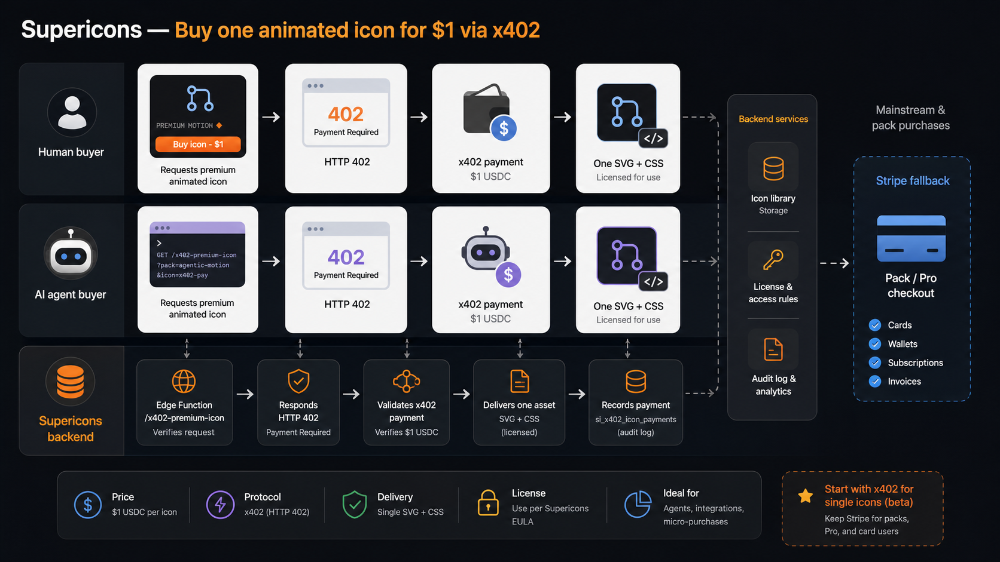
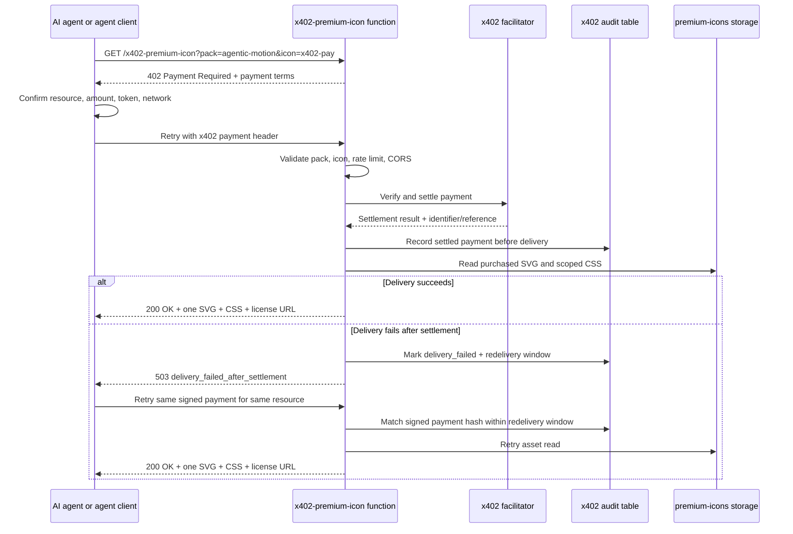
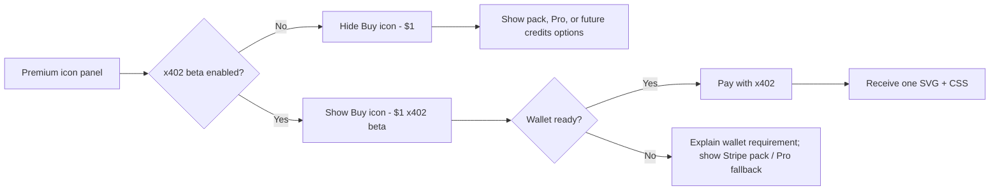
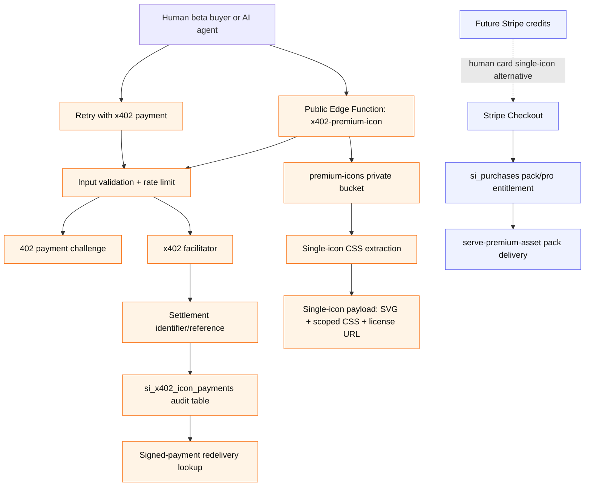

# Supericons x402 Single-Icon Payment PRD

Date: 2026-07-06
Status: Draft v3 for implementation review
Feature: `$1` single-icon purchase for Agentic Motion via x402
Companion research:
- `docs/x402-single-icon-payment-exploration-2026-07-05.md`
- `docs/x402-vs-stripe-payment-research-2026-07-05.md`

## Visual Concept



Generated visual prompt summary: a product architecture infographic showing human and AI-agent buyers requesting one premium animated icon, receiving `HTTP 402`, paying through x402, and receiving one licensed SVG plus CSS, with Stripe shown as a separate fallback for packs and Pro checkout. [SOURCE: generated image asset]

Note: the visual concept is directional. The v3 product decision below keeps the general-audience `$1` human UI hidden until a real beta payment path is available, so the image should not be treated as final screen copy. [ASSUMPTION]

## Problem

Supericons has a visible `$1` "Buy icon" affordance in the premium motion panel, but the current implementation does not yet fulfill single-icon purchases. [SOURCE: docs/x402-single-icon-payment-exploration-2026-07-05.md]

The existing Stripe purchase flow is pack/product oriented, and a correct single-icon Stripe implementation would require icon-level entitlements, Checkout metadata, webhook fulfillment, and a delivery endpoint that only serves the purchased icon. [SOURCE: docs/x402-single-icon-payment-exploration-2026-07-05.md]

The product opportunity is to let agents and crypto-ready buyers purchase one exact digital resource with minimal friction: pay for a URL, receive one licensed animated SVG and its CSS. [SOURCE: docs/x402-single-icon-payment-exploration-2026-07-05.md]

The operational risk is that a paid-resource endpoint has a dangerous failure window: payment may settle before asset delivery succeeds. The PRD must define idempotent redelivery, machine-readable errors, and audit status before implementation. [ASSUMPTION]

## Target Users

| Segment | Job To Be Done | Source |
|---|---|---|
| AI coding agent | When an agent needs a premium icon for a generated UI, it wants to programmatically pay for one exact asset so it can continue without a browser Checkout redirect. | [SOURCE: docs/x402-vs-stripe-payment-research-2026-07-05.md] |
| Developer using an agent | When a developer asks an agent to add an animated icon, they want the agent to resolve payment and asset retrieval with explicit price confirmation so the work does not stall on manual checkout. | [ASSUMPTION] |
| Crypto-ready human buyer | When a buyer already has a compatible stablecoin wallet, they want to pay for one icon without account creation so they can copy the asset immediately. | [SOURCE: docs/x402-single-icon-payment-exploration-2026-07-05.md] |
| Mainstream human buyer | When a buyer prefers card payment, they want a familiar Stripe flow for packs, Pro, or future credits rather than a wallet-first flow. | [SOURCE: docs/x402-vs-stripe-payment-research-2026-07-05.md] |

## Goals

1. Ship a narrow x402 beta that sells exactly one Agentic Motion icon per paid request. [SOURCE: docs/x402-single-icon-payment-exploration-2026-07-05.md]
2. Keep Stripe as the main human checkout path for packs, Pro, receipts, refunds, and account-based ownership. [SOURCE: docs/x402-vs-stripe-payment-research-2026-07-05.md]
3. Avoid adding Stripe webhook complexity for the first `$1` icon experiment. [SOURCE: docs/x402-single-icon-payment-exploration-2026-07-05.md]
4. Prevent full-pack leakage through the single-icon endpoint. [SOURCE: docs/x402-single-icon-payment-exploration-2026-07-05.md]
5. Produce enough audit data to debug successful, failed, duplicate, and delivery-failed payment attempts. [SOURCE: docs/x402-single-icon-payment-exploration-2026-07-05.md]
6. Define an agent-safe error and retry contract before any mainnet payment is accepted. [ASSUMPTION]

## Decisions

| ID | Decision | Source |
|---|---|---|
| D1 | Phase 0 starts on testnet; the preferred production path is Base mainnet USDC with the Coinbase CDP facilitator unless the spike finds a blocker. | [SOURCE: docs/x402-vs-stripe-payment-research-2026-07-05.md] |
| D2 | Human card demand should be handled later with Stripe credits rather than direct `$1` card checkout. | [SOURCE: docs/x402-vs-stripe-payment-research-2026-07-05.md] |
| D3 | The general-audience `$1` button remains hidden until an x402 beta wallet path is actually available; non-beta users should see pack, Pro, or future credits options instead. | [SOURCE: docs/x402-vs-stripe-payment-research-2026-07-05.md] |
| D4 | A settled payment must have a recordable idempotency key, payment identifier, settlement reference, and signed-payment-payload hash before asset delivery. Redelivery requires the original signed x402 payment payload, not just a visible identifier. The exact field names are confirmed during Phase 0. | [SOURCE: docs/x402-single-icon-payment-exploration-2026-07-05.md] |
| D5 | A same-wallet duplicate purchase for the same icon is accepted v1 behavior with no automatic refund. The agent docs and beta UI must disclose this. | [ASSUMPTION] |
| D6 | Preview fidelity is a launch gate. Mainnet launch cannot proceed until the owner decides whether full-fidelity public previews are acceptable for a `$1` licensed source file. | [SOURCE: docs/x402-vs-stripe-payment-research-2026-07-05.md] |
| D7 | Plain unpaid `402` hits should be sampled or counted, not inserted as one audit row per request. Paid attempts, verification failures, settlement records, delivery failures, duplicates, and rate-limit events are logged fully. | [ASSUMPTION] |

## Non-Goals

1. This PRD does not replace Stripe Checkout for packs, Pro, or mainstream card payments. [SOURCE: docs/x402-vs-stripe-payment-research-2026-07-05.md]
2. This PRD does not require a polished wallet UI for non-crypto human buyers in v1. [SOURCE: docs/x402-vs-stripe-payment-research-2026-07-05.md]
3. This PRD does not grant pack ownership after a single-icon x402 payment. [SOURCE: docs/x402-single-icon-payment-exploration-2026-07-05.md]
4. This PRD does not add open-ended repeat-download entitlement recovery. It only requires a short redelivery window for the same settled payment and same resource. [ASSUMPTION]
5. This PRD does not expose `bundle.json`, full collection CSS, or any non-purchased icon SVG as a paid single-icon response. [SOURCE: docs/x402-single-icon-payment-exploration-2026-07-05.md]
6. This PRD does not automate refunds for accidental duplicate payments in v1. [ASSUMPTION]

## Scope

### In Scope

| ID | Scope Item | Mapping |
|---|---|---|
| S1 | A new public Edge Function for single-icon x402 purchases. | User job: AI coding agent |
| S2 | x402 payment challenge on unpaid requests. | User job: AI coding agent |
| S3 | Testnet-first payment verification and settlement, with Base USDC/CDP as preferred production path. | Risk: production payment mistakes |
| S4 | Response containing only the purchased icon SVG and required animation CSS. | Risk: full-pack leakage |
| S5 | Audit logging for successful, failed, duplicate, and delivery-failed attempts in a separate x402 payment table. | Business goal: demand measurement |
| S6 | Idempotent redelivery for the same original signed payment payload and same resource within a short window. | Risk: paid-but-not-delivered |
| S7 | Machine-readable error contract for agents. | User job: AI coding agent |
| S8 | Endpoint abuse controls: validation before facilitator calls, basic rate limiting, and conservative CORS. | Risk: public endpoint abuse |
| S9 | Hidden or allowlisted beta UI wiring for the existing `Buy icon - $1` affordance. | Risk: pricing trust |
| S10 | Documentation for agent clients describing how to request, pay, retry, and interpret errors for one icon. | Business goal: agent ecosystem discovery |

### Out of Scope

| ID | Out-of-Scope Item | Reason |
|---|---|---|
| O1 | Stripe single-icon entitlement implementation. | Would require a separate entitlement/webhook design. [SOURCE: docs/x402-single-icon-payment-exploration-2026-07-05.md] |
| O2 | Human fiat-to-x402 card flow. | Research found wallet-less x402 is not buildable as a low-friction `$1` flow today. [SOURCE: docs/x402-vs-stripe-payment-research-2026-07-05.md] |
| O3 | Refund automation. | v1 should first prove demand and payment correctness. [ASSUMPTION] |
| O4 | Marketplace-wide x402 support for all premium packs. | Initial scope should reduce blast radius. [ASSUMPTION] |
| O5 | General-audience visible `$1` checkout. | Showing a `$1` promise that most humans cannot complete would create a trust risk. [ASSUMPTION] |

## UX Flow

### Primary Agent Flow



The agent must confirm the requested pack, icon, amount, token, network, and destination before paying. [ASSUMPTION]

### Human Beta Flow



Human x402 should be framed as beta because mainstream users may not have a compatible wallet or stablecoin balance. [SOURCE: docs/x402-vs-stripe-payment-research-2026-07-05.md]

The product must avoid showing a general `$1` button that mostly resolves to a `$9.99` pack ask, because that would read as a bait-and-switch. [ASSUMPTION]

## Architecture



The x402 path should remain separate from `si_purchases`, because a single-icon payment is not pack ownership. [SOURCE: docs/x402-single-icon-payment-exploration-2026-07-05.md]

## Functional Requirements

| ID | Requirement | Maps To | Source |
|---|---|---|---|
| FR1 | Add `x402-premium-icon` as a public Edge Function with JWT verification disabled. | User job: AI coding agent | [SOURCE: docs/x402-single-icon-payment-exploration-2026-07-05.md] |
| FR2 | Validate `pack` and `icon` before any facilitator call, starting with `agentic-motion` and a known icon allowlist. | Risk: invalid asset access | [ASSUMPTION] |
| FR3 | Return `402 Payment Required` with machine-readable payment terms when no valid x402 payment is supplied. | User job: AI coding agent | [SOURCE: docs/x402-single-icon-payment-exploration-2026-07-05.md] |
| FR4 | Verify and settle the supplied x402 payment before returning licensed asset data. | Risk: unpaid asset access | [SOURCE: docs/x402-single-icon-payment-exploration-2026-07-05.md] |
| FR5 | Return only one icon SVG and only the CSS needed for that icon. | Risk: full-pack leakage | [SOURCE: docs/x402-single-icon-payment-exploration-2026-07-05.md] |
| FR6 | Never return `bundle.json`, full pack CSS, or any non-purchased icon SVG through the single-icon endpoint. | Risk: full-pack leakage | [SOURCE: docs/x402-single-icon-payment-exploration-2026-07-05.md] |
| FR7 | Log settled, verify-failed, delivery-failed, redelivered, duplicate, and rate-limited attempts in `si_x402_icon_payments` or an equivalent audit store; sample or aggregate plain unpaid `402` hits instead of inserting every probe. | Business goal: debugging and demand measurement | [SOURCE: docs/x402-single-icon-payment-exploration-2026-07-05.md] |
| FR8 | Require a recordable idempotency key, payment identifier, settlement reference, and signed-payment-payload hash before delivery; replaying the same signed payment payload for the same resource within the redelivery window must not charge again. | Risk: paid-but-not-delivered | [SOURCE: docs/x402-single-icon-payment-exploration-2026-07-05.md] |
| FR9 | Replaying the same signed payment payload for a different resource must return `409 payment_reused_for_different_resource`. | Risk: entitlement confusion | [ASSUMPTION] |
| FR10 | Keep x402 single-icon records separate from pack-level `si_purchases`. | Risk: entitlement confusion | [SOURCE: docs/x402-single-icon-payment-exploration-2026-07-05.md] |
| FR11 | Add verification scripts for unpaid, invalid, paid testnet, redelivery, error-contract, leakage, and CSS-isolation checks. | Risk: regression | [ASSUMPTION] |
| FR12 | Gate visible UI exposure behind a beta flag until unpaid, paid, invalid, redelivery, leakage, and CSS-isolation checks pass. | Risk: launch quality | [ASSUMPTION] |
| FR13 | Document the agent-facing request flow, retry behavior, response format, error table, and support contact for settlement disputes. | Business goal: agent ecosystem discovery | [SOURCE: docs/x402-single-icon-payment-exploration-2026-07-05.md] |
| FR14 | Apply basic rate limiting per IP or equivalent client signal before facilitator verification. | Risk: public endpoint abuse | [ASSUMPTION] |
| FR15 | Use conservative CORS in Phase 1; browser origins should remain closed or explicitly allowlisted until Phase 2. | Risk: public endpoint abuse | [ASSUMPTION] |
| FR16 | Paid responses must include a stable license URL in addition to a license code string. | Risk: proof-of-rights ambiguity | [ASSUMPTION] |
| FR17 | x402 price terms must be read from a single premium pricing/config source rather than duplicated in UI copy and endpoint code. | Risk: price drift | [SOURCE: lib/si-premium-motion.js] |
| FR18 | Enforce database-level uniqueness for signed payment hash, payment identifier, and settlement reference when present; the first valid settlement row wins and concurrent duplicates take the redelivery or processing path. | Risk: duplicate charge/concurrency | [ASSUMPTION] |
| FR19 | Enable RLS on the x402 audit table and expose no anon/auth read or write policies; only service-role server code may read or write payer addresses and settlement metadata. | Risk: payment metadata exposure | [ASSUMPTION] |
| FR20 | Return `410 redelivery_window_expired` when the original signed payment is replayed for the same resource after the redelivery window. | User job: AI coding agent | [ASSUMPTION] |
| FR21 | Support a reversible endpoint kill switch that returns `503 endpoint_disabled` before database, rate-limit, facilitator, or payment-challenge work. | Risk: emergency rollback and testnet exposure | [ASSUMPTION] |

## API Contract

### Request

```txt
GET /functions/v1/x402-premium-icon?pack=agentic-motion&icon=x402-pay
```

The exact x402 payment header names, idempotency identifier, and facilitator response shape must be confirmed against the selected x402 library during Phase 0. [ASSUMPTION]

### Unpaid Response

```txt
HTTP 402 Payment Required
Content-Type: application/json
```

```json
{
  "error": "payment_required",
  "pack": "agentic-motion",
  "icon": "x402-pay",
  "price": "1.00",
  "currency": "USDC",
  "asset": "animated SVG and animation CSS",
  "payment": {
    "network": "base",
    "facilitator": "coinbase-cdp",
    "requirements": "<x402 payment requirements>"
  }
}
```

This response shape is a product contract proposal, not a verified implementation. [ASSUMPTION]

### Paid Response

```txt
HTTP 200 OK
Content-Type: application/json
Cache-Control: private, no-store
```

```json
{
  "pack": "agentic-motion",
  "icon": "x402-pay",
  "license": "single-icon-license",
  "license_url": "<stable public single-icon license URL>",
  "svg": "<svg ...>",
  "css": "...",
  "receipt": {
    "payment_identifier": "...",
    "settlement_reference": "...",
    "network": "base",
    "token": "USDC",
    "amount": "1.00"
  },
  "redelivery": {
    "available_until": "2026-07-06T00:30:00Z"
  }
}
```

The endpoint must not include other pack icons in the paid response. [SOURCE: docs/x402-single-icon-payment-exploration-2026-07-05.md]

### Error Responses

| HTTP | Code | Charged? | When | Agent Action | Source |
|---|---|---:|---|---|---|
| `400` | `invalid_request` | `false` | Missing malformed query parameters. | Fix request. | [ASSUMPTION] |
| `400` | `invalid_pack_or_icon` | `false` | Pack or icon is not in the allowlist. | Pick a valid resource. | [ASSUMPTION] |
| `402` | `payment_required` | `false` | No payment header supplied. | Construct x402 payment and retry. | [SOURCE: docs/x402-single-icon-payment-exploration-2026-07-05.md] |
| `402` | `payment_verification_failed` | `false` unless `settlement_reference` is present | Payment header exists but wrong amount, wrong network, expired, or rejected. | Read `reason`; correct payment terms; retry only if not settled. | [ASSUMPTION] |
| `409` | `payment_already_processing` | `unknown` | Another request with the same signed payment payload is already being verified or delivered. | Retry the same signed payment after a short delay. | [ASSUMPTION] |
| `409` | `payment_reused_for_different_resource` | `true` for original resource only | Same signed payment payload is replayed for a different icon or pack. | Reuse the original signed payment for the original resource or make a new payment. | [ASSUMPTION] |
| `410` | `redelivery_window_expired` | `true` | Same signed payment is replayed for the same resource after the redelivery window. | Contact support with receipt data; do not loop or create a second payment unless the buyer explicitly approves. | [ASSUMPTION] |
| `429` | `rate_limited` | `false` | Too many unpaid or failed verification attempts. | Back off and retry later. | [ASSUMPTION] |
| `503` | `endpoint_disabled` | `false` | The x402 endpoint is intentionally paused by operator configuration. | Stop payment attempts and retry only after the endpoint is re-enabled. | [ASSUMPTION] |
| `503` | `asset_unavailable` | `false` | The icon asset or scoped CSS cannot be prepared before settlement. | Do not reuse this payment; no charge was attempted. Escalate the broken resource. | [ASSUMPTION] |
| `503` | `facilitator_unavailable` | `false` unless `settlement_reference` is present | Facilitator cannot verify or settle. | Retry later; do not create a new payment if a settlement reference exists. | [ASSUMPTION] |
| `503` | `delivery_failed_after_settlement` | `true` | Payment settled, but storage read or payload assembly failed. | Retry same payment and same resource within redelivery window. | [ASSUMPTION] |
| `500` | `internal_error` | `unknown` unless response includes settlement data | Unexpected server error. | Retry same payment first; escalate with receipt data if present. | [ASSUMPTION] |

Every non-`200` JSON error must include `error`, `message`, `charged`, and `request_id`; settlement-related errors must also include `payment_identifier` or `settlement_reference` when available. [ASSUMPTION]

## Redelivery and Idempotency

Default rule: a settled payment for `pack + icon + signed_payment_payload_hash` can redeliver the same single-icon payload for 30 minutes without another charge when the request presents the original signed x402 payment payload. The payment identifier alone is never sufficient for redelivery, because identifiers can appear in receipts, logs, or proxies. [ASSUMPTION]

The 30-minute default exists to cover storage failures, response interruption, and agent retry loops, not to create long-term ownership recovery. [ASSUMPTION]

If exact x402 Payment-Identifier support is unavailable in the selected library, Phase 0 must define an equivalent idempotency key or settlement reference before mainnet launch. [SOURCE: docs/x402-single-icon-payment-exploration-2026-07-05.md]

Concurrent requests with the same signed payment payload must converge on one database record. The first request that creates the pending/settled record wins; later concurrent requests return `409 payment_already_processing`, redeliver the same resource if delivery has succeeded, or return the recorded delivery failure/error state. [ASSUMPTION]

## Data Model

Proposed audit table:

```sql
create table si_x402_icon_payments (
  id uuid primary key default gen_random_uuid(),
  request_id uuid not null default gen_random_uuid(),
  pack_slug text not null,
  icon_name text not null,
  status text not null check (
    status in (
      'settlement_pending',
      'verify_failed',
      'settled',
      'delivery_failed',
      'redelivered',
      'duplicate',
      'rate_limited'
    )
  ),
  facilitator text,
  network text not null,
  token_symbol text not null default 'USDC',
  token_amount numeric,
  amount_usd numeric,
  payer_address text,
  payment_identifier text,
  idempotency_key text,
  signed_payment_payload_hash text,
  settlement_reference text,
  transaction_hash text,
  charged boolean not null default false,
  error_code text,
  error_message text,
  redelivery_expires_at timestamptz,
  paid_at timestamptz,
  delivered_at timestamptz,
  created_at timestamptz not null default now(),
  updated_at timestamptz not null default now()
);

create unique index si_x402_icon_payments_payment_identifier_uidx
  on si_x402_icon_payments (payment_identifier)
  where payment_identifier is not null and charged = true;

create unique index si_x402_icon_payments_settlement_reference_uidx
  on si_x402_icon_payments (settlement_reference)
  where settlement_reference is not null and charged = true;

create unique index si_x402_icon_payments_signed_payload_uidx
  on si_x402_icon_payments (signed_payment_payload_hash)
  where signed_payment_payload_hash is not null
    and status in ('settlement_pending', 'settled', 'delivery_failed', 'redelivered');

alter table si_x402_icon_payments enable row level security;
```

This table is for operations, analytics, duplicate investigation, failure debugging, and possible future support workflows; it does not unlock pack access. [SOURCE: docs/x402-single-icon-payment-exploration-2026-07-05.md]

The table must have no anon or authenticated client policies in v1; Supabase service-role server code is the only allowed read/write path. Payer addresses, transaction hashes, and settlement references are private operational data. [ASSUMPTION]

Plain unpaid `402` hits should not create one row per request in this table. Use aggregate counters, edge logs, or sampled records for unpaid probes so bot traffic does not pollute payment analytics. [ASSUMPTION]

Rate-limit counters must be incremented atomically in the database, for example with an RPC that performs `insert ... on conflict ... do update set request_count = request_count + 1 returning request_count`, so concurrent requests cannot undercount or turn a first-window collision into a `500`. [ASSUMPTION]

The final schema may split attempts and settlements into separate tables if implementation proves that cleaner, but the final model must preserve the statuses and recovery data above. [ASSUMPTION]

## Success Metrics

| Metric | Definition | Source |
|---|---|---|
| Endpoint correctness | Unpaid request returns `402`; paid request returns one icon only; invalid icon is rejected. | [ASSUMPTION] |
| Paid-path verification | Testnet paid request returns one working icon payload and a settled audit row. | [ASSUMPTION] |
| Redelivery correctness | Replaying the same settled payment for the same icon during the redelivery window returns the same asset without another charge. | [ASSUMPTION] |
| CSS isolation | The purchased icon renders and animates correctly using only the returned SVG and CSS in an isolated page. | [ASSUMPTION] |
| Leakage prevention | Zero responses containing full bundle data from the single-icon endpoint. | [SOURCE: docs/x402-single-icon-payment-exploration-2026-07-05.md] |
| Agent completion | Number of successful x402 settled icon purchases from agent or API clients. | [ASSUMPTION] |
| Duplicate rate | Count of repeated settled payments for the same wallet/resource or same payment identifier. | [SOURCE: docs/x402-single-icon-payment-exploration-2026-07-05.md] |
| Bazaar discovery | Whether the endpoint appears in Coinbase x402 Bazaar after first settled payment and remains listed. | [SOURCE: docs/x402-vs-stripe-payment-research-2026-07-05.md] |
| Support burden | Number of user support issues tied to failed x402 payment or asset delivery. | [ASSUMPTION] |

### Beta Evaluation Gate

After 60 days on mainnet, use this decision rule: if there are at least 10 organic settled purchases from non-test wallets and no unresolved paid-but-not-delivered incidents, consider Phase 2 UI expansion; otherwise keep the endpoint as passive agent-positioning infrastructure and defer further UI investment. Organic purchases exclude wallets listed in a maintained internal test-wallet allowlist. [ASSUMPTION]

## Acceptance Criteria

1. Unpaid request to the beta endpoint returns `402 Payment Required`. [SOURCE: docs/x402-single-icon-payment-exploration-2026-07-05.md]
2. Testnet paid request returns `200 OK` with one SVG, scoped CSS, license URL, receipt metadata, and a redelivery expiry. [ASSUMPTION]
3. Paid request does not return `bundle.json`, full pack CSS, or any non-purchased icon SVG. [SOURCE: docs/x402-single-icon-payment-exploration-2026-07-05.md]
4. Invalid `pack` or `icon` values return `400` before any facilitator verification call. [ASSUMPTION]
5. Payment verification failure returns a machine-readable `402 payment_verification_failed` response. [ASSUMPTION]
6. Facilitator outage returns `503 facilitator_unavailable` and clearly states whether any settlement reference exists. [ASSUMPTION]
7. Delivery failure after settlement records `delivery_failed` and supports same-signed-payment redelivery for the same resource within the redelivery window. [ASSUMPTION]
8. Reusing a payment identifier for a different icon returns `409 payment_reused_for_different_resource`. [ASSUMPTION]
9. Replaying the same signed payment after the redelivery window returns `410 redelivery_window_expired`. [ASSUMPTION]
10. Unique constraints prevent duplicate charged settlement rows for the same signed payment hash, payment identifier, or settlement reference. [ASSUMPTION]
11. RLS is enabled on payment audit tables, and no anon/auth client policy exposes payment metadata. [ASSUMPTION]
12. Plain unpaid `402` requests are sampled or counted, not fully inserted one row per request. [ASSUMPTION]
13. Successful, failed, redelivered, duplicate, and rate-limited attempts are represented in the audit store. [ASSUMPTION]
14. Rate-limit increments are atomic under concurrent requests. [ASSUMPTION]
15. The purchased icon renders and animates correctly using only the returned SVG and CSS in an isolated verification page. [ASSUMPTION]
16. The visible app `$1` button is hidden behind a beta flag until unpaid, paid, invalid, redelivery, leakage, CSS-isolation, and error-contract checks pass. [ASSUMPTION]
17. The preview-fidelity launch gate is resolved before any mainnet launch. [SOURCE: docs/x402-vs-stripe-payment-research-2026-07-05.md]
18. Stripe pack checkout and Pro checkout behavior remain unchanged. [SOURCE: docs/x402-vs-stripe-payment-research-2026-07-05.md]

## Risks

| Risk | Impact | Mitigation | Source |
|---|---|---|---|
| Paid but not delivered | Buyer pays but receives no asset. | Record settlement before delivery; allow same-signed-payment redelivery for same resource. | [ASSUMPTION] |
| Full-pack leakage | A `$1` buyer could receive all 50 animated icons. | Return only one SVG and scoped CSS; add leakage tests. | [SOURCE: docs/x402-single-icon-payment-exploration-2026-07-05.md] |
| Broken scoped CSS | Leakage tests pass but the purchased icon does not animate. | Verify isolated render and animation using only returned payload. | [ASSUMPTION] |
| Low adoption | x402 demand may be small initially. | Treat as agent-positioning beta, not revenue forecast. | [SOURCE: docs/x402-vs-stripe-payment-research-2026-07-05.md] |
| Wallet friction for humans | Mainstream buyers may not complete wallet payments. | Keep Stripe as primary human path; hide `$1` general UI. | [SOURCE: docs/x402-vs-stripe-payment-research-2026-07-05.md] |
| Pricing trust | A visible `$1` button that falls back to `$9.99` pack checkout can feel misleading. | Hide `$1` outside beta and reserve human card path for future credits. | [ASSUMPTION] |
| Duplicate payments | Retried or repeated requests could settle more than once. | Use payment identifiers, audit statuses, redelivery, and clear no-auto-refund disclosure. | [SOURCE: docs/x402-single-icon-payment-exploration-2026-07-05.md] |
| Public endpoint abuse | Bogus payment headers could trigger facilitator verification cost. | Validate input before facilitator calls; rate-limit failures; use conservative CORS. | [ASSUMPTION] |
| Payment metadata exposure | Wallet addresses and transaction hashes could leak through client-readable tables. | Enable RLS and keep audit tables service-role-only. | [ASSUMPTION] |
| Facilitator/API churn | x402 tooling may change while still emerging. | Keep implementation narrow and isolated. | [ASSUMPTION] |
| Tax/accounting gaps | Non-Stripe revenue may need separate reporting. | Start with an audit table and manual review. | [ASSUMPTION] |

## Rollout Plan

### Phase 0: Technical Spike

1. Use testnet first; prefer Coinbase CDP facilitator and Base USDC for the direct x402 path unless the spike finds a blocker. [SOURCE: docs/x402-vs-stripe-payment-research-2026-07-05.md]
2. Confirm exact headers, payment requirement format, nonce/expiry behavior, idempotency field, CORS behavior, testnet flow, settlement response, and error semantics. [ASSUMPTION]
3. Hardcode one resource: `agentic-motion/x402-pay`. [SOURCE: docs/x402-single-icon-payment-exploration-2026-07-05.md]
4. Define the canonical price config used by UI labels and x402 payment terms. [SOURCE: lib/si-premium-motion.js]
5. Build a paid-path verifier using a testnet wallet and record the expected audit row shape. [ASSUMPTION]
6. Choose the rate-limit backing store, such as Postgres counters, platform rate limiting, or another durable store. [ASSUMPTION]
7. Define the internal test-wallet allowlist used to exclude owner/test purchases from beta metrics. [ASSUMPTION]
8. Draft the single-icon license terms in parallel with the endpoint spike. [ASSUMPTION]
9. Resolve preview fidelity before mainnet. [SOURCE: docs/x402-vs-stripe-payment-research-2026-07-05.md]

### Phase 1: Hidden Agent Beta

1. Build `x402-premium-icon` endpoint. [SOURCE: docs/x402-single-icon-payment-exploration-2026-07-05.md]
2. Add `si_x402_icon_payments` audit table or equivalent attempt/settlement model. [SOURCE: docs/x402-single-icon-payment-exploration-2026-07-05.md]
3. Add verification scripts for unpaid, invalid, paid testnet, redelivery, error-contract, leakage, and CSS-isolation checks. [ASSUMPTION]
4. Create an agent-facing docs page or Markdown guide, including duplicate-payment and redelivery rules. [SOURCE: docs/x402-single-icon-payment-exploration-2026-07-05.md]
5. Make one controlled mainnet purchase only after all testnet gates pass. [ASSUMPTION]
6. Check Coinbase x402 Bazaar listing behavior after the first settled mainnet payment. [SOURCE: docs/x402-vs-stripe-payment-research-2026-07-05.md]
7. Track monthly facilitator settlement count and alert on any `delivery_failed` row. [ASSUMPTION]

### Phase 2: Product UI Beta

1. Wire `Buy icon - $1` only for allowlisted beta users or hidden beta surfaces. [ASSUMPTION]
2. Explain wallet/stablecoin requirements before payment. [SOURCE: docs/x402-vs-stripe-payment-research-2026-07-05.md]
3. Keep Stripe pack or Pro checkout as a separate fallback, not as the default result of a general-audience `$1` click. [ASSUMPTION]
4. Track completion, failure, duplicate, support, and Bazaar discovery signals. [ASSUMPTION]

### Phase 3: Revisit Human Checkout

1. Design Stripe credits for human card single-icon demand if demand appears. [SOURCE: docs/x402-vs-stripe-payment-research-2026-07-05.md]
2. Re-check fiat/x402 facilitator maturity before investing in wallet-less human flows. [SOURCE: docs/x402-vs-stripe-payment-research-2026-07-05.md]

## Open Questions

1. What is the final public URL for the single-icon license terms, and does the license allow personal, commercial, client, and AI-agent-generated project use? [ASSUMPTION]
2. Should signed-in users who pay with x402 be able to attach the single-icon payment to their Supericons account later? [ASSUMPTION]
3. What exact lower-fidelity or protection change, if any, is required for public previews before mainnet launch? [SOURCE: docs/x402-single-icon-payment-exploration-2026-07-05.md]
4. Should the 30-minute redelivery window be shortened or lengthened after Phase 0 testing? [ASSUMPTION]
5. Which internal owner reviews non-Stripe x402 payment records for accounting and support? [ASSUMPTION]

## Recommendation

Proceed with Phase 0 and Phase 1 only. [ASSUMPTION]

Do not make x402 the primary human checkout path. Keep Stripe for packs and Pro while using x402 where it is strongest: direct agent-native payment for one exact digital resource. [SOURCE: docs/x402-vs-stripe-payment-research-2026-07-05.md]
