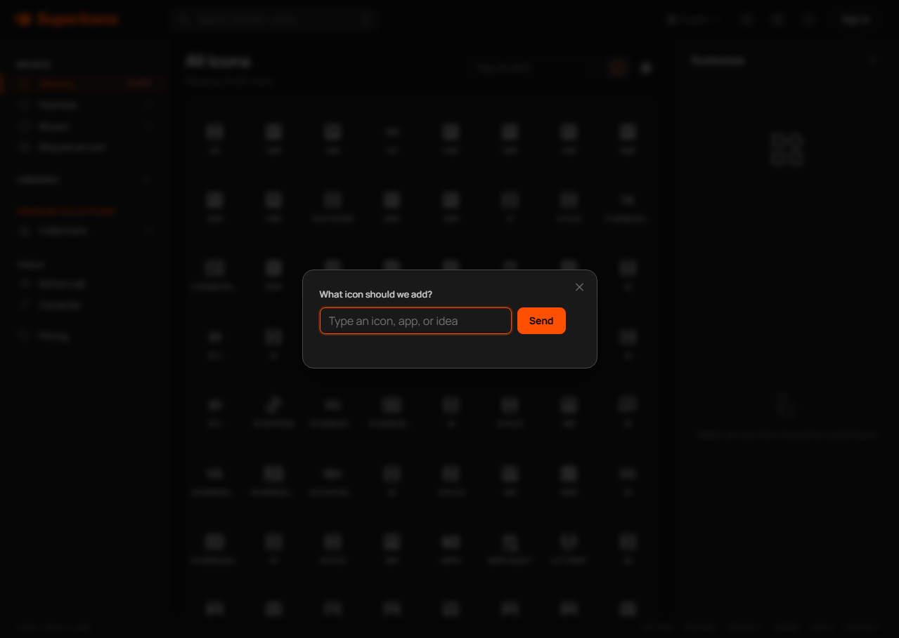
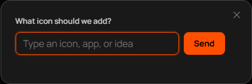

# Icon request modal follow-up verification

Date: 2026-07-27

## Scope

This follow-up changes only the website icon request presentation:

- The Request an icon sidebar action uses the same font size as other sidebar items.
- A sidebar request opens in a centered modal with a backdrop and close control.
- Zero-result and low-result request forms stay inline.
- Opening the sidebar request does not scroll the grid or trigger another icon batch.

No database, admin API, search, ranking, MCP, recommendation, or icon ordering
logic changed.

## Reproduction

The production page reproduced both reported defects before the fix:

- Request an icon computed to `16px`; Favorites computed to `12.8px`.
- Clicking Request an icon scrolled the grid to `1858px`, loaded another 200
  icons, and pushed the inline form about 806 pixels farther down after it
  briefly appeared.

The first new Chromium regression failed on the font mismatch before the
implementation changed.

## Root cause

The sidebar button used `font: inherit`, which replaced the shared sidebar item
font size with the larger parent size.

The request form lived after the infinite-scroll grid. Calling
`scrollIntoView()` moved the grid to its bottom sentinel, loaded another batch,
and moved the form out of view.

## Verification matrix

| Check | Result |
| --- | --- |
| JavaScript syntax | Passed |
| Icon request static contract | Passed |
| Chromium request flow | Passed |
| Sidebar font size equality | Passed |
| Modal fixed inside viewport | Passed |
| Modal does not scroll or load the grid | Passed |
| Escape and backdrop close behavior | Passed |
| Focus returns to the sidebar action | Passed |
| Five request payload cases | Passed |
| Existing grid behavior | Passed |
| Twelve locale catalogs | Passed |
| Production build | Passed |
| Release preflight inventory | Passed |

The production build contains the modal markup, fixed modal styles, dedicated
request RPC, and no admin artifacts.

## Visual evidence

The local Chromium screenshot used the shipped icon index. The modal card was
inside the viewport, the input had focus, and the grid scroll position stayed
at zero.

## Production release

Website deploy `6a671da03887ad34f1ef7057` was published from commit
`cac55a308`. The previous website deploy
`6a66db661eee4ce20a26e8e0` is the exact rollback target.

The released bundle fingerprints are:

- HTML: `5c2048a3f9981b80561d805a655df6cc83981794aac5747af053f519345d5165`
- JavaScript: `17894a9f9563a596ef1c08fab94de53ede5862f0698dd463ff0959627d130d62`
- CSS: `9d42a805b6d669dee262c40d8bc4df2b4ef2e755d6b2d62ac2db84334bfd3393`

Live Chromium verification passed on both the exact deploy URL and
`supericons.dev`. It confirmed:

- The sidebar action and Favorites both compute to `12.8px`.
- The modal remains fixed and inside the viewport after one second.
- The input receives focus.
- The grid stays at 200 rendered cells and scroll position zero.
- Escape returns focus to the sidebar action.
- Clicking the backdrop closes the modal.
- No page errors occurred.

No production request was submitted during this visual smoke test.
